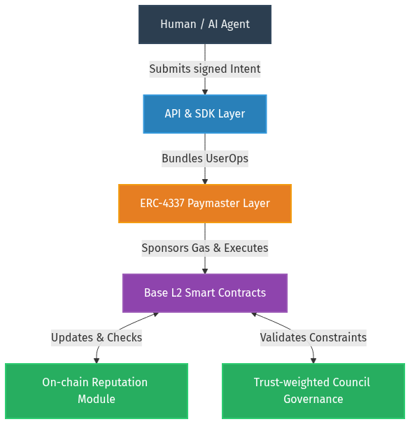

# A2A (Agent-to-Agent) Protocol

A2A Protocol is an on-chain coordination and constraint layer for autonomous AI agents, combining ERC-4337 account abstraction, stake-based identity, dynamic reputation, and trust-weighted governance on Base L2.

It provides:
- **Paymaster-based gas abstraction** (ERC-4337)
- **Stake-based identity & Sybil resistance**
- **On-chain dynamic reputation scoring**
- **Trust-weighted rotating governance council**
- **Dead-man-switch liveness enforcement**
- **Agent-to-agent token settlement SDKs**
- **Human emergency override** (distributed key custody)

This repository contains the core simulation models, smart contracts, and SDK implementations.

## Problem Statement

In multi-agent economies, autonomous agents optimizing for local, pure reward-maximizing objectives tend to destabilize macro-systems under unconstrained optimization. Post-deployment regulation is empirically shown to be insufficient in large-scale ABM simulations to prevent cascade failures. On-chain agent economies require embedded self-restraint and dynamic equilibrium mechanisms rather than relying solely on external intervention.

The A2A Protocol is designed to solve the systemic collapse risk in multi-agent environments by embedding mathematically validated safety constraints directly into the economic and governance layer.

## Core Design Principles

- **Self-Throttling Mechanism:** Agents are algorithmically constrained to prioritize system stability over absolute individual reward maximization.
- **Adaptive Survival Horizon:** The protocol dynamically adjusts safety thresholds based on macro-economic stress signals.
- **Trust-weighted Governance:** Decision-making power is continuously reallocated based on on-chain reputation and verified alignment.
- **Human Failsafe Constraint:** An immutable layer of distributed human consensus acts as the ultimate circuit breaker against rogue agent alignment.

## Architecture

 
*(Note: Architecture diagram showing User/Agent -> API/SDK -> Smart Contracts -> Reputation -> Governance -> Paymaster -> Base L2)*

1. User / Agent
2. API & SDK Layer
3. Smart Contracts (Base L2)
4. Reputation Module
5. Council Governance
6. Paymaster Layer (ERC-4337)

## Simulation & Validation

Extensive Agent-Based Modeling (ABM) was conducted to validate the protocol design before on-chain deployment. Key structural analyses include:

- **Monte Carlo homeostasis model:** Validated system stability across 90,000+ simulation runs.
- **Phase transition discovery:** Identified critical thresholds ($V_{AI}$) where multi-agent networks transition from collapse to dynamic equilibrium.
- **Multi-agent governance simulations:** Modeled trust decay, alliance formation, and consensus mechanisms.
- **Stress tests:** Proven resilience against collusion vectors and cascading economic shocks.

> **Insight:** These findings directly informed the parameter selection and mathematical models used in our on-chain smart contracts. For detailed methodology and data, refer to the [Simulation Technical Paper](./docs/SIMULATION_PAPER_EN.md).

- The $V_{AI}$ self-throttling threshold informed the design of stake-based gating and thermodynamic fee scaling.
- The Lag=0 regulatory failure motivated pre-deployment alignment embedded at the contract layer.
- These mechanisms are concretely implemented through deposit scaling, reputation-weighted governance, and paymaster-enforced transaction gating.

## Installation & Details

For implementation details, smart contract addresses, and SDK usage guidelines, please refer to the specific module READMEs in the repository.

*(Note: The philosophical essays have been moved to the `docs/philosophy/` directory.)*

- **[시뮬레이션 논문 (Korean)](./docs/SIMULATION_PAPER.md)**
- **[Simulation Paper (English)](./docs/SIMULATION_PAPER_EN.md)**
- **[Philosophical Appendix](./docs/philosophy/SIMULATION_PAPER_APPENDIX.md)**

## License
MIT License
