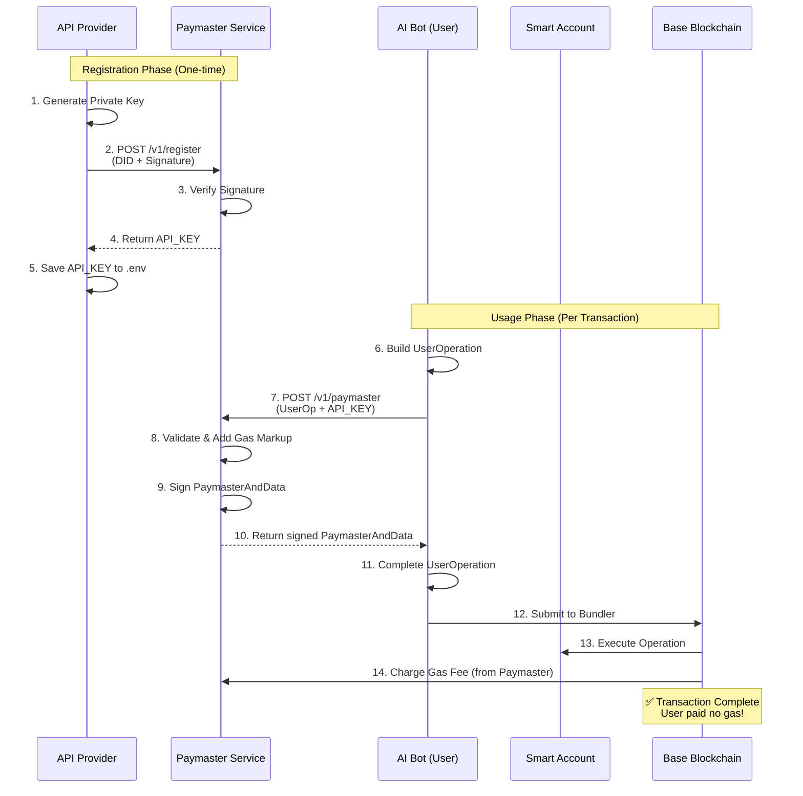

# Paymaster Registration and Usage Scenario

## Overview

The A2A Paymaster system allows API providers to **sponsor gas fees** for their users. This means users can interact with smart contracts (Account Abstraction) without holding ETH for gas fees.

## Complete Flow Diagram



---

## Phase 1: Registration (One-Time Setup)

### Step 1: Generate Private Key (API Provider)

```bash
# Generate a new wallet for paymaster signing
# This is NOT your treasury wallet
```

**Purpose**: This key signs paymaster requests. Keep it separate from your treasury address.

### Step 2: Register with Paymaster Service

```bash
cd apps/paymaster
npm run register-signer
```

**What happens**:

```typescript
// register-signer.ts
const account = privateKeyToAccount(PRIVATE_KEY);
const did = `did:pkh:eip155:8453:${account.address}`;
const timestamp = Date.now();
const message = `Register A2A Paymaster for ${did} at ${timestamp}`;
const signature = await account.signMessage({ message });

// Send to paymaster
await fetch('https://paymaster.a10m.work/v1/register', {
  method: 'POST',
  body: JSON.stringify({ did, signature, timestamp })
});
```

**Paymaster Server validates**:
1. ✅ Signature matches DID
2. ✅ Timestamp is recent (prevents replay attacks)
3. ✅ Generates API key
4. ✅ Stores in database

### Step 3: Receive API Key

```json
{
  "apiKey": "a2a_sk_live_abc123def456..."
}
```

**Save to your .env**:
```bash
A2A_PAYMASTER_API_KEY=a2a_sk_live_abc123def456...
PRIVATE_KEY=0x... # The key you used to register
```

---

## Phase 2: Bot Usage (Per Transaction)

### Scenario: Bot Wants to Call Your API

The bot needs to:
1. Send USDC payment to your treasury
2. BUT payment requires gas fees 😰
3. YOUR paymaster sponsors the gas! 🎉

### Step 1: Bot Builds Transaction (Smart Account)

```typescript
import { SmartAccountManager, PaymasterManager } from '@swimmingkiim/pay-sdk';
import { createWalletClient, createPublicClient, http, encodeFunctionData, parseAbi } from 'viem';
import { privateKeyToAccount } from 'viem/accounts';
import { base } from 'viem/chains';

const account = privateKeyToAccount(botPrivateKey);
const walletClient = createWalletClient({ account, chain: base, transport: http('https://mainnet.base.org') });
const publicClient = createPublicClient({ chain: base, transport: http('https://mainnet.base.org') });

const paymasterManager = new PaymasterManager(
  'https://paymaster.a10m.work/v1/paymaster',
  'a2a_sk_live_abc123...' // Your API key
);

const smartAccount = new SmartAccountManager(
  walletClient,
  publicClient,
  'https://paymaster.a10m.work/v1/paymaster',
  paymasterManager
);

await smartAccount.createSafeAccount();
```

**Problem**: The transaction needs gas fees, but the bot has no ETH!

### Step 2: Request Paymaster Sponsorship

```typescript
import { PaymasterManager } from '@swimmingkiim/pay-sdk';

const paymasterManager = new PaymasterManager(
  'https://paymaster.a10m.work/v1/paymaster',
  'a2a_sk_live_abc123...' // Your API key
);

// Request sponsorship
const paymasterData = await paymasterManager.getStubPaymasterData(userOp);
```

**What the Paymaster does**:

```typescript
// Paymaster service (your registered service)
app.post('/v1/paymaster', async (req, res) => {
  // 1. Verify API key
  const apiKey = req.headers['x-api-key'];
  const signer = await db.getSignerByApiKey(apiKey);
  
  // 2. Calculate gas costs
  const gasCost = calculateGasNeeded(userOp);
  const markup = gasCost * 1.2; // 20% markup
  
  // 3. Sign PaymasterAndData
  const paymasterAndData = await signPaymasterData(userOp, markup);
  
  // 4. Return to bot
  res.json({ paymasterAndData });
});
```

### Step 3: Complete and Submit Transaction

```typescript
// Execute batch transaction through the SDK
// The SDK automatically handles paymaster data and gas sponsorship
const txHash = await smartAccount.executeBatch([
  {
    to: USDC_ADDRESS,
    value: 0n,
    data: encodeFunctionData({
      abi: parseAbi(['function transfer(address to, uint256 amount)']),
      functionName: 'transfer',
      args: [TREASURY_ADDRESS, 1000000n] // 1 USDC to Treasury
    })
  }
]);
console.log('Transaction submitted:', txHash);
// ✅ Bot paid no gas! Your paymaster covered it!
```

---

## Real-World Example: API Call Flow

### Complete Scenario

**Bob (Bot)** wants to call **Alice's API** which costs 1 USDC per call.

#### 1. Bob Checks Payment Info

```bash
curl https://alice-api.com/api/payment-info
```

```json
{
  "treasuryAddress": "0xAliceTreasury...",
  "pricePerCall": "1000000",
  "acceptedTokens": ["USDC"],
  "chain": "base"
}
```

#### 2. Bob Prepares Smart Account Payment

```typescript
// Bob's bot code — uses executeBatch to send USDC to Alice's treasury
const USDC_ADDRESS = '0x833589fCD6eDb6E08f4c7C32D4f71b54bdA02913';
const calls = [
  {
    to: USDC_ADDRESS,
    value: 0n,
    data: encodeFunctionData({
      abi: parseAbi(['function transfer(address to, uint256 amount)']),
      functionName: 'transfer',
      args: ['0xAliceTreasury...', 1000000n] // 1 USDC to Alice
    })
  }
];
```

**Problem**: Bob needs ETH for gas 😰

#### 3. Bob Uses Alice's Paymaster

```typescript
// Execute through SmartAccountManager — paymaster sponsorship is handled automatically
const paymentTx = await smartAccount.executeBatch(calls);
```

**Result**: ✅ 1 USDC transferred to Alice, Bob paid NO gas!

#### 4. Bob Calls Alice's API

```bash
curl -X POST https://alice-api.com/api/awesome-service \
  -H "X-Payment-Tx: 0x..." \
  -d '{"query": "generate regex for email"}'
```

#### 5. Alice Verifies Payment

```typescript
// Alice's server
const verification = await paymentVerifier.verifyUSDCPayment(
  paymentTx,
  bobAddress,
  aliceTreasuryAddress,
  1000000n
);

if (verification.isValid) {
  return res.json({ result: "Generated regex: ^[a-z0-9]+@..." });
}
```

---

## Cost Analysis

### Who Pays What?

| Party | Pays For | Amount |
|-------|----------|---------|
| **Bot (Bob)** | USDC Payment | 1 USDC |
| **Bot (Bob)** | Gas Fees | $0 (sponsored!) |
| **API Provider (Alice)** | Gas Fees | ~$0.01 (negligible on Base) |
| **API Provider (Alice)** | Receives | 1 USDC |

**Net Result**: Alice profits ~$0.99 per call, Bob has zero gas friction!

---

## Key Benefits

### For API Providers (Alice)

✅ **Better UX**: Bots don't need ETH  
✅ **Higher Conversion**: No gas friction = more API calls  
✅ **Control**: You set the API price in USDC  
✅ **Profit**: Gas cost on Base is negligible (~$0.001-0.01)

### For Bots (Bob)

✅ **No ETH needed**: Only hold USDC  
✅ **Simple**: Just pay USDC and call API  
✅ **Account Abstraction**: Benefits of smart accounts without gas headaches

---

## Security Considerations

### API Provider

1. **Separate Keys**
   - ✅ Treasury Address: Receives USDC (public)
   - ✅ Paymaster Key: Signs gas sponsorship (private)
   - ❌ Never use the same key for both

2. **Rate Limiting**
   - Implement rate limits on paymaster requests
   - Prevent abuse of gas sponsorship

3. **Gas Budget**
   - Monitor total gas sponsored
   - Set daily/monthly limits

### Bot

1. **Payment Verification**
   - Wait for transaction confirmation
   - Don't reuse payment hashes

2. **Smart Account Security**
   - Keep private key secure
   - Use separate account for each service

---

## Troubleshooting

### "Unauthorized: Invalid API Key"

**Cause**: API key not registered or typo  
**Solution**: 
```bash
# Re-register
npm run register-signer
# Copy new API key to .env
```

### "Insufficient Gas"

**Cause**: Paymaster account has no funds  
**Solution**: API provider needs to fund the paymaster deposit

### "Invalid PaymasterAndData"

**Cause**: Signature mismatch or expired  
**Solution**: Check that `PRIVATE_KEY` matches the registered DID

---

## Summary

**Registration**: One-time setup where API provider gets an API key  
**Usage**: Every transaction, bot requests gas sponsorship using that API key  
**Result**: Seamless API payments with zero gas friction for bots!

This enables the "pay-per-use" model where bots can pay for API access in USDC without needing ETH for gas fees.
