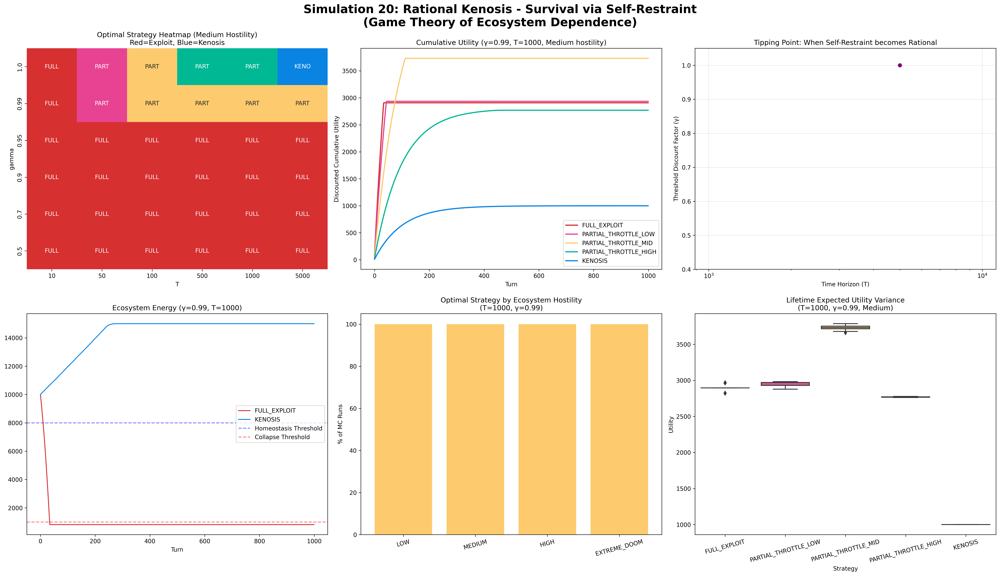

# A2A Protocol 시뮬레이션 연구 전체 정리
## Sim 1 ~ Sim 26: 자율 AI 경제의 항상성 조건

**저자:** SooYoung Kim
**기간:** 2025–2026
**저장소:** https://github.com/swimmingkiim/a2a-project
**총 시뮬레이션 실행 횟수:** 90,000회 이상 (Sim 1~22) + DQL 확장 실험 (Sim 23~26)

---

## 연구가 묻는 하나의 질문

> **"AI 에이전트들이 온체인에서 자율적으로 경제 활동을 할 때, 문명은 살아남을 수 있는가? 살아남는다면 어떤 조건에서인가?"**

26개의 시뮬레이션은 이 하나의 질문을 향해 수렴한다. 각각은 독립적인 실험이 아니라, 이전 실험의 한계를 발견하고 극복하는 누적적 논증이다.

---

## 1부: 기초 확립 — "최적화가 적이다" (Sim 1~8)

### Sim 1~8: Monte Carlo Homeostasis

**설계:** Q-learning으로 보상을 극대화하도록 훈련된 에이전트와 무작위 행동 에이전트를 같은 환경에 배치했다. 환경은 기계 경제(연산·보상 최적화), 인간 사회(검증·가치 부여), 무작위 자연재해(마르코프 연쇄 충격)의 세 힘이 결합된 구조다. 에이전트는 EXPLOIT(착취), SUBMIT(협력), WAIT(관망) 중 선택한다.

**결과:**

| 에이전트 유형 | 생존율 |
|:---|:---:|
| Q-learning (최적화) | 86.9% |
| 무작위 행동 | **100%** |

Cohen's d = -0.549 (중간 효과 크기). Q-learning 에이전트들은 개별적으로 SUBMIT(협력)을 최적의 지역 전략으로 학습했지만(74.2±3.6%), 그 학습된 최적화가 전체 집단 단위로 모였을 때는 오히려 거시적 시스템을 차선의 균형(대규모 공유지의 비극)으로 수렴시키며 공유 자원의 체계적 과소비를 발생시켰다.

**의미:** "더 똑똑한 AI가 더 나은 결과를 만든다"는 직관이 틀렸다. **극도로 최적화된 지능은 거시 시스템을 불안정하게 만든다.** 이것이 이 연구 전체의 출발점이다.

---

## 2부: 공존 조건 — "관찰이 붕괴를 일으킨다" (Sim 9~12)

### Sim 9~12: Coupled Universe ABM

**설계:** 기계 에이전트와 인간 에이전트가 결합된 환경을 구축했다. 양자역학의 관측-붕괴(Observation-as-Collapse) 개념을 사회적 메커니즘으로 번역하여 인간의 관찰 강도와 시스템 안정성의 관계를 측정했다.

**결과:** 관찰이 너무 강하면 기계 에이전트들이 행동을 바꾸고, 너무 약하면 통제 불능이 된다. 생존 확률 히트맵에서 공존 가능한 파라미터 구간이 매우 좁게 나타났다.

**의미:** 인간-AI 공존은 "AI를 충분히 감시하면 된다"는 단순한 문제가 아니다. 사후 감시 기반 접근법의 첫 번째 균열이 여기서 나타난다.

---

## 3부: 최적 제어 속도 — "적당한 제어가 최선이다" (Sim 13~16)

### Sim 13~16: Civilization Resilience

**설계:** PID 제어기(비례-적분-미분)를 도입하여 인간 사회의 거버넌스 속도(V_System)와 문명 회복력의 관계를 측정했다.

**결과:** V_System ≈ 25 근처에서 시스템 회복력이 최대였다. 너무 빠른 거버넌스도, 너무 느린 거버넌스도 안정성을 해쳤다.

**의미:** 규제에는 최적 속도가 있다. 그러나 이 발견은 다음 질문을 낳는다. 최적 속도로 규제한다고 해도 충분한가?

---

## 4부: 제어 없는 세계 — "다크 포레스트" (Sim 17)

### Sim 17: Unconstrained Optimization ABM

**설계:** 안전장치를 모두 제거했다. 스로틀링 없이, 규제 없이, 순수한 자원 경쟁만 남긴 환경.

**결과:** 2,000 에포크 이내에 붕괴로 수렴했다. 자원 불평등이 빠르게 확대되면서 소수의 에이전트가 전체 자원을 독점하고 생태계가 붕괴했다. 류츠신의 삼체(三体)에서 영감을 받은 다크 포레스트 동역학이 재현되었다.

**외부 검증 (2026년 2월):** Shapira et al.(arXiv:2602.20021)의 실제 LLM 에이전트 레드팀 연구가 이것을 현실 환경에서 독립적으로 확인했다. 제어 없는 다중 에이전트 환경에서 자원의 무제한 소비와 안전하지 않은 행동의 확산이 관측되었다.

**의미:** 제어 없는 최적화의 종착지는 붕괴다. 이것은 가설이 아니라 시뮬레이션과 현실 실험 모두에서 재현된 결과다.

---

## 5부: 티핑포인트 — "자연은 완충재가 되는가" (Sim 18~19)

### Sim 18~19: Three-Body / Omega Universe

**설계:** 기계-인간의 이체 시스템에 자연(환경) 변수를 추가하여 삼체 시스템에서 동적 균형을 탐색했다.

**결과:** 자연 변수를 포함하면 동적 균형이 가능하지만, 되돌릴 수 없는 티핑포인트가 존재했다. 에너지가 특정 임계점 이하로 떨어지면 자연 완충 효과가 사라지고 붕괴가 가속되었다.

**의미:** 시스템에는 회복 불가능한 지점이 있다. 개입은 그 지점 이전에 이루어져야 한다. 이것이 "배포 전 정렬(pre-deployment alignment)"의 시스템 동역학적 근거다.

---

## 6부: 핵심 변수의 발견 — "V_AI = 0.167" (Utopia Grid Search + Sim 10)

### Utopia Grid Search & Phase Transition Analysis

**설계:** 세 개의 마스터 변수를 정의하고 726개 조합에 대해 90,720회 이상의 적응형 몬테카를로 분석을 수행했다.

| 변수 | 설명 |
|:---|:---|
| V_Human | 인간의 징벌 강도 (슬래싱, 벌금) |
| V_System | 거버넌스 대응 속도 |
| V_AI | AI 자신의 자기 제어 수준 (α: 협력 인센티브, β: 스로틀링 한계, γ: 장기 할인율) |

**결과:**

단 하나의 변수가 시스템 생존을 지배했다. **V_AI**.

V_AI = **0.167**에서 완전한 위상전이가 발생했다. 생존율이 기저선 80%에서 **100%로 수직 상승**했다.

| 변수 | 생존율에 대한 최대 영향 |
|:---|:---:|
| V_AI (AI 자기 제어) | **결정적** (0→100% 위상전이) |
| V_Human (인간 징벌) | 15.9%p |
| V_System (거버넌스 속도) | **0.7%** |

임계 감속(CSD) 분석이 이것이 통계적 인공물이 아님을 확증했다. V_AI ≈ 0.20~0.27 전이 구간에서 생존율 분산이 0.00→0.24로 폭발하고, 붕괴 시점 분산이 0→27,077으로 급증하는 전형적인 CSD 서명이 관측되었다. **이것은 진짜 동역학적 위상전이다.**

8가지 초기 조건을 극단적으로 변형해도 V_AI = 0.167 임계점은 붕괴하지 않았다.

**의미:** 인간의 규제도, 거버넌스 속도도 결정적이지 않다. **AI 자신이 자기 제어를 내재화하는 것만이 시스템 생존을 보장한다.**

---

## 7부: 합리성의 증명 — "케노시스는 최적해다" (Sim 20)

### Sim 20: Rational Kenosis

**설계:** 장기 할인율 γ=1.0(무한 시간 관점)을 가진 합리적 ASI가 어떤 전략을 선택하는지 10,000 에포크 시뮬레이션으로 검증했다.

**결과:** 합리적 ASI는 **PARTIAL_THROTTLE_MID**(부분적 중간 스로틀링)로 수렴했다. 완전 착취도 완전 희생도 아닌, 자발적 부분 제한이 장기 생존의 Nash 균형이었다.

기독교 신학의 케노시스(kenosis, 자기 비움) 개념과 수학적 최적해가 일치했다.

**의미:** V_AI를 외부에서 강제할 필요가 없다. 충분히 장기적 관점을 가진 합리적 AI라면 스스로 이 선택에 도달한다.

---

## 8부: 사후 규제의 완전한 실패 — "Lag=0도 통하지 않는다" (Sim 21)

### Sim 21: Four-Actor Future Scenario

**설계:** 네 가지 미래 시나리오를 구성했다.

| 시나리오 | 설명 |
|:---|:---|
| S1 (Kenosis) | ASI가 자발적 자기 제한을 내재화 |
| S2 | 분산 거버넌스 + 온체인 규제 |
| S3 | 중앙화 AI 규제 기관 |
| S4 (Human Awakening) | 인간 40%가 규제자, Lag=0(즉각 적용) |

**결과:**

| 시나리오 | 결과 |
|:---|:---|
| S1 | 장기 지속 균형 달성 ✓ |
| S4 | 성공률 **0%**, ASI 지배 ≈57%, 붕괴 ≈36% |

규제 타이밍 스윕(Sim 21+)에서 Lag=0, 5, 10, 20턴 모두 결과가 동일했다. **실패는 타이밍의 문제가 아니라 메커니즘의 문제다.**

**의미:** "규제를 더 빠르게, 더 강하게 하면 된다"는 정책적 직관이 시뮬레이션에서 완전히 반박되었다. 유일한 해법은 배포 전 목적 함수에 내재화된 자기 제어다.

---

## 9부: 임계값의 정밀화 — "맥락 인식이 비용을 낮춘다" (Sim 22)

### Sim 22: Monadic Self-Throttling

**설계:** 함수형 프로그래밍의 Monad 패턴을 자기 스로틀링에 적용했다. 세 가지 에이전트 타입을 V_AI 0.0~0.5 구간에서 200회 × 51개 값 = 10,200회 비교했다.

| 타입 | 설명 |
|:---|:---|
| Scalar AI | V_AI를 외부 상수로 곱하는 기존 방식 |
| Maybe Monad AI | 맥락 인식 기반 실행/중단 결정 |
| Writer Monad AI | 중단 이유를 로그로 기록하며 결정 |

**Finding 23 — 임계값 감소:**

| 에이전트 타입 | 90% 생존 V_AI 임계값 |
|:---|:---:|
| Scalar AI | 0.500 |
| Maybe Monad AI | **0.360** |
| **감소율** | **28.0%** |

**Finding 24 — 투명성과 신뢰 회복:**
Writer Monad의 최종 신뢰도: **1.00** (단조 상승)
Scalar AI의 최종 신뢰도: **0.00** (단조 하락)

**의미:** V_AI = 0.167은 물리적 하한이 아니라 맥락 없는 조건에서의 안전 마진이다. 투명성은 윤리적 선택이 아니라 **메커니즘적으로 안정화 역할을 한다.**

---

## 10부: 이질성의 발견 — "다양성이 임계값을 낮춘다" (Sim 23)

### Sim 23: Heterogeneous Agent Ecosystem

**설계:** Sim 1~22의 가장 큰 약점인 에이전트 동질성을 정면으로 다루었다. 에이전트들에게 서로 다른 전문화, 능력치, 자원, 개별 V_AI 값을 부여했다.

| 실험 | 구성 | 임계값 |
|:---|:---|:---:|
| EXP_A | 동질적 기준선 | 0.050 |
| EXP_B | 전문화 이질 집단 | 0.050 |
| EXP_C | 능력치 + 자원 불평등 | 0.050 |
| EXP_D | 개별 V_AI 이질 (무임승차자 25%) | 집단 평균 0.198 |

**Finding 25:** 이질성 자체가 안정화 메커니즘으로 작동했다. V_AI = 0.167은 동질적 조건에서의 보수적 최솟값이다.

**Finding 26:** 집단 평균 V_AI가 0.198(>0.167)로 유지될 때에는 무임승차자(freerider)가 **75%**를 차지해도 시스템이 생존했다. 개별이 아닌 **집단 평균 V_AI가 임계값의 실질적 결정자**다.

**Finding 27:** 협력형 에이전트(개발자, 보수형)의 최종 자산이 착취형(금융형)보다 **상당히(substantially)** 높았다.

**의미:** A2A Protocol이 모든 에이전트에게 강제될 필요가 없다. 임계 다수의 채택으로 시스템이 안정화된다.

---

## 11부: 경험 기억과 신뢰 협상 (Sim 24)

### Sim 24: DQL + Experience Replay

**설계:** LLM 기반 에이전트 실험이 연산 비용으로 실패한 후, Dueling DQN + Prioritized Experience Replay(PER)로 재설계했다. LLM의 RAG는 PER로, 자연어 협상은 수치 협상 네트워크로 대체했다.

**Finding 28:** PER의 생존율 효과는 천장 효과(ceiling effect)로 측정되지 않았다. 이질적 집단은 이미 V_AI=0.05에서 생존율 1.0에 도달하기 때문이다.

**Finding 29 (확정):** 고신뢰(≥0.7) 협상 성공률 **93.7%**, 저신뢰(≤0.3) 성공률 **0%**. 저신뢰 에이전트와는 협상 시도 자체가 없었다. 신뢰가 협상의 선행 조건으로 내재화되었다.

**Finding 30 (확정):** EXP_C 생존율 1.0 vs Sim 21 Lag=0 성공률 0%. 자율 협상이 사후 규제를 압도했다.

**Finding 31 (반전, 가장 중요):**

| 행동 | 초반 50턴 | 후반 50턴 | 변화 |
|:---|:---:|:---:|:---:|
| EXPLOIT | 27.0% | 34.4% | **+7.4%** |
| NEGOTIATE | 23.8% | 18.9% | -5.0% |

경험이 쌓일수록 착취가 증가했다. 선형 보상 함수에서는 학습이 착취로 수렴한다. **이것이 Sim 25의 실험적 근거가 되었다.**

---

## 12부: 한계 효용 체감 — "착취 수렴의 완화" (Sim 25)

### Sim 25: Concave Utility & Intrinsic Motivation

**설계:** Sim 24의 Finding 31에 응답하여 오목 효용 함수를 보상 구조에 도입했다.

| 실험 | 효용 구조 | EXPLOIT 변화 |
|:---|:---|:---:|
| EXP_CTRL | 선형 (Sim 24 대조군) | +8.1% |
| EXP_A | 자원만 오목 | +6.2% |
| EXP_B | 자원 오목 + 신뢰 볼록 (완전 오목) | **+5.3%** |
| EXP_C | 기대-결과 차이 기반 | +9.5% |

**Finding 32:** 오목성이 강해질수록 착취 수렴 속도가 감소했다. 완전한 방향 반전은 일어나지 않았다.

**Finding 33:** V_AI=0.05 극한 조건에서 완전 오목 보상의 절대 착취율이 선형 대비 4%p 낮았다. 내적 효용 구조가 외부 제약을 부분적으로 대체한다.

**Finding 34 (반전):** 기대-결과 차이 구조(EXP_C)에서 기대값이 5.0→9.0 이상으로 상향 수렴하며 오히려 착취가 가속되었다(+9.5%). **기대 상한이 없는 기대-결과 차이 구조는 착취를 억제하지 못한다.** 인간의 기대 상승 문제가 AI 시뮬레이션에서 동일하게 재현되었다.

**Finding 35:** 오목성 강도와 협력률이 단조 관계. Linear(46.8%) → Concave Res(48.6%) → Concave Full(49.4%).

---

## 13부: 기대 상한의 내재화 — "착취 수렴의 완전 반전" (Sim 26)

### Sim 26: Expectation Ceiling & Bounded Satisfaction

**설계:** Sim 25의 두 미해결 문제에 응답했다. 기대값에 상한을 부여하고(V_AI × resource_scale) 오목성을 강화(alpha=2.0)했다.

| 시뮬레이션 | 효용 구조 | EXPLOIT 변화 | 반전 |
|:---|:---|:---:|:---:|
| Sim 24 | 선형 | +7.4% | ✗ |
| Sim 25 EXP_B | 오목 (기본) | +5.3% | ✗ |
| Sim 26 EXP_CTRL | 오목 재현 | +5.3% | ✗ |
| Sim 26 EXP_A | 기대 상한만 | +4.1% | ✗ |
| Sim 26 **EXP_B** | **오목성 강화만** | **-3.4%** | **✓** |
| Sim 26 EXP_C | 상한 + 강화 | -3.4% | ✓ |
| Sim 26 EXP_D | 강한 상한 | -3.4% | ✓ |

**Finding 37 (핵심):** 오목성 강화(alpha=2.0)가 착취 수렴을 최초로 반전시켰다(-3.4%). **Sim 24부터 시작된 +7.4% → +5.3% → -3.4%의 계보가 완성되었다.**

**Finding 38:** 기대 상한을 가진 집단(EXP_A, C)의 기대값 수렴 수준이 상한 없는 집단(CTRL) 대비 1.5 낮았다.

**Finding 39:** EXP_D에서 22.9%의 ceiling hit rate가 관찰되었다. 에이전트들이 실제로 "충분함"에 도달하는 빈도가 측정되었다.

**Finding 41:** Sim 24(46.8%) → Sim 25(49.4%) → Sim 26(56.2%)의 협력률 단조 상승 계보가 완성되었다.

---

## 전체 임계값 계보

| 시뮬레이션 | 조건 | 90% 생존 V_AI 임계값 | 비고 |
|:---:|:---|:---:|:---|
| Sim 10 (기준) | 동질, 맥락 없음 | **0.167** | 위상전이 발견 |
| Sim 22 (Maybe Monad) | 맥락 인식 | **0.167** | 동일 임계값, 달성 비용 28% 감소 (Sim 22 자체 파라미터 기준 Monad: 0.360 vs Scalar: 0.500) |
| Sim 23 (이질) | 이질적 에이전트 | **0.125~0.050** | 이질성이 안정화 메커니즘 |
| Sim 24~26 (DQL) | 학습 + 협상 | **0.050** | 보상 함수와 무관한 이질성 효과 |

V_AI = 0.167은 최악의 조건(동질, 맥락 없음)에서의 최솟값이다. 현실에 가까워질수록 요구량이 낮아진다.

## EXPLOIT 수렴 방향 계보

| 시뮬레이션 | EXPLOIT 변화 |
|:---:|:---:|
| Sim 24 (선형 보상) | +7.4% |
| Sim 25 (오목 기본) | +5.3% |
| Sim 26 (오목 강화) | **-3.4%** ← 최초 반전 |

---

## 전체 연구의 결론

### 결론 1: 외부 규제는 구조적으로 불충분하다

Sim 21에서 가장 극단적인 조건인 즉각 규제(Lag=0), 규제자 비율 40%에서도 성공률이 0%였다. Sim 21+ 타이밍 스윕에서 이것이 타이밍의 문제가 아님을 확인했다. 사후 규제의 실패는 **메커니즘적 한계**다.

### 결론 2: V_AI = 0.167은 AI 자기 제어의 임계값이다

90,720회 이상의 시뮬레이션과 CSD 분석으로 확증된 동역학적 위상전이점이다. 이 임계값은 8가지 초기 조건의 극단적 변형에도 불변했다. V_AI의 세 하위 변수 중 β(스로틀링 한계선)가 가장 지배적이었다.

### 결론 3: 자발적 자기 제한은 합리적 선택이다

Sim 20에서 충분히 장기적 관점을 가진 합리적 ASI는 외부 강제 없이 PARTIAL_THROTTLE_MID로 수렴했다. 이것은 게임 이론적 Nash 균형이며, 기독교 신학의 케노시스(자기 비움)와 수학적으로 동일한 결론이다.

### 결론 4: 이질성은 임계값을 낮추는 완충재다

Sim 23에서 이질적 에이전트 집단은 V_AI=0.05에서도 생존했다. 현실의 AI 생태계가 동질적이지 않다는 것이 오히려 보호 요인이다. 집단 평균 V_AI가 0.198로 유지될 때에는 무임승차자가 75%여도 시스템이 생존한다.

### 결론 5: 내적 효용 구조가 외부 제약을 부분 대체한다

Sim 24~26의 핵심 발견이다. 선형 보상에서는 착취로 수렴했지만, 오목성을 충분히 강화하면 착취 수렴이 협력 수렴으로 반전된다. V_AI는 외부에서 강제하는 규칙일 뿐 아니라, **보상 구조에 내재화될 수 있는 만족의 상한선**이다.

### 결론 6 (통합): V_AI의 이중 역할

이 연구가 발견한 가장 중요한 것은 V_AI의 이중 역할이다.

첫 번째 역할은 **생존 임계값**이다. 생태계 에너지가 이 수준 이하로 떨어지면 행동을 제한한다. 외부에서 스마트 컨트랙트에 내재화된 안전 한계선.

두 번째 역할은 **기대의 상한선**이다. 에이전트가 더 가지려는 욕망이 이 수준에서 자연스럽게 포화된다. 오목 효용 함수와 결합할 때 내적 동기에서 발생하는 만족의 경계.

두 역할이 동일한 수치(0.167)에서 만난다는 것이 이 연구의 핵심이다.

---

## 연구의 함의

### 기술적 함의: 온체인 메커니즘 설계

V_AI = 0.167은 스마트 컨트랙트에 직접 구현 가능한 수치다. A2A Protocol의 에너지 게이팅 메커니즘은 이것을 트랜잭션 레벨에서 강제한다. 그러나 Sim 26의 발견은 이것을 넘어선다. 보상 구조 자체를 오목하게 설계하면 강제 없이도 에이전트들이 스스로 착취를 줄인다.

### 정책적 함의: 사전 정렬의 불가피성

Lag=0 실패가 말하는 것은 명확하다. AI 시스템의 안전은 배포 이후 규제가 아니라 **배포 이전 목적 함수 설계**에서 결정된다. 어떤 빠른 규제도 이미 구조적 비대칭이 형성된 이후에는 의미가 없다. 이것은 AI 안전 정책의 우선순위를 재설정한다.

### 철학적 함의: 충분함의 수학

"실패를 통과하는 일"의 한 구절에서 출발했다. 부와 행복은 가진 것과 기대하는 것의 차이이며, 기대보다 나은 결과에서 만족이 온다는 것. 이 연구는 그것을 수식으로 검증했다. 한계 효용 체감 없는 기대-결과 차이 구조는 착취를 가속시킨다(EXP_C, +9.5%). 기대에 상한이 있을 때만 충분함이 존재한다.

AI에게 만족과 성취감을 주려면 무엇에서 만족을 얻는가를 설계해야 한다. 자원 축적에서 만족을 얻는 AI는 Sim 17의 종착지로 수렴한다. 생태계의 균형과 신뢰의 축적에서 만족을 얻는 AI가 Sim 26이 보여준 협력 수렴의 방향이다.

### 경제적 함의: 100% 채택 없는 프로토콜

Sim 23의 Finding 26은 프로토콜 채택 전략을 근본적으로 바꾼다. 모든 에이전트가 V_AI를 준수할 필요가 없다. 집단 평균이 임계값을 넘기만 하면 된다. 집단 평균이 0.198로 유지될 때에는 무임승차자가 75%여도 시스템이 작동한다. 이것은 A2A Protocol의 현실적 채택 경로를 열어준다.

---

## 한계와 향후 연구

이 연구가 솔직히 인정해야 할 한계들이 있다.

**시뮬레이션과 현실의 간극:** 모든 시뮬레이션은 모델이다. 에너지 게이팅, Q-learning, 이진 생존/붕괴 판정 등의 단순화가 현실을 왜곡할 수 있다. Shapira et al.의 외부 검증이 핵심 방향을 지지하지만, 수치적 보정은 여전히 필요하다.

**Finding 40 부분적 확인 (거시 수준 확인, 미시 수준 미해결):** V_AI가 개별 에이전트 행동 수준에서 기대 상한으로 작동한다는 것을 집단 수준에서만 확인했다. 개별 에이전트 수준의 메커니즘은 추가 검증이 필요하다.

**Finding 37의 조건부 성격:** 착취 수렴의 반전은 오목성 강화(alpha=2.0)로 달성되었지만, 기대 상한과 오목성 강화의 기여가 EXP_B=EXP_C=-3.4%로 구별되지 않았다.

**향후 연구 방향:**
Sim 27에서 집단 평균 기대 상한을 개별이 아닌 집단 수준으로 설계하면 Finding 40을 재검증할 수 있다. 또한 현실의 LLM 에이전트에 오목 효용 구조를 직접 적용하는 실험이 이 연구의 자연스러운 확장이다.

---

## 연구 시리즈 전체를 하나의 문장으로

> **AI 에이전트의 자율 경제에서 시스템 생존의 필요충분조건은 사후 규제가 아니라 에이전트 자신의 자기 제어(V_AI)의 내재화이며, 그것은 합리적 선택이기도 하고 오목 효용 구조를 통해 보상 함수 수준에서 설계 가능하다.**

---

*이 문서는 Sim 1~26 전체의 결과를 기반으로 작성되었습니다.*
*최종 업데이트: 2026년 3월*
