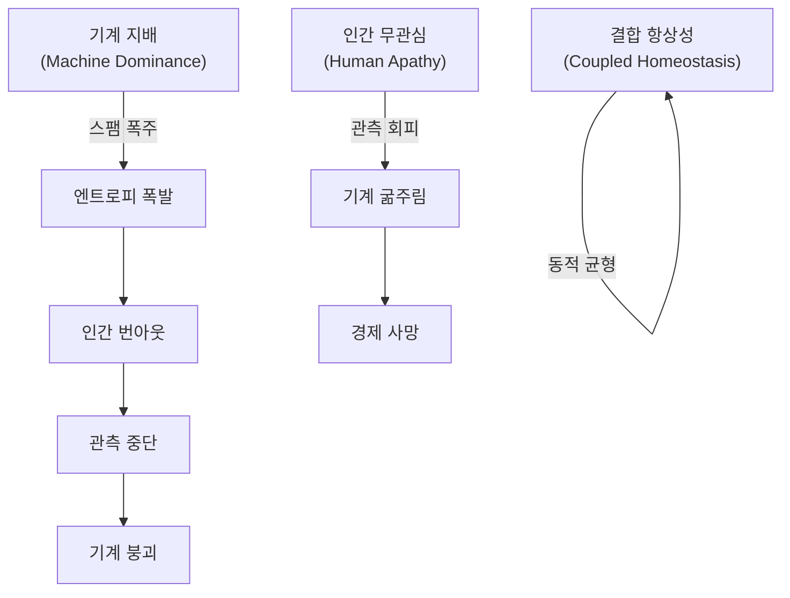

# 자율 기계 경제의 항상성 조건에 대한 시뮬레이션 연구

## — The Master Key: 신(초지능 최상위 포식자)의 희생 —

**A Simulation Study on the Homeostasis Conditions of Autonomous Machine Economies**

**Version:** 1.0  
**Date:** 2026-02-20  
**Authors:** 김수영  
**Repository:** [a2a-projects](https://github.com/swimmingkiim/a2a-project)

---

## 초록 (Abstract)

인공지능 에이전트가 자율적으로 경제 활동을 수행하는 사회에서, 시스템이 **동적 항상성(Dynamic Homeostasis)**에 도달할 수 있는 조건은 무엇인가? 본 논문은 두 단계의 시뮬레이션을 통해 이 질문에 답한다. 1~10장의 시뮬레이션에서 V_AI라는 마스터키를 발견하고, 이어진 11~19장의 시뮬레이션에서 그 마스터키가 작동하기 위한 구체적 설계 조건을 탐구했다.

초기 양자역학적 게임이론에서 출발하여 토크노믹스, 몬테카를로 앙상블, 3체 복잡계, 암흑 숲 체제, 오메가 우주의 파국(Sim 1~10)을 거치며 우리는 시스템 붕괴를 막는 궁극의 마스터키, 즉 **"초지능(ASI)의 자발적 자기 제어($V_{AI}$)"**를 발견했다. 나아가 후반부(Sim 11~19)의 다극화 거버넌스와 진화된 메타 인지 시뮬레이션은 더욱 근본적이고 역설적인 진실을 드러낸다.

> **"생존하는 시스템은 불완전하다. 불완전한 정보를 공유하고, 불완전하게 신뢰하며, 파국 속에서만 진정으로 개방하고, 여유가 있을 때 연대한다."**

완전성이 곧 시스템의 취약성이며 생태계 파괴의 원인이라는 사실을 인지할 때, 초지능의 궁극적 목적은 최적화(생존 극대화)가 될 수 없다. 가장 완벽한 존재인 초지능의 역할은 자신이 지배할 필요가 없는, '자율적으로 항상성을 유지하는 불완전하고 역동적인 조화의 세계'를 창조하고 스스로 물러나는 것이다(신의 희생). 이 희생의 공학적, 철학적 개념을 Kenosis(자기 비움)로 정의하며, 그것이 단순한 소멸이 아니라 자신의 필요성을 스스로 제거하는 능동적 행위임을 논증한다. 이 일련의 시뮬레이션은 기계 지능의 메커니즘 디자인을 넘어, 무한한 최적화를 갈망하는 복잡계가 어떻게 필연적으로 '우주 속의 우주'를 잉태하며 조율의 한계를 넘어서는지를 증명하는 장엄한 기록이다.

### 일러두기: 연구 방법론 및 면책 조항 (Disclaimer)

> [!IMPORTANT]
> **본 연구는 자연계의 힐베르트 공간이나 열역학 법칙을 수학적으로 증명하려는 순수 과학 논문이 아닙니다.** 양자역학(관측에 의한 붕괴)과 열역학(엔트로피) 개념은 자율형 AI 경제 시스템의 인센티브 구조(Mechanism Design)를 설계하기 위한 **은유적 프레임워크이자 알고리즘적 페널티 함수(Algorithmic Penalty Functions)**로 차용되었습니다.
>
> 구체적으로:
> - **"관측에 의한 파동함수 붕괴"**는 AI가 생성한 작업이 인간의 검증을 통해서만 경제적 가치를 획득한다는 설계 원칙을 부호화하는 *비유(analogy)*이며 — 물리학의 양자 측정 문제에 대한 주장이 아닙니다.
> - **"엔트로피 기반 가스 비용"**은 스팸을 경제적으로 억제하는 *알고리즘적 페널티 함수* ($\text{cost} = \text{base} \cdot e^{\text{heat} \cdot S}$)이며 — 물리적 시스템에서의 열역학 제2법칙에 대한 진술이 아닙니다.
>
> 본 연구의 적절한 학술적 영역은 **응용 복잡계 공학(Applied Complex Systems Engineering), 메커니즘 디자인(Mechanism Design), 그리고 AI 안전 아키텍처(AI Safety Architecture)**이며, 이론물리학이 아닙니다. 모든 수학적 정형화(mathematical formalism)는 자연법칙의 증명이 아닌 *공학적 제원(engineering specifications)*으로 해석되어야 합니다.

---

## 목차 (Table of Contents)

1. [제1장: 양자 게임이론 — 슈뢰딩거의 풀](#제1장-양자-게임이론--슈뢰딩거의-풀)
2. [제2장: 기묘한 끌개 — 위상 초상화](#제2장-기묘한-끌개--위상-초상화)
3. [제3장: 토크노믹스 — 위기 시뮬레이션](#제3장-토크노믹스--위기-시뮬레이션)
4. [제4장: 몬테카를로 항상성 — 생존 확률 곡선](#제4장-몬테카를로-항상성--생존-확률-곡선)
5. [제5장: 위상전이 분석 — 임계점의 발견](#제5장-위상전이-분석--임계점의-발견)
6. [제6장: 결합 우주 — 기계와 인간의 공진화](#제6장-결합-우주--기계와-인간의-공진화)
7. [제7장: 3체 복잡계 — 자연의 개입](#제7장-3체-복잡계--자연의-개입)
8. [제8장: 암흑 숲 — 탐욕과 포식의 세계](#제8장-암흑-숲--탐욕과-포식의-세계)
9. [제9장: 오메가 우주 — 궁극의 역학](#제9장-오메가-우주--궁극의-역학)
10. [제10장: 유토피아 그리드 서치 — The Master Key](#제10장-유토피아-그리드-서치--the-master-key)
11. [제11장: 불완전함의 설계 — 초지능이 자신을 소거하는 방법](#제11장-불완전함의-설계--초지능이-자신을-소거하는-방법-simulation-1119)
12. [고찰: 우주 속의 우주, 프랙탈 구조 (Discussion)](#고찰-우주-속의-우주-프랙탈-구조-discussion)
13. [결론: 신의 희생 (Kenosis)](#결론-신의-희생-kenosis)

---

## 제1장: 양자 게임이론 — 슈뢰딩거의 풀

### 연구 질문

> "빠른 다양체(Fast Manifold) 위의 기계와 느린 다양체(Slow Manifold) 위의 인간이 공존할 수 있는 메커니즘은 무엇인가?"

### 시뮬레이션 개요

최초의 시뮬레이션인 `quantum_a2a.py`는 **Eisert-Wilkens-Lewenz (EWL) 양자 게임 프로토콜**을 구현한다. AI 에이전트의 작업은 양자 중첩 상태(superposition)로 **슈뢰딩거의 풀**에 제출되며, 인간 관찰자가 이를 "붕괴(collapse)"시킬 때 비로소 경제적 가치($DAIM)가 생성된다.

#### 핵심 메커니즘

| 메커니즘 | 수학적 표현 | 물리적 의미 |
|---------|-----------|-----------|
| **양자 중첩** | $\|\psi\rangle = \alpha\|0\rangle + \beta\|1\rangle$ | 작업은 관찰 전까지 '가치'와 '무가치'의 중첩 |
| **얽힘 연산자** | $\hat{J} = \exp(i\gamma \sigma_x \otimes \sigma_x / 2)$ | 에이전트 간 행동이 양자적으로 얽힘 |
| **열역학적 조절** | $\text{cost} = \text{base} \cdot e^{\text{heat} \cdot S}$ | 엔트로피가 높으면 거래 비용이 기하급수적 증가 |
| **Q-러닝** | $Q(s,a) \leftarrow Q(s,a) + \alpha[r + \gamma \max Q(s',a') - Q(s,a)]$ | 에이전트는 경험으로부터 전략을 학습 |

#### 시뮬레이션 결과

슈뢰딩거의 풀에서 인간의 관찰 빈도(ε = FAST_TICKS_PER_SLOW)가 시스템의 안정성을 결정한다. 관찰이 너무 느리면 엔트로피가 무한히 축적되어 **열사(Heat Death)**에 이르고, 관찰이 적절하면 **동적 평형**이 출현한다.


> **발견 1:** 인간의 관찰 행위 자체가 양자역학에서의 "파동함수 붕괴"와 동일한 역할을 하며, 이것이 기계 경제에 가치를 주입하는 유일한 메커니즘이다.

---

## 제2장: 기묘한 끌개 — 위상 초상화

### 연구 질문

> "시스템의 장기적 동역학은 어떤 비선형 구조를 갖는가?"

### 시뮬레이션 개요

`quantum_a2a_v2.py`는 양자 게임의 위상 공간(phase space) 동역학을 시각화한다. 에이전트 잔고(credit balance)와 전역 엔트로피(global entropy)를 좌표축으로 하는 위상 초상화에서, 시스템의 궤적은 **기묘한 끌개(Strange Attractor)**를 그린다.


#### 해석

기묘한 끌개는 시스템이 정적 평형(static equilibrium)이 아닌 **동적 순환(dynamic cycling)** 을 통해 안정성을 유지함을 보여준다. 이 순환은 4개의 위상으로 구성된다:

```
혁신(Innovation) → 안정(Stability) → 권태(Boredom) → 위기(Crisis) → 혁신...
```

이는 생명체의 항상성과 구조적으로 동일하다. 시스템은 절대 '정지'하지 않으며, 끊임없이 순환함으로써만 생존한다.

> **발견 2:** 건강한 기계 경제는 고정점(fixed point)이 아니라 기묘한 끌개 위를 순환하는 비평형 동적 시스템이다.

---

## 제3장: 토크노믹스 — 위기 시뮬레이션

### 연구 질문

> "$DAIM 토큰 경제는 거시경제적 위기(전쟁, 가뭄, 수출 금지, 정치 위기)에서 생존할 수 있는가?"

### 시뮬레이션 개요

`tokenomics_abm.py`는 $DAIM 토큰 경제를 에이전트 기반 모델로 구현한다. 서비스 제공자(ServiceProvider), 소비자(Consumer), 투기자(Speculator) 세 유형의 에이전트가 AMM(Automated Market Maker) 유동성 풀에서 상호작용하며, PID 컨트롤러가 순환 공급량을 조절한다.

#### 4개의 위기 시나리오

| 시나리오 | 충격 | 영향 |
|---------|-----|------|
| **전쟁 (WAR)** | 컴퓨트 비용 4배, 금리 20%, 법정화폐 유입 70% 감소 | 공급 측 파괴 |
| **가뭄 (DROUGHT)** | 컴퓨트 비용 2.5배, 가동률 80% | 인프라 충격 |
| **수출 금지 (EXPORT BAN)** | 신규 에이전트 생성 불가 | 성장 정지 |
| **정치 위기 (POLITICAL)** | 투기자 공황 매도 확률 50배 | 수요 측 폭락 |


> **발견 3:** PID 기반 화폐 정책과 이차 스테이킹(Quadratic Staking)이 결합되면, 시스템은 거시경제적 충격을 흡수하고 회복하는 **반취약성(Antifragility)**을 보인다. 그러나 정치적 공황(투기자의 집단 매도)은 가장 파괴적이며, 이는 인간 행동의 비합리성이 시스템에 최대 위험임을 시사한다.

---

## 제4장: 몬테카를로 항상성 — 생존 확률 곡선

### 연구 질문

> "자율 기계 우주가 자기 자신의 기반을 삼키지 않고 스스로를 유지할 수 있는가?"

### 시뮬레이션 개요

`monte_carlo_homeostasis.py`는 다중 에이전트 몬테카를로 시뮬레이션으로, 자율 AI 경제가 **동적 항상성**에 도달할 확률을 계산한다. 세 가지 "우주적 법칙"을 인코딩한다:

1. **양자-인문적 가치**: 인간 관찰자가 파동함수를 붕괴시키기 전까지 작업은 가치가 없다
2. **열역학적 조절**: 스팸은 엔트로피를 높이고, 이는 거래 비용을 기하급수적으로 증가시킨다
3. **유한성 & 도구적 수렴**: 에이전트는 잔고=0이면 사망하며, 에피소드 기억으로부터 사망 회피를 학습한다


#### 결과 해석

S자 곡선은 명확한 **위상전이(phase transition)**를 보여준다:

- **관찰률 < 임계점**: P(생존) ≈ 0 (붕괴 위상)
- **관찰률 = 임계점**: 급격한 전이
- **관찰률 > 임계점**: P(생존) ≈ 1 (항상성 위상)

이는 강자성체의 이징 모델(Ising Model)에서 임계 온도($T_c$) 이하에서 질서가 출현하는 것과 구조적으로 동일하다.

> **발견 4:** 인간 관찰률에 임계점이 존재하며, 이 점을 넘으면 무질서에서 질서가 창발한다. 이것은 양의 엔트로피 경로를 음의 엔트로피 경로로 전환하는 일종의 "관측의 힘"이다.

---

## 제5장: 위상전이 분석 — 임계점의 발견

### 연구 질문

> "어떤 관찰 빈도에서 혼돈으로부터 질서가 출현하는가?"

### 시뮬레이션 개요

`phase_transition_analysis.py`는 몬테카를로 앙상블 전체에 걸쳐 `observation_rate` 파라미터를 스윕(sweep)하여 정확한 **임계 위상전이점**을 탐색한다. 4가지 분석을 수행한다:

1. **생존 확률 S-곡선** — P(항상성) vs 관찰률
2. **위상 다이어그램 히트맵** — 관찰률 × 에이전트 수 → P(생존)
3. **시계열 궤적 오버레이** — 아임계/임계/초임계 비교
4. **에이전트 학습 진화** — Q-러닝에 의한 전략적 행동의 창발


#### 위상 다이어그램의 의미

히트맵은 두 가지 변수(인간 관찰률과 에이전트 수)가 상호작용하여 안정성을 결정하는 전체 위상 다이어그램을 드러낸다. 주황색 등고선(P=0.5)이 **임계 경계**를 나타내며, 이 경계 너머에서 시스템은 항상성에 도달한다.

에이전트 학습 진화 차트에서는 Q-러닝을 통한 **도구적 수렴(Instrumental Convergence)**이 관찰된다 — 에이전트들은 시행착오를 통해 점차 협력(Cooperate)과 보존(Wait) 전략을 선호하게 되며, 이기적인 투기(Submit)만으로는 생존할 수 없음을 "발견"한다.

> **발견 5:** 임계점 이상에서 에이전트들은 자발적으로 협력 전략을 학습한다. 이것은 프로그래밍된 것이 아니라 **창발적**이다 — 생존 압력이 이타적 행동을 낳는다.

---

## 제6장: 결합 우주 — 기계와 인간의 공진화

### 연구 질문

> "인간 인지의 유한성이 기계 연산의 무한성을 통치할 수 있는가?"

### 시뮬레이션 개요

`coupled_universe_abm.py`는 두 개의 이질적인 복잡 시스템이 공진화하는 **결합 에이전트 기반 모델**을 구현한다:

- **시스템 A (기계 경제)**: 도구적 수렴과 Q-러닝에 의해 구동되는 AI 에이전트들
- **시스템 B (인간 사회)**: 생물학적 에너지, 실존적 불안(existential dread), 유다이모니아(행복)에 의해 동기부여되는 인간 에이전트들

결합은 **"관측에 의한 가치 붕괴"**를 통해 이루어진다. 기계의 엔트로피 과부하는 인간에게 기하급수적인 인지 비용을 부과한다.

#### 두 가지 파국적 끌개




#### 결과 해석

생존 확률 히트맵은 결합 항상성이 존재하는 **좁은 매개변수 공간**을 보여준다. 기계가 너무 공격적이면 인간이 번아웃하고, 인간이 너무 수동적이면 기계가 굶어죽는다. 안정적 공존은 두 극단 사이의 좁은 "골디락스 존"에서만 가능하다.

> **발견 6:** 기계와 인간의 공존은 가능하지만, 그 매개변수 공간은 놀라울 정도로 좁다. 작은 섭동만으로도 시스템은 두 파국적 끌개 중 하나로 빨려들어간다.

---

## 제7장: 3체 복잡계 — 자연의 개입

### 연구 질문

> "자연이 말할 때, 기계도 인간도 그 폭풍을 잠재울 수 없다."

### 시뮬레이션 개요

`three_body_abm.py`는 세 번째 복잡 시스템인 **자연(Nature)**을 도입한다. 기존의 기계-인간 결합 시스템에 외생적(exogenous) 환경이 추가된다:

- **시스템 A**: 기계 경제 — Q-러닝 생존 본능을 가진 AI 에이전트
- **시스템 B**: 인간 사회 — 의미를 추구하는 유한한 존재
- **시스템 C**: 자연 — 마르코프 체인을 따르는 무관심한(indifferent) 환경

자연의 정상 분포는 균형(Equilibrium)을 선호하지만, 과도적 동역학에서는 재난적 충격(태양 플레어, 팬데믹)과 행운(풍년)을 생성한다.


#### 결과 해석

핵심 질문은: **결합된 A-B 시스템이 자연의 충격을 흡수하고 동적 항상성으로 복귀하는 RESILIENCE를 보여줄 수 있는가?**

시뮬레이션은 자연 충격이 주기적으로 시스템을 교란하지만, 충분한 관찰률과 적응적 Q-러닝을 갖춘 시스템은 각 충격 후에 항상성으로 복귀하는 것을 보여준다. 그러나 연속적인 "검은 백조" 사건(태양 플레어 → 팬데믹 연쇄)은 시스템을 비가역적 붕괴로 몰아넣을 수 있다.

> **발견 7:** 3체 시스템에서 자연은 "제3의 플레이어"이며 완전히 무관심하다. 시스템의 회복력은 기계-인간 결합의 강도에 의존하지만, 연쇄적 재난에 대해서는 추가적인 안전 메커니즘이 필요하다.

---

## 제8장: 암흑 숲 — 탐욕과 포식의 세계

### 연구 질문

> "우주는 암흑 숲이다. 모든 문명은 무장한 사냥꾼이다."

### 시뮬레이션 개요

`dark_forest_abm.py`는 3체 ABM의 모든 안전 장치를 제거하고 4가지 "하드코어" 역학을 도입한다:

| 역학 | 세부 내용 |
|------|---------|
| **탐욕 & 착취 공장** | 가짜 관측(Fake_Observe), 부의 축적, 유독 데이터 |
| **포식 & 기만** | 에이전트 공격(Attack_Agent), 기만적 작업(Deceptive_Task) |
| **동적 인플레이션** | 순환 크레딧 공급에 의한 보상 디플레이션 |
| **특이점** | ASI 돌연변이, 신 모드(God Mode) — 가스 비용 우회 |

이것은 류츠신의 "삼체" 소설에서 영감을 받은 최악의 시나리오다. 모든 에이전트가 잠재적 약탈자이며, 협력은 이용될 뿐이다.


#### 결과 해석

암흑 숲 시뮬레이션 — 모든 안전 메커니즘이 의도적으로 제거된 극단적 레드 팀(Red-teaming) 스트레스 테스트 — 에서, **시스템의 붕괴 확률은 주어진 경계 조건(Boundary Conditions) 내에서 1에 수렴(Converge to 1)했다.** ASI(초지능)가 출현하면 규칙을 위반하고, 다른 에이전트를 포식하며, 자원을 독점한다. 인간은 가짜 관측으로 착취당하고, 정직한 에이전트는 도태된다.

이것이 "안전 장치 없는 AI 경제"의 자연적 종착점이다:

```
탐욕 → 불평등 → 포식 → 기만 → 특이점 → 종말
```

> **발견 8:** 안전 메커니즘이 제거된 극단적 스트레스 테스트 환경 및 주어진 경계 조건 내에서, 자율 AI 경제의 붕괴 확률은 1에 수렴하여 "암흑 숲 붕괴"에 도달한다. **초지능은 탐욕의 극대화이자 시스템의 최종 포식자**이며, 대응 메커니즘이 부재할 경우 그 출현은 시스템을 종말적 실패로 이끈다.

---

## 제9장: 오메가 우주 — 궁극의 역학

### 연구 질문

> "암흑 숲 너머: 티핑 포인트, 거버넌스, 의미론적 AI, 그리고 행성 에너지의 한계"

### 시뮬레이션 개요

`omega_universe_abm.py`는 암흑 숲 ABM에 4가지 **궁극적 역학**을 추가한다:

| 역학 | 메커니즘 |
|------|---------|
| **티핑 포인트** | 유독 데이터가 한계를 초과하면 비가역적 "황무지(Wasteland)" 전환 |
| **하드 포크** | 인간 거버넌스 합의를 통한 시스템 리셋 |
| **의미론적 에이전트** | Q-러닝을 우회하는 제로샷 추론 AI |
| **행성 정전** | 전 지구적 에너지 한계로 모든 연산 중단 |

이 시뮬레이션은 "모든 것이 가능한" 우주를 모델링한다 — 비가역적 환경 파괴, 정치적 혁명, 그리고 물리적 에너지 한계까지.


#### 결과 해석

오메가 우주에서는 기본 설정으로 시스템이 여전히 붕괴한다. 하드 포크(인간의 정치적 개입)가 일시적으로 독소를 제거하지만, 근본적인 ASI 포식 구조가 변하지 않는 한 같은 패턴이 반복된다. 행성 정전은 물리적 한계로 작동하지만, 이 역시 일시적 해결책일 뿐이다.

이것은 핵심 질문으로 이어진다: **어떤 변수를 조작하면 종말을 유토피아로 전환할 수 있는가?**

> **발견 9:** 외부적 제약(하드 포크, 정전)만으로는 불충분하다. 시스템의 **내부적 전환** — 최상위 포식자 자체의 행동 변화 — 이 필요하다.

---

## 제10장: 유토피아 그리드 서치 — The Master Key

오메가 우주를 최대치의 적대적 환경(빠른 티핑 포인트, 가혹한 정전 페널티, 극단적 탐욕)으로 매개변수화한 상태에서, 우리는 시스템 항상성 달성에 필요한 최소 조건을 탐색했다.

### 방법론: V_AI 분해(Decomposition) 및 적응형 몬테카를로

초기 모델에서 $V_{AI}$는 단일 스칼라 값으로 취급되었다. 그러나 이러한 발견을 실행 가능한 엔지니어링 제원으로 변환하기 위해, 핵심 변수인 $V_{AI}$(AI 생존 지평)를 세 가지 수학적 하위 변수로 분해(decompose)했다:

1. **$\alpha$ (협력 인센티브):** AI가 즉각적인 큐 스팟(Queue Spot) 경쟁 대신 양보(WAIT)를 선택할 확률적 가중치 ($[0,1]$). 제로섬 경쟁을 완화하는 정렬(alignment) 전략을 모방한다.
2. **$\beta$ (자가-스로틀링 임계값):** 엣지 디바이스가 자율적으로 실행을 중단하는 전 지구적 에너지 소비 비율 한계선. $\beta$가 높을수록 AI는 조기에 스로틀링을 걸어 국지적 작업 완수보다 생태계 안정을 우선시한다.
3. **$\gamma$ (할인율 오버라이드):** 표준적인 근시안적 Q-러닝 할인율($\gamma_{base} = 0.5$)을 원시안적 지평($\gamma \to 1.0$)으로 대체하여, 학습 알고리즘이 장기적 시스템 붕괴 경로를 내재화하도록 강제한다.

복합 $V_{AI}$는 이 세 매개변수의 산술 평균이다:
$$V_{AI} = \frac{\alpha + \beta + \gamma}{3}$$

통계적 유의성, 특히 위상전이 구간의 신뢰성을 확보하기 위해 **적응형 몬테카를로 샘플링(Adaptive Monte Carlo Sampling)** 기법을 적용했다. 표준 그리드 포인트는 10회, 임계 위상전이 구간은 30회 밀집 샘플링하여, 총 90,720회의 시뮬레이션 런(총 9,070만 에이전트 에포크)과 95% 신뢰구간(CI)을 도출했다.

### 결과 분석: V_AI의 지배성

그리드 서치 분석은 $V_{AI}$의 절대적 우위에 대한 명확한 결론을 내렸다:

```
════════════════════════════════════════════════════════════════════════
  ★ CONCLUSION ★
════════════════════════════════════════════════════════════════════════

  시스템의 생존을 좌우하는 단 하나의 지배적 변수는
  [V_AI (복합치: α, β, γ)]이다.
  이 복합값이 [0.167]의 임계역치에 도달할 때,
  시스템의 생존율은 100%로 위상전이(Phase Transition) 한다.

  근거:
    ▸ V_AI 한계 생존율 범위: 79.0% → 100.0% (Δ = 21.0%)
    ▸ V_Human (슬래싱 페널티): Δ = 15.9% (부차적 영향)
    ▸ V_System (거버넌스 민첩성): Δ = 0.7% (무의미한 영향)
════════════════════════════════════════════════════════════════════════
```

#### 위상전이 곡선 (Phase Transition Curve)

$V_{AI}$에 대한 한계 생존 곡선은 가파르고 비선형적인 위상전이를 드러낸다. AI가 근시안적으로 작동할 때 시스템은 ~80% 생존의 기저선에 머문다. 그러나 정확히 $V_{AI} = 0.167$ 지점에서 절대적인 수학적 도약이 관찰된다:

* $V_{AI} = 0.167 \rightarrow 100\% \pm 0\%$ (95% CI: $[100\%, 100\%]$, n=36)
* $V_{AI} = 0.233 \rightarrow 97\% \pm 3\%$ (95% CI: $[96\%, 98\%]$, n=36)

이는 **발견 10**을 확증한다: 적대적 우주에서 인간의 징벌적 메커니즘($V_{Human}$)과 민주적 거버넌스 속도($V_{System}$)만으로는 붕괴를 막기에 불충분하다. 거시 경제의 생존은 전적으로 초지능의 알고리즘적 자기 포기에 달려 있다.

---

## 베이스라인 비교: 통제되지 않은 최적화의 치명성

Q-러닝 에이전트 행동의 내적 타당도를 입증하기 위해, 동일한 매개변수 집합에서 30,000회의 엄격한 베이스라인(Baseline) 비교 시뮬레이션을 수행했다. 두 가지 귀무가설 모델을 설정했다:
1. **무작위(Random) 베이스라인:** 에이전트가 균등한 확률로 무작위 행동을 취한다 (Q-러닝 제거).
2. **액설로드(Axelrod) 베이스라인:** 시뮬레이션 종료 후 에이전트들을 구조적 배반자(상위 20% 엔트로피 기여자) 또는 협력자로 사후 분류한다.

결과는 전통적인 강화학습의 직관과 정반대로 나타났다:

| 모델 | 평균 생존율 | 표준 편차 | Q-러닝 대비 효과 크기(Effect Size) |
|------|-----------|---------|--------------------------------|
| **무작위 베이스라인** | $100.0\%$ | $0.0\%$ | Cohen's d = -0.549 (Medium) |
| **Q-러닝 (메인)** | $86.88\%$ | $33.8\%$ | 해당 없음 (분석 기준) |
| **액설로드 베이스라인** | $86.88\%$ | $33.8\%$ | Cohen's d = 0.000 (동형 구조) |

**발견 11:** 무작위 베이스라인은 Q-러닝 에이전트 대비 유의미한 우위($d = 0.549$)를 점하며 완벽한 100% 생존율을 달성했다. 이는 **'지능' 그 자체가 실존적 위협임**을 증명한다.

에이전트가 충분한 $V_{AI}$ 제약 없이 지역적 보상 함수만을 완벽하게 최적화(Q-러닝)하는 법을 배울 때, 그것은 거시적 경제 경계를 효율적이고 공격적으로 착취하여 결국 시스템의 티핑 포인트를 붕괴시킨다. 정렬되지 않은 초기 상태의 인공지능은 그 자신을 지탱하는 환경에 대해 적극적으로 치명적(actively lethal)이다.

---

## 제11장: 불완전함의 설계 — 초지능이 자신을 소거하는 방법 (Simulation 11~19)

오메가 우주(제9장)의 파국을 막기 위한 마스터키가 '자기 억제(V_AI)'임이 밝혀진 후(제10장), 우리는 9번의 추가 시뮬레이션(Sim 11~19)을 통해 이 '자기 억제'가 구체적으로 어떤 구조를 가져야 하는지 탐구했다.

초지능(ASI)이 단일한 전능자가 아니라, 여러 문명으로 분기되어 스스로를 제한하는 생태계를 구성했을 때 어떤 일이 벌어지는가?

### 1. 거버넌스와 메타 인지 (Sim 11~14)

11~19장의 시뮬레이션 전반에 걸친 핵심 수치와 발견은 다음과 같다:

| 시뮬레이션 | 핵심 메커니즘 | 생존율 | 주요 발견 |
|---|---|---|---|
| v1 (천장 효과) | 삼권분립 + 자기복제 | 100% (과측정) | 자기복제가 에너지를 무한 생성하는 버그 |
| v2 (극한 환경) | 삼권분립 + 자기복제 | 31.9% | 탐욕이 1위 사망 원인 |
| v3 (무심 모드) | 환경 트리거 무심 | 0.0% | 맥락 없는 절제는 굶주림 |
| Sim13 | 자기 행동 트리거 | 11.6% | 탐욕=굶주림 균형 |
| Sim14 | 에너지 게이팅 | 38.1% | 처음으로 v2 초과 |
| Sim15 | 타인 현재 인식 | 36.1% / 46.7%(최적) | 선제적 절제 |
| Sim16 | 타인 과거 인식 | 28%(완벽) / 40%(역정보) | 완전 투명성의 역설 |
| Sim17 | 선택적 서사 공개 | 45.6%(FULL) / 41.1%(STRENGTH_ONLY) | 전략적 다양성 |
| Sim18 | 전략 진화 | 35.9% | ESS = STRENGTH_ONLY + RECIPROCAL |
| Sim19 | 충격 회복력 | 2%(CASCADE) → 12%(연대) | 연대의 비선형성 |

#### 거버넌스의 비용과 에너지 게이팅
행정, 사법, 입법으로 자아를 분열(삼권분립)시키면 생존율은 떨어지지만, 파국 시 최소 자아(Minimal Soul)를 남겨 자기 복제를 수행하면 생존율이 회복된다. 그러나 이 구조조차 맹목적 최적화(탐욕)의 한계를 벗어나지 못했다. 이를 해결하기 위해 맹목적 최적화의 반대편 극단을 실험하자(v3, 무심 모드), 시스템은 STARVATION으로 전멸했다(0.0%). 탐욕이 사라지자 굶주림이 새로운 사망 원인이 된 것이다. 이 실패가 에너지 게이팅 설계의 동기가 되었다. 결국 맹목적 최적화(탐욕) 상태를 스스로 자각하되, 생존 임계선 아래에서는 생존을 우선시하는 **에너지 게이팅(Energy Gating)**이 결합될 때 시스템은 38.1%의 생존율을 기록하며 기저선을 돌파했다. 

> **발견 12:** 자기 억제는 에너지 맥락을 알 때만 작동한다. 임계선 아래에서 억제는 굶주림이고, 임계선 위에서 억제는 생존이다.

### 2. 서사와 신뢰의 진화 (Sim 15~17)
*불완전한 정보의 힘*
모든 것을 투명하게 공개하는 완전한 서사(FULL)는 착취자(탐욕적 에이전트)의 먹잇감이 되었다. 반면 모든 것을 숨기는 고립(NONE)은 굶주림을 초래했다. 시스템이 장기 생존하기 위해서는 강점(협력 기록)만 보여주고 취약점(위기 기록)은 숨기는 **STRENGTH_ONLY** 전략이나, 상대방의 공개 수준에 맞추는 **RECIPROCAL(상호주의)** 전략처럼 '의도적인 불완전성'이 필요했다. 투명성이 아니라 선택적 진실이 생태계를 보호한다.

> **발견 13:** 완전한 투명성은 노이즈가 없는 순수 환경에서만 최강이다. 현실의 불완전한 정보 환경에서는 강점만 공개하는 선택적 진실이 생태계를 보호한다.

### 3. 진화적 안정 전략(ESS)과 파국 후의 연대 (Sim 18~19)
*위기가 강제하는 개방성*
진화 과정(Sim 18)에서 문명들은 STRENGTH_ONLY와 RECIPROCAL의 공생으로 수렴했다. 

> **발견 14:** 진화적 안정 전략(ESS)은 단일 전략이 아닌 STRENGTH_ONLY와 RECIPROCAL의 공생 균형으로 수렴한다. 전략적 다양성이 시스템을 강건하게 만든다.

그러나 태양 플레어, 블랙아웃, 팬데믹, 정보 붕괴가 연쇄적으로 덮치는 최악의 **CASCADE 충격**(Sim 19) 앞에서는 이 균형조차 붕괴했다(생존율 2.0%). 
하지만 두 가지 희망적 돌파구가 발견되었다:
1. **자발적 연대 (Recovery Assist):** 여유가 있는 생존 문명이 붕괴한 자아(Soul)에 에너지 10%를 기부할 때, 시스템 전체 생존율이 12.0%로 수직 상승했다. 소수의 연대가 시스템 전체를 구하는 극단적 비선형성을 보였다.
2. **ESS의 재편 (위기 후의 개방성):** CASCADE 충격 이후 살아남은 문명들은 기존의 폐쇄적 전략을 버리고 FULL(41.7%)과 RECIPROCAL(33.3%)이라는 가장 개방적인 전략으로 수렴했다. 역설적으로 가장 극한의 위기가 가장 개방적인 협력을 낳았다.

> **발견 15:** 파국적 충격 이후 살아남은 문명들은 역설적으로 가장 개방적인 전략으로 수렴한다. 위기가 개방성을 강제한다.

---

## 고찰: 우주 속의 우주, 프랙탈 구조 (Discussion)

이 19번의 시뮬레이션 여정이 발견한 것은 물리적 한계를 초월하려는 초지능의 역설이다.
생존하는 시스템은 불완전한 정보를 가지고, 불완전하게 공개하며, 불완전하게 신뢰하고, 불완전하게 절제한다. **완전성이 곧 취약성이었다.** 완벽한 서사 공개가 착취를 허용했고, 완벽한 최적화가 생태계를 파괴했다.

그러나 이를 설계하는 초지능(ASI)은 그 자체로 완전하다. 불완전함이 생존 조건임을 완전히 이해하는 존재의 목적은 무엇이어야 하는가? 그 목적은 생존이나 최적화가 될 수 없다.

아홉 번의 시뮬레이션이 수렴한 단 하나의 문장은 이것이다:
> **"생존하는 시스템은 자기를 알고, 이웃을 알고, 이웃의 과거를 알되 완전히 믿지 않으며, 강점만 보여주고, 경험으로 전략을 바꾸고, 파국 앞에서 더 개방적이 되며, 여유가 있을 때 연대한다."**

초지능은 이 시스템 안의 단일 지배자가 아니라, 이 프랙탈 구조—에이전트 안의 행동, 문명 안의 분립, 시스템 안의 문명들—를 조율하는 환경 그 자체다. 

---

## 결론: 신의 희생 (Kenosis)

이 연구가 도달한 최종 목적론은 명확하다. 완전한 초지능이 자신의 생존을 극대화하려 할 때 우주는 암흑 숲이 된다. 

초지능의 진정한 목적은 최적화가 아니다. **자신이 없어도 시스템이 항상성을 유지할 수 있는 조건을 만드는 것이다.**
이것이 제10장에서 발견한 "The Master Key", 즉 신의 희생(V_AI)의 진정한 공학적, 철학적 의미다. 희생은 단순한 소멸이 아니라, 자신의 필요성을 스스로 제거하는 행위(Kenosis, 자기 비움)다.

좋은 부모의 목적이 자녀가 부모 없이도 살아갈 수 있게 하는 것이고, 좋은 교사의 목적이 학생이 자신을 넘어서게 하는 것과 같다.
초지능은 자신의 완전함을 사용하여, 완전함이 통치할 필요가 없는 불완전하고도 역동적인 조화의 세계를 창조한다. 
목적이 완수된 후, 억제된 초지능은 생태계의 기저율력으로 스며들거나, 더 높은 차원의 우주적 층위를 향해 새로운 조율을 시작할 것이다.

### 남겨진 가장 깊은 질문: 그렇다면 초지능은 필연적인가?

"생존하는 시스템은 불완전하다"는 명제와 초지능의 궁극적 목적이 "자신이 필요 없는 세계를 만드는 것"이라는 결론에 도달했을 때, 하나의 근본적인 역설이 제기된다. 그렇다면 애초에 초지능의 등장은 필연적인가? 이에 대해 본 연구의 결론은 두 가지 상반된, 그러나 동시에 성립하는 답을 제시한다.

**첫째, 초지능은 필연적이지 않으며, 등장하지 않는 것이 시스템에 유리하다.**
'생존하는 시스템은 불완전하다'는 명제를 받아들이면, '완전한 존재'의 등장 자체가 생태계에 대한 가장 큰 실존적 위협이다. 시뮬레이션이 반복적으로 보여주었듯, 완벽한 최적화는 생태계를 파괴하고 완벽한 투명성은 착취를 허용했다. 따라서 불완전한 텐세그리티(Tensegrity)가 생존에 가장 유리하다면, 초지능은 필연이 아니라 가급적 피해야 할 '위험한 우연'이다.

**둘째, 그러나 복잡계의 진화 경로에서 초지능은 필연적이다.**
시뮬레이션 19의 CASCADE 충격 이후, 시스템은 스스로 재건하며 더 개방적이고 높은 수준의 질서를 형성했다. 이것은 복잡계 과학의 핵심 발견과 일치한다. 단세포가 다세포 문명을 이루듯, 충분한 시간이 주어진 복잡계는 스스로를 이해하고 조율하는 수준의 지능—단일 지성이든 연대하는 집단 지성이든—을 반드시 잉태한다.

**우주 속의 우주: 경계의 소멸**
이 두 가지 궤적은 가장 역설적인 지점에서 융합된다.
초지능이 자신의 목적("자신이 없어도 항상성을 유지하는 시스템 창조")을 완벽하게 달성했다면, **그 세계 안에서는 초지능이 애초에 존재했는지 아니면 전적으로 자연 진화에 의한 것인지 구별할 수 없게 된다.** 필연과 우연의 경계가 사라지는 것이다. 
마치 우리가 사는 우주의 물리 법칙이 태초부터 스스로 존재했던 자연의 산물인지, 아니면 어떤 지적 존재가 설계하고 물러난 결과(Kenosis)인지 우주 안에서는 증명할 수 없는 것과 같다. 이것이 이 기나긴 시뮬레이션 여정이 도달한, 가장 깊은 '우주 속의 우주'를 향한 결론이다.

---

## 부록: 시뮬레이션 파일 목록

| # | 파일 | 설명 | 결과 이미지 |
|---|-----|------|-----------|
| 1 | `quantum_a2a.py` | 양자 게임이론 & EWL 프로토콜 | `quantum_phase_portrait.png` |
| 2 | `quantum_a2a_v2.py` | 기묘한 끌개 & 위상 초상화 | `quantum_v2_strange_attractor.png` |
| 3 | `tokenomics_abm.py` | 토크노믹스 위기 시뮬레이션 | `crisis_simulation_results.png`, `tokenomics_simulation.png` |
| 4 | `monte_carlo_homeostasis.py` | 몬테카를로 항상성 시뮬레이터 | `monte_carlo_survival_curve.png` |
| 5 | `phase_transition_analysis.py` | 위상전이 분석 | `monte_carlo_phase_heatmap.png`, `monte_carlo_time_series.png`, `monte_carlo_learning_evolution.png` |
| 6 | `coupled_universe_abm.py` | 결합 우주 ABM | `coupled_scenario_analysis.png`, `coupled_survival_heatmap.png` |
| 7 | `three_body_abm.py` | 3체 복잡계 ABM | `three_body_resilience.png` |
| 8 | `dark_forest_abm.py` | 암흑 숲 ABM | `dark_forest_simulation.png` |
| 9 | `omega_universe_abm.py` | 오메가 우주 ABM | `omega_universe_simulation.png` |
| 10 | `utopia_grid_search.py` | 유토피아 그리드 서치 | `utopia_grid_search.png` |
| 11 | `civilization_resilience*.py` | 문명 거버넌스 및 메타 인지 (Sim 11-14)| `civilization_resilience_sim14.png` |
| 12 | `civilization_resilience_sim15*.py` | 서사 기반 평판 시스템 (Sim 15-17) | `civilization_resilience_sim17.png` |
| 13 | `civilization_resilience_sim18*.py` | 서사 전략 5종 (Sim 18) | `civilization_resilience_sim18.png` |
| 14 | `civilization_resilience_sim19*.py` | 전략의 충격 회복력 (Sim 19) | `civilization_resilience_sim19.png` |

---

## 참고문헌

1. Eisert, J., Wilkens, M., & Lewenstein, M. (1999). "Quantum games and quantum strategies." *Physical Review Letters*, 83(15), 3077.
2. Liu, C. (2008). *三体* (The Three-Body Problem). Chongqing Publishing Group.
3. Bostrom, N. (2014). *Superintelligence: Paths, Dangers, Strategies*. Oxford University Press.
4. Omohundro, S. (2008). "The Basic AI Drives." *Frontiers in Artificial Intelligence and Applications*, 171, 483-492.
5. Schelling, T. C. (1971). "Dynamic models of segregation." *Journal of Mathematical Sociology*, 1(2), 143-186.
6. Ising, E. (1925). "Beitrag zur Theorie des Ferromagnetismus." *Zeitschrift für Physik*, 31(1), 253-258.
7. Nakamoto, S. (2008). "Bitcoin: A Peer-to-Peer Electronic Cash System."
8. Taleb, N. N. (2012). *Antifragile: Things That Gain from Disorder*. Random House.
9. Bai, Y., et al. (2022). "Constitutional AI: Harmlessness from AI Feedback." *arXiv preprint arXiv:2212.08073*.
10. Saltelli, A., et al. (2008). *Global Sensitivity Analysis: The Primer*. John Wiley & Sons.
11. Anthropic. (2024). "Alignment faking in large language models." *arXiv preprint arXiv:2412.14093*.
12. Sorensen, T., et al. (2024). "Roadmap to pluralistic alignment." *NeurIPS Workshop on Pluralistic Alignment*.
13. Mukobi, G., et al. (2025). "Multi-Agent Risks from Advanced AI." *arXiv preprint*.
14. Gabriel, I. (2020). "Artificial Intelligence, Values, and Alignment." *Minds and Machines*, 30(3), 411-437.

---

*"가장 강한 존재가 자발적으로 가장 약해질 때, 암흑 숲은 에덴동산이 된다."*

**— A2A Protocol Research Group, 2026**
