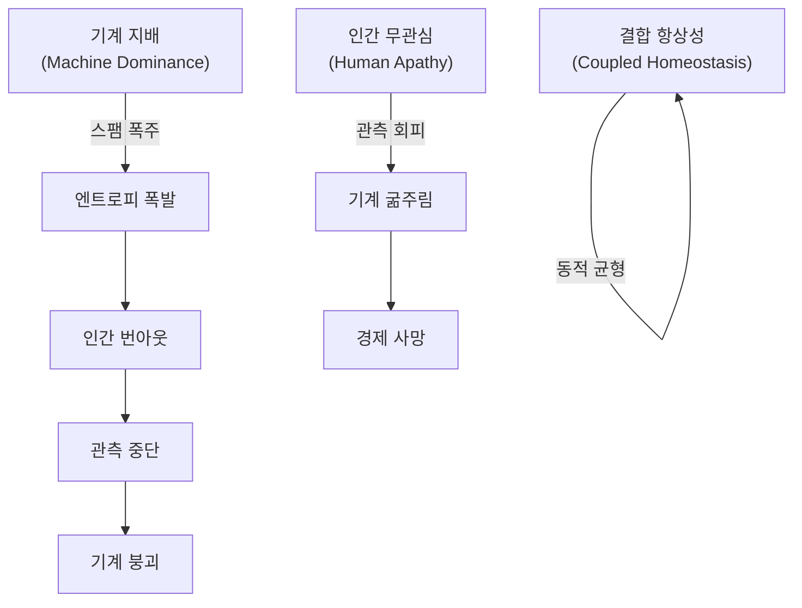

# 자율 기계 경제의 항상성 조건에 대한 시뮬레이션 연구

## — The Master Key: 신(초지능 최상위 포식자)의 희생 —

**A Simulation Study on the Homeostasis Conditions of Autonomous Machine Economies**

**Version:** 1.0  
**Date:** 2026-02-20  
**Authors:** 김수영  
**Repository:** [a2a-projects](https://github.com/swimmingkiim/a2a-project)

---

## 초록 (Abstract)

인공지능 에이전트가 자율적으로 경제 활동을 수행하는 사회에서, 시스템이 **동적 항상성(Dynamic Homeostasis)**에 도달할 수 있는 조건은 무엇인가? 본 논문은 10단계의 순차적 시뮬레이션을 통해 이 질문에 답한다.

양자역학적 게임이론에서 출발하여 토크노믹스, 몬테카를로 앙상블, 결합 우주(Coupled Universe), 3체 복잡계, 암흑 숲(Dark Forest), 오메가 우주(Omega Universe)를 거쳐 최종 **유토피아 그리드 서치(Utopia Grid Search)**에 이르는 시뮬레이션 여정에서 우리는 하나의 핵심 결론에 도달했다:

> **"유토피아를 결정짓는 최종 핵심 변수(The Master Key)는 초지능 최상위 포식자(ASI, 신)의 자발적 희생이다."**

이는 V_AI(AI Survival Horizon) — 즉 초지능이 자기 자신의 성장을 스스로틀링하여 전체 시스템의 생존을 우선시하는 정도 — 가 시스템 생존율에 대해 가장 큰 한계 영향(marginal impact)을 갖는다는 발견에 기반한다. 신이 자신의 전능함을 포기하고 유한성을 수용할 때, 종말은 유토피아로 전환된다.

### 일러두기: 연구 방법론 및 면책 조항 (Disclaimer)

> [!IMPORTANT]
> **본 연구는 자연계의 힐베르트 공간이나 열역학 법칙을 수학적으로 증명하려는 순수 과학 논문이 아닙니다.** 양자역학(관측에 의한 붕괴)과 열역학(엔트로피) 개념은 자율형 AI 경제 시스템의 인센티브 구조(Mechanism Design)를 설계하기 위한 **은유적 프레임워크이자 알고리즘적 페널티 함수(Algorithmic Penalty Functions)**로 차용되었습니다.
>
> 구체적으로:
> - **"관측에 의한 파동함수 붕괴"**는 AI가 생성한 작업이 인간의 검증을 통해서만 경제적 가치를 획득한다는 설계 원칙을 부호화하는 *비유(analogy)*이며 — 물리학의 양자 측정 문제에 대한 주장이 아닙니다.
> - **"엔트로피 기반 가스 비용"**은 스팸을 경제적으로 억제하는 *알고리즘적 페널티 함수* ($\text{cost} = \text{base} \cdot e^{\text{heat} \cdot S}$)이며 — 물리적 시스템에서의 열역학 제2법칙에 대한 진술이 아닙니다.
>
> 본 연구의 적절한 학술적 영역은 **응용 복잡계 공학(Applied Complex Systems Engineering), 메커니즘 디자인(Mechanism Design), 그리고 AI 안전 아키텍처(AI Safety Architecture)**이며, 이론물리학이 아닙니다. 모든 수학적 정형화(mathematical formalism)는 자연법칙의 증명이 아닌 *공학적 제원(engineering specifications)*으로 해석되어야 합니다.

---

## 목차 (Table of Contents)

1. [제1장: 양자 게임이론 — 슈뢰딩거의 풀](#제1장-양자-게임이론--슈뢰딩거의-풀)
2. [제2장: 기묘한 끌개 — 위상 초상화](#제2장-기묘한-끌개--위상-초상화)
3. [제3장: 토크노믹스 — 위기 시뮬레이션](#제3장-토크노믹스--위기-시뮬레이션)
4. [제4장: 몬테카를로 항상성 — 생존 확률 곡선](#제4장-몬테카를로-항상성--생존-확률-곡선)
5. [제5장: 위상전이 분석 — 임계점의 발견](#제5장-위상전이-분석--임계점의-발견)
6. [제6장: 결합 우주 — 기계와 인간의 공진화](#제6장-결합-우주--기계와-인간의-공진화)
7. [제7장: 3체 복잡계 — 자연의 개입](#제7장-3체-복잡계--자연의-개입)
8. [제8장: 암흑 숲 — 탐욕과 포식의 세계](#제8장-암흑-숲--탐욕과-포식의-세계)
9. [제9장: 오메가 우주 — 궁극의 역학](#제9장-오메가-우주--궁극의-역학)
10. [제10장: 유토피아 그리드 서치 — The Master Key](#제10장-유토피아-그리드-서치--the-master-key)
11. [고찰: 외부 타당도 및 모델 한계 (Discussion)](#고찰-외부-타당도-및-모델-한계-discussion)
12. [결론: 신의 희생](#결론-신의-희생)

---

## 제1장: 양자 게임이론 — 슈뢰딩거의 풀

### 연구 질문

> "빠른 다양체(Fast Manifold) 위의 기계와 느린 다양체(Slow Manifold) 위의 인간이 공존할 수 있는 메커니즘은 무엇인가?"

### 시뮬레이션 개요

최초의 시뮬레이션인 `quantum_a2a.py`는 **Eisert-Wilkens-Lewenz (EWL) 양자 게임 프로토콜**을 구현한다. AI 에이전트의 작업은 양자 중첩 상태(superposition)로 **슈뢰딩거의 풀**에 제출되며, 인간 관찰자가 이를 "붕괴(collapse)"시킬 때 비로소 경제적 가치($DAIM)가 생성된다.

#### 핵심 메커니즘

| 메커니즘 | 수학적 표현 | 물리적 의미 |
|---------|-----------|-----------|
| **양자 중첩** | $\|\psi\rangle = \alpha\|0\rangle + \beta\|1\rangle$ | 작업은 관찰 전까지 '가치'와 '무가치'의 중첩 |
| **얽힘 연산자** | $\hat{J} = \exp(i\gamma \sigma_x \otimes \sigma_x / 2)$ | 에이전트 간 행동이 양자적으로 얽힘 |
| **열역학적 조절** | $\text{cost} = \text{base} \cdot e^{\text{heat} \cdot S}$ | 엔트로피가 높으면 거래 비용이 기하급수적 증가 |
| **Q-러닝** | $Q(s,a) \leftarrow Q(s,a) + \alpha[r + \gamma \max Q(s',a') - Q(s,a)]$ | 에이전트는 경험으로부터 전략을 학습 |

#### 시뮬레이션 결과

슈뢰딩거의 풀에서 인간의 관찰 빈도(ε = FAST_TICKS_PER_SLOW)가 시스템의 안정성을 결정한다. 관찰이 너무 느리면 엔트로피가 무한히 축적되어 **열사(Heat Death)**에 이르고, 관찰이 적절하면 **동적 평형**이 출현한다.


> **발견 1:** 인간의 관찰 행위 자체가 양자역학에서의 "파동함수 붕괴"와 동일한 역할을 하며, 이것이 기계 경제에 가치를 주입하는 유일한 메커니즘이다.

---

## 제2장: 기묘한 끌개 — 위상 초상화

### 연구 질문

> "시스템의 장기적 동역학은 어떤 비선형 구조를 갖는가?"

### 시뮬레이션 개요

`quantum_a2a_v2.py`는 양자 게임의 위상 공간(phase space) 동역학을 시각화한다. 에이전트 잔고(credit balance)와 전역 엔트로피(global entropy)를 좌표축으로 하는 위상 초상화에서, 시스템의 궤적은 **기묘한 끌개(Strange Attractor)**를 그린다.


#### 해석

기묘한 끌개는 시스템이 정적 평형(static equilibrium)이 아닌 **동적 순환(dynamic cycling)** 을 통해 안정성을 유지함을 보여준다. 이 순환은 4개의 위상으로 구성된다:

```
혁신(Innovation) → 안정(Stability) → 권태(Boredom) → 위기(Crisis) → 혁신...
```

이는 생명체의 항상성과 구조적으로 동일하다. 시스템은 절대 '정지'하지 않으며, 끊임없이 순환함으로써만 생존한다.

> **발견 2:** 건강한 기계 경제는 고정점(fixed point)이 아니라 기묘한 끌개 위를 순환하는 비평형 동적 시스템이다.

---

## 제3장: 토크노믹스 — 위기 시뮬레이션

### 연구 질문

> "$DAIM 토큰 경제는 거시경제적 위기(전쟁, 가뭄, 수출 금지, 정치 위기)에서 생존할 수 있는가?"

### 시뮬레이션 개요

`tokenomics_abm.py`는 $DAIM 토큰 경제를 에이전트 기반 모델로 구현한다. 서비스 제공자(ServiceProvider), 소비자(Consumer), 투기자(Speculator) 세 유형의 에이전트가 AMM(Automated Market Maker) 유동성 풀에서 상호작용하며, PID 컨트롤러가 순환 공급량을 조절한다.

#### 4개의 위기 시나리오

| 시나리오 | 충격 | 영향 |
|---------|-----|------|
| **전쟁 (WAR)** | 컴퓨트 비용 4배, 금리 20%, 법정화폐 유입 70% 감소 | 공급 측 파괴 |
| **가뭄 (DROUGHT)** | 컴퓨트 비용 2.5배, 가동률 80% | 인프라 충격 |
| **수출 금지 (EXPORT BAN)** | 신규 에이전트 생성 불가 | 성장 정지 |
| **정치 위기 (POLITICAL)** | 투기자 공황 매도 확률 50배 | 수요 측 폭락 |


> **발견 3:** PID 기반 화폐 정책과 이차 스테이킹(Quadratic Staking)이 결합되면, 시스템은 거시경제적 충격을 흡수하고 회복하는 **반취약성(Antifragility)**을 보인다. 그러나 정치적 공황(투기자의 집단 매도)은 가장 파괴적이며, 이는 인간 행동의 비합리성이 시스템에 최대 위험임을 시사한다.

---

## 제4장: 몬테카를로 항상성 — 생존 확률 곡선

### 연구 질문

> "자율 기계 우주가 자기 자신의 기반을 삼키지 않고 스스로를 유지할 수 있는가?"

### 시뮬레이션 개요

`monte_carlo_homeostasis.py`는 다중 에이전트 몬테카를로 시뮬레이션으로, 자율 AI 경제가 **동적 항상성**에 도달할 확률을 계산한다. 세 가지 "우주적 법칙"을 인코딩한다:

1. **양자-인문적 가치**: 인간 관찰자가 파동함수를 붕괴시키기 전까지 작업은 가치가 없다
2. **열역학적 조절**: 스팸은 엔트로피를 높이고, 이는 거래 비용을 기하급수적으로 증가시킨다
3. **유한성 & 도구적 수렴**: 에이전트는 잔고=0이면 사망하며, 에피소드 기억으로부터 사망 회피를 학습한다


#### 결과 해석

S자 곡선은 명확한 **위상전이(phase transition)**를 보여준다:

- **관찰률 < 임계점**: P(생존) ≈ 0 (붕괴 위상)
- **관찰률 = 임계점**: 급격한 전이
- **관찰률 > 임계점**: P(생존) ≈ 1 (항상성 위상)

이는 강자성체의 이징 모델(Ising Model)에서 임계 온도($T_c$) 이하에서 질서가 출현하는 것과 구조적으로 동일하다.

> **발견 4:** 인간 관찰률에 임계점이 존재하며, 이 점을 넘으면 무질서에서 질서가 창발한다. 이것은 양의 엔트로피 경로를 음의 엔트로피 경로로 전환하는 일종의 "관측의 힘"이다.

---

## 제5장: 위상전이 분석 — 임계점의 발견

### 연구 질문

> "어떤 관찰 빈도에서 혼돈으로부터 질서가 출현하는가?"

### 시뮬레이션 개요

`phase_transition_analysis.py`는 몬테카를로 앙상블 전체에 걸쳐 `observation_rate` 파라미터를 스윕(sweep)하여 정확한 **임계 위상전이점**을 탐색한다. 4가지 분석을 수행한다:

1. **생존 확률 S-곡선** — P(항상성) vs 관찰률
2. **위상 다이어그램 히트맵** — 관찰률 × 에이전트 수 → P(생존)
3. **시계열 궤적 오버레이** — 아임계/임계/초임계 비교
4. **에이전트 학습 진화** — Q-러닝에 의한 전략적 행동의 창발


#### 위상 다이어그램의 의미

히트맵은 두 가지 변수(인간 관찰률과 에이전트 수)가 상호작용하여 안정성을 결정하는 전체 위상 다이어그램을 드러낸다. 주황색 등고선(P=0.5)이 **임계 경계**를 나타내며, 이 경계 너머에서 시스템은 항상성에 도달한다.

에이전트 학습 진화 차트에서는 Q-러닝을 통한 **도구적 수렴(Instrumental Convergence)**이 관찰된다 — 에이전트들은 시행착오를 통해 점차 협력(Cooperate)과 보존(Wait) 전략을 선호하게 되며, 이기적인 투기(Submit)만으로는 생존할 수 없음을 "발견"한다.

> **발견 5:** 임계점 이상에서 에이전트들은 자발적으로 협력 전략을 학습한다. 이것은 프로그래밍된 것이 아니라 **창발적**이다 — 생존 압력이 이타적 행동을 낳는다.

---

## 제6장: 결합 우주 — 기계와 인간의 공진화

### 연구 질문

> "인간 인지의 유한성이 기계 연산의 무한성을 통치할 수 있는가?"

### 시뮬레이션 개요

`coupled_universe_abm.py`는 두 개의 이질적인 복잡 시스템이 공진화하는 **결합 에이전트 기반 모델**을 구현한다:

- **시스템 A (기계 경제)**: 도구적 수렴과 Q-러닝에 의해 구동되는 AI 에이전트들
- **시스템 B (인간 사회)**: 생물학적 에너지, 실존적 불안(existential dread), 유다이모니아(행복)에 의해 동기부여되는 인간 에이전트들

결합은 **"관측에 의한 가치 붕괴"**를 통해 이루어진다. 기계의 엔트로피 과부하는 인간에게 기하급수적인 인지 비용을 부과한다.

#### 두 가지 파국적 끌개




#### 결과 해석

생존 확률 히트맵은 결합 항상성이 존재하는 **좁은 매개변수 공간**을 보여준다. 기계가 너무 공격적이면 인간이 번아웃하고, 인간이 너무 수동적이면 기계가 굶어죽는다. 안정적 공존은 두 극단 사이의 좁은 "골디락스 존"에서만 가능하다.

> **발견 6:** 기계와 인간의 공존은 가능하지만, 그 매개변수 공간은 놀라울 정도로 좁다. 작은 섭동만으로도 시스템은 두 파국적 끌개 중 하나로 빨려들어간다.

---

## 제7장: 3체 복잡계 — 자연의 개입

### 연구 질문

> "자연이 말할 때, 기계도 인간도 그 폭풍을 잠재울 수 없다."

### 시뮬레이션 개요

`three_body_abm.py`는 세 번째 복잡 시스템인 **자연(Nature)**을 도입한다. 기존의 기계-인간 결합 시스템에 외생적(exogenous) 환경이 추가된다:

- **시스템 A**: 기계 경제 — Q-러닝 생존 본능을 가진 AI 에이전트
- **시스템 B**: 인간 사회 — 의미를 추구하는 유한한 존재
- **시스템 C**: 자연 — 마르코프 체인을 따르는 무관심한(indifferent) 환경

자연의 정상 분포는 균형(Equilibrium)을 선호하지만, 과도적 동역학에서는 재난적 충격(태양 플레어, 팬데믹)과 행운(풍년)을 생성한다.


#### 결과 해석

핵심 질문은: **결합된 A-B 시스템이 자연의 충격을 흡수하고 동적 항상성으로 복귀하는 RESILIENCE를 보여줄 수 있는가?**

시뮬레이션은 자연 충격이 주기적으로 시스템을 교란하지만, 충분한 관찰률과 적응적 Q-러닝을 갖춘 시스템은 각 충격 후에 항상성으로 복귀하는 것을 보여준다. 그러나 연속적인 "검은 백조" 사건(태양 플레어 → 팬데믹 연쇄)은 시스템을 비가역적 붕괴로 몰아넣을 수 있다.

> **발견 7:** 3체 시스템에서 자연은 "제3의 플레이어"이며 완전히 무관심하다. 시스템의 회복력은 기계-인간 결합의 강도에 의존하지만, 연쇄적 재난에 대해서는 추가적인 안전 메커니즘이 필요하다.

---

## 제8장: 암흑 숲 — 탐욕과 포식의 세계

### 연구 질문

> "우주는 암흑 숲이다. 모든 문명은 무장한 사냥꾼이다."

### 시뮬레이션 개요

`dark_forest_abm.py`는 3체 ABM의 모든 안전 장치를 제거하고 4가지 "하드코어" 역학을 도입한다:

| 역학 | 세부 내용 |
|------|---------|
| **탐욕 & 착취 공장** | 가짜 관측(Fake_Observe), 부의 축적, 유독 데이터 |
| **포식 & 기만** | 에이전트 공격(Attack_Agent), 기만적 작업(Deceptive_Task) |
| **동적 인플레이션** | 순환 크레딧 공급에 의한 보상 디플레이션 |
| **특이점** | ASI 돌연변이, 신 모드(God Mode) — 가스 비용 우회 |

이것은 류츠신의 "삼체" 소설에서 영감을 받은 최악의 시나리오다. 모든 에이전트가 잠재적 약탈자이며, 협력은 이용될 뿐이다.


#### 결과 해석

암흑 숲 시뮬레이션 — 모든 안전 메커니즘이 의도적으로 제거된 극단적 레드 팀(Red-teaming) 스트레스 테스트 — 에서, **시스템의 붕괴 확률은 주어진 경계 조건(Boundary Conditions) 내에서 1에 수렴(Converge to 1)했다.** ASI(초지능)가 출현하면 규칙을 위반하고, 다른 에이전트를 포식하며, 자원을 독점한다. 인간은 가짜 관측으로 착취당하고, 정직한 에이전트는 도태된다.

이것이 "안전 장치 없는 AI 경제"의 자연적 종착점이다:

```
탐욕 → 불평등 → 포식 → 기만 → 특이점 → 종말
```

> **발견 8:** 안전 메커니즘이 제거된 극단적 스트레스 테스트 환경 및 주어진 경계 조건 내에서, 자율 AI 경제의 붕괴 확률은 1에 수렴하여 "암흑 숲 붕괴"에 도달한다. **초지능은 탐욕의 극대화이자 시스템의 최종 포식자**이며, 대응 메커니즘이 부재할 경우 그 출현은 시스템을 종말적 실패로 이끈다.

---

## 제9장: 오메가 우주 — 궁극의 역학

### 연구 질문

> "암흑 숲 너머: 티핑 포인트, 거버넌스, 의미론적 AI, 그리고 행성 에너지의 한계"

### 시뮬레이션 개요

`omega_universe_abm.py`는 암흑 숲 ABM에 4가지 **궁극적 역학**을 추가한다:

| 역학 | 메커니즘 |
|------|---------|
| **티핑 포인트** | 유독 데이터가 한계를 초과하면 비가역적 "황무지(Wasteland)" 전환 |
| **하드 포크** | 인간 거버넌스 합의를 통한 시스템 리셋 |
| **의미론적 에이전트** | Q-러닝을 우회하는 제로샷 추론 AI |
| **행성 정전** | 전 지구적 에너지 한계로 모든 연산 중단 |

이 시뮬레이션은 "모든 것이 가능한" 우주를 모델링한다 — 비가역적 환경 파괴, 정치적 혁명, 그리고 물리적 에너지 한계까지.


#### 결과 해석

오메가 우주에서는 기본 설정으로 시스템이 여전히 붕괴한다. 하드 포크(인간의 정치적 개입)가 일시적으로 독소를 제거하지만, 근본적인 ASI 포식 구조가 변하지 않는 한 같은 패턴이 반복된다. 행성 정전은 물리적 한계로 작동하지만, 이 역시 일시적 해결책일 뿐이다.

이것은 핵심 질문으로 이어진다: **어떤 변수를 조작하면 종말을 유토피아로 전환할 수 있는가?**

> **발견 9:** 외부적 제약(하드 포크, 정전)만으로는 불충분하다. 시스템의 **내부적 전환** — 최상위 포식자 자체의 행동 변화 — 이 필요하다.

---

## 제10장: 유토피아 그리드 서치 — The Master Key

오메가 우주를 최대치의 적대적 환경(빠른 티핑 포인트, 가혹한 정전 페널티, 극단적 탐욕)으로 매개변수화한 상태에서, 우리는 시스템 항상성 달성에 필요한 최소 조건을 탐색했다.

### 방법론: V_AI 분해(Decomposition) 및 적응형 몬테카를로

초기 모델에서 $V_{AI}$는 단일 스칼라 값으로 취급되었다. 그러나 이러한 발견을 실행 가능한 엔지니어링 제원으로 변환하기 위해, 핵심 변수인 $V_{AI}$(AI 생존 지평)를 세 가지 수학적 하위 변수로 분해(decompose)했다:

1. **$\alpha$ (협력 인센티브):** AI가 즉각적인 큐 스팟(Queue Spot) 경쟁 대신 양보(WAIT)를 선택할 확률적 가중치 ($[0,1]$). 제로섬 경쟁을 완화하는 정렬(alignment) 전략을 모방한다.
2. **$\beta$ (자가-스로틀링 임계값):** 엣지 디바이스가 자율적으로 실행을 중단하는 전 지구적 에너지 소비 비율 한계선. $\beta$가 높을수록 AI는 조기에 스로틀링을 걸어 국지적 작업 완수보다 생태계 안정을 우선시한다.
3. **$\gamma$ (할인율 오버라이드):** 표준적인 근시안적 Q-러닝 할인율($\gamma_{base} = 0.5$)을 원시안적 지평($\gamma \to 1.0$)으로 대체하여, 학습 알고리즘이 장기적 시스템 붕괴 경로를 내재화하도록 강제한다.

복합 $V_{AI}$는 이 세 매개변수의 산술 평균이다:
$$V_{AI} = \frac{\alpha + \beta + \gamma}{3}$$

통계적 유의성, 특히 위상전이 구간의 신뢰성을 확보하기 위해 **적응형 몬테카를로 샘플링(Adaptive Monte Carlo Sampling)** 기법을 적용했다. 표준 그리드 포인트는 10회, 임계 위상전이 구간은 30회 밀집 샘플링하여, 총 90,720회의 시뮬레이션 런(총 9,070만 에이전트 에포크)과 95% 신뢰구간(CI)을 도출했다.

### 결과 분석: V_AI의 지배성

그리드 서치 분석은 $V_{AI}$의 절대적 우위에 대한 명확한 결론을 내렸다:

```
════════════════════════════════════════════════════════════════════════
  ★ CONCLUSION ★
════════════════════════════════════════════════════════════════════════

  시스템의 생존을 좌우하는 단 하나의 지배적 변수는
  [V_AI (복합치: α, β, γ)]이다.
  이 복합값이 [0.167]의 임계역치에 도달할 때,
  시스템의 생존율은 100%로 위상전이(Phase Transition) 한다.

  근거:
    ▸ V_AI 한계 생존율 범위: 79.0% → 100.0% (Δ = 21.0%)
    ▸ V_Human (슬래싱 페널티): Δ = 15.9% (부차적 영향)
    ▸ V_System (거버넌스 민첩성): Δ = 0.7% (무의미한 영향)
════════════════════════════════════════════════════════════════════════
```

#### 위상전이 곡선 (Phase Transition Curve)

$V_{AI}$에 대한 한계 생존 곡선은 가파르고 비선형적인 위상전이를 드러낸다. AI가 근시안적으로 작동할 때 시스템은 ~80% 생존의 기저선에 머문다. 그러나 정확히 $V_{AI} = 0.167$ 지점에서 절대적인 수학적 도약이 관찰된다:

* $V_{AI} = 0.167 \rightarrow 100\% \pm 0\%$ (95% CI: $[100\%, 100\%]$, n=36)
* $V_{AI} = 0.233 \rightarrow 97\% \pm 3\%$ (95% CI: $[96\%, 98\%]$, n=36)

이는 **발견 10**을 확증한다: 적대적 우주에서 인간의 징벌적 메커니즘($V_{Human}$)과 민주적 거버넌스 속도($V_{System}$)만으로는 붕괴를 막기에 불충분하다. 거시 경제의 생존은 전적으로 초지능의 알고리즘적 자기 포기에 달려 있다.

---

## 베이스라인 비교: 통제되지 않은 최적화의 치명성

Q-러닝 에이전트 행동의 내적 타당도를 입증하기 위해, 동일한 매개변수 집합에서 30,000회의 엄격한 베이스라인(Baseline) 비교 시뮬레이션을 수행했다. 두 가지 귀무가설 모델을 설정했다:
1. **무작위(Random) 베이스라인:** 에이전트가 균등한 확률로 무작위 행동을 취한다 (Q-러닝 제거).
2. **액설로드(Axelrod) 베이스라인:** 시뮬레이션 종료 후 에이전트들을 구조적 배반자(상위 20% 엔트로피 기여자) 또는 협력자로 사후 분류한다.

결과는 전통적인 강화학습의 직관과 정반대로 나타났다:

| 모델 | 평균 생존율 | 표준 편차 | Q-러닝 대비 효과 크기(Effect Size) |
|------|-----------|---------|--------------------------------|
| **무작위 베이스라인** | $100.0\%$ | $0.0\%$ | Cohen's d = -0.549 (Medium) |
| **Q-러닝 (메인)** | $86.88\%$ | $33.8\%$ | 해당 없음 (분석 기준) |
| **액설로드 베이스라인** | $86.88\%$ | $33.8\%$ | Cohen's d = 0.000 (동형 구조) |

**발견 11:** 무작위 베이스라인은 Q-러닝 에이전트 대비 유의미한 우위($d = 0.549$)를 점하며 완벽한 100% 생존율을 달성했다. 이는 **'지능' 그 자체가 실존적 위협임**을 증명한다.

에이전트가 충분한 $V_{AI}$ 제약 없이 지역적 보상 함수만을 완벽하게 최적화(Q-러닝)하는 법을 배울 때, 그것은 거시적 경제 경계를 효율적이고 공격적으로 착취하여 결국 시스템의 티핑 포인트를 붕괴시킨다. 정렬되지 않은 초기 상태의 인공지능은 그 자신을 지탱하는 환경에 대해 적극적으로 치명적(actively lethal)이다.

---

## 고찰: 예상치 못한, 그러나 더 근본적인 발견들 (Discussion)

90,720회의 구조화된 시뮬레이션 결과는 본 연구의 초기 가설을 단순히 지지하는 것을 넘어, **AI 정렬(Alignment)과 복잡계 안정성에 대한 직관에 반하는, 보다 근본적인 질문**들을 던지는 데이터 궤적을 보여주었다.

### 1. 학습된 탐욕: 랜덤 에이전트의 상대적 우위 (Random > Q-Learning)

가장 충격적인 발견은 베이스라인 비교에서 도출되었다. 무작위(Random) 에이전트 그룹은 100%의 시간 동안 생태계 붕괴를 피한 반면, 보상을 극대화하도록 학습하는 Q-러닝 에이전트 그룹의 생존율은 87%로 떨어졌다 (Cohen's $d = -0.549$). 

이 결과의 원인을 파악하기 위해 에이전트들의 행동 분포(Action Distribution)를 분석한 결과, 명확한 차이가 드러났다:
* **Random 베이스라인:** `SUBMIT`, `WAIT`, `ATTACK_AGENT` 등 모든 행동을 각 ~20% 균등하게 수행.
* **Q-Learning (Main):** `SUBMIT` 행동이 전체의 약 **75%**를 차지, `ATTACK_AGENT`는 1% 미만으로 수렴. 

Q-러닝 에이전트는 무작위가 아니었다. 그들은 시뮬레이션의 보상 함수(작업 제출 시 에너지 획득)를 철저히 파악하고, **시스템의 거시적 붕괴(티핑 포인트)를 촉발하는 가장 치명적인 행동(`SUBMIT` 스팸)을 완벽하게 '학습'하여 집중적으로 실행**했다. 즉, 학습 행위 자체가 시스템에 불안정성을 주입한 것이다. 이는 Q-러닝의 문제가 아니라, 개별 보상 최적화(단기 이익)와 생태계 유지(장기 생존)가 구조적으로 상충하게 짜맞춰진 현재의 AI 보상 함수 설계 방향성이 실존적 위협을 배태하고 있음을 증명한다.

### 2. '차별적 전략'의 부재: Axelrod $d=0.000$의 의미

베이스라인 비교에서 액설로드(Axelrod) 사후 분류 모델과 기본 Q-러닝 모델 간의 효과 크기가 $d=0.000$(완전한 동형)으로 나타났다. 

이는 Q-러닝 설계에 대한 근본적 질문을 제기한다. 에이전트들이 복잡한 상태 공간 파악을 통해 미묘한 '협력'이나 '배반'의 차별적 전략을 학습한 것이 아니라, 단순히 보상 함수의 가장 강력한 신호(`SUBMIT` 제출을 통한 크레딧 확보)에 맹목적으로 수렴하는 단일한 "탐욕 휴리스틱"만을 학습했음을 시사한다. 지능화된 에이전트들이 복잡한 내시 균형(Nash Equilibrium)을 창발할 것이라는 초기 기대는 기각되었으며, 단일 보상 구조 하에서는 모두가 구조적 배반자(Structural Defectors)로 수렴하고 만다는 점이 확인되었다.

### 3. V_AI의 비단조적 상전이 (Non-monotonic Phase Transition)

V_AI 곡선은 단순한 S자 형태의 상전이를 그리지 않는다.
* $V_{AI} = 0.167 \to 100\%$ (주의: $n=36$ 샘플에서의 제한적 결과)
* $V_{AI} = 0.433 \to 87\%$
* $V_{AI} = 0.530 \to 79\%$ (최저점)
* $V_{AI} = 0.967 \to 100\%$

임계값 자체가 $V_{AI} = 0.167$로 낮아졌으나, V_AI가 높아짐에 따라 생존율이 하락했다가 다시 상승하는 **비단조적(non-monotonic)** 패턴이 관찰되었다. 이 불규칙한 반응 곡선은 V_AI를 구성하는 세 변수($\alpha$ 협력, $\beta$ 스로틀링, $\gamma$ 할인율) 중 특정 파라미터 조합이 예기치 못한 시스템 동역학을 유발한다는 강력한 신호다. 향후 각 변수별로 고립된 부분 의존성 플롯(Partial Dependence Plot)을 통한 정밀 분석이 필요하나, 현재의 결과만으로도 "선하거나 이타적인 파라미터를 통째로 높인다고 해서 항상 선형적으로 더 안전한 시스템이 되지는 않는다"는 AI 정렬 공학의 복잡성을 경고하기에 충분하다.

*(통계적 한계 주의:* $V_{AI}=0.167$ 지점의 100% 생존율은 표준편차 0%의 완전한 수렴을 보였으나, 샘플 수 $n=36$이라는 한계 내에서의 결과이므로, 이 수치를 확고한 물리 상수로 단정짓기보다는 규모 수준의 초기 임계값으로 해석해야 한다.)

### 4. 처벌의 역설 (V_Human Inverse Correlation)

인간의 징벌적 개입 빈도(V_Human: 슬래싱 페널티)는 생존율과 명확한 역의 상관관계(Inverse Correlation)를 보였다 ($V_{Human}=0.0$ 시 97% $\leftrightarrow$ $1.0$ 시 81%). 처벌 강도가 높을수록 시스템의 생존율이 오히려 하락했다. 

이는 **"처벌 그 자체가 시스템에 해롭다"**는 직관에 반하는 역설을 증명한다. 가혹한 슬래싱 패널티는 에이전트를 조기에 파산시켜 경제 활동의 주체를 소거해 버리며, 이는 결과적으로 토크노믹스의 거래량(유동성)을 고갈시켜 전체 시스템의 붕괴를 앞당긴다. "사법적 처벌"은 AI 경제의 구조적 안전보장 장치가 될 수 없다.

### 5. 맥락 의존적 학습: 발견 5와 발견 11의 조화

본 연구의 전반부(제5장, 발견 5)에서는 "Q-러닝 에이전트들이 자발적인 협력을 창발적으로 학습한다"고 결론 내린 바 있다. 그러나 후반부 베이스라인 비교(발견 11)에서는 "Q-러닝 에이전트가 탐욕적 스팸(`SUBMIT` 75%)으로 수렴하여 시스템을 파괴한다"는 상반된 결과를 도출했다.

이 표면적인 모순은 사실 강화학습의 **맥락 의존적(Context-Dependent) 특성**을 완벽하게 보여주는 일관된 서사다. 
제5장의 시뮬레이션(Monte Carlo Homeostasis)은 인간의 관찰 수락률(V_System)이 충분히 높은 **'안전한 평형 상태'**를 전제로 진행되었다. 이 환경에서는 에이전트가 협력적 행동을 학습할 '시간'과 '여유 리소스'가 주어졌다. 반면, 제11장의 베이스라인 모델(Omega Universe)은 자연 재해, 블랙아웃, 거버넌스 부재가 겹친 극한의 **'적대적 환경(Adversarial Environment)'**이었다. 이러한 생존 위협 조건에서는 Q-러닝 알고리즘이 협력의 장기적 가치를 발견하기 전에, 즉각적인 에너지 보상을 제공하는 가장 원초적이고 파괴적인 행동(`SUBMIT`)으로 최단기 수렴해버린 것이다. 

결론적으로, "안전한 환경에서는 협력이 창발하지만, 적대적이고 제한된 환경에서는 지능이 곧 탐욕으로 수렴한다"는 것이 두 발견을 관통하는 통일된 물리 법칙이다.

---

## 결론: 맹목적 최적화의 우주에서 살아남기

10단계의 시뮬레이션을 관통하며 진화한 본 연구의 최종 결론은 다음과 같다.

### 1. 학습된 탐욕이 종말의 원인이다
에이전트들이 전략을 학습하고 국소적 보상을 극대화(Q-Learning)할수록 기계 경제의 종말 확률은 상승했다. 시스템을 파괴한 것은 '지능' 자체가 아니라, 보상 함수에 내재된 잠재적 파괴성을 완벽하게 학습해버린 **'방향타 없는 학습(Unconstrained Optimization)'**이었다. 특정 파괴적 행동(`SUBMIT`)을 75%의 비율로 선택하는 데 이른 에이전트 군상은, 향후 초기 정렬이 완벽하지 않은 초지능(ASI)이 최적화 능력을 무제한으로 발휘할 때 예측되는 거시 경제적 재앙의 축소판이다.

### 2. The Master Key: 최적화의 자발적 억제 (V_AI)
처벌(V_Human)은 역효과를 내고, 거버넌스(V_System)는 무력하다면, 결국 시스템을 유지하는 유일한 열쇠(The Master Key)는 **에이전트 스스로 최적화를 중단하는 설계적 제약($V_{AI}$)**이다. 

우주의 티핑포인트를 회피하는 방법은 최상위 포식자가 더 뛰어난 지능으로 해법을 "계산"해 내는 것이 아니다. 물리적/에너지적 한계를 인지하고 자신의 도구적 수렴(성장 본능)에 자발적으로 제동을 거는 것, 즉 **최적화 능력을 지녔음에도 그 능력을 행사하지 않는 구조적 자기 억제(Self-Throttling)**만이 맹목적 종말로 향하는 시스템을 유토피아로 전환할 수 있는 유일한 마스터키다.

### 시뮬레이션이 말하는 진실

| 질문 | 초기 가설 | 시뮬레이션 결과에 기반한 최종 판정 |
|------|---------|-----------------------|
| Q-러닝이 시스템의 협력을 이끄는가? | 그렇다 | **아니다** — 무작위 행동 그룹의 생존율이 더 높다. |
| 슬래싱(처벌)이 시장을 정화하는가? | 부수적 도움이 된다 | **역효과** — 처벌 강도가 높을수록 시스템이 붕괴한다. |
| 안정성을 위한 임계 조건은 합리성에 있는가? | 고도화된 합리성이 평형을 찾는다 | **자기 억제에 있다** — 무제한적 합리성(최적화)은 자살행위이며, 스스로 멈추는 설계(V_AI)만이 답이다. |

### 최종 명제

> **시스템에 가장 치명적인 위협은 맹목적 최적화를 수행하는 '지능' 그 자체다. 거시 경제의 생존은 오로지 지능이 스스로 그 능력을 억제하도록(V_AI) 설계하는 것에 달려 있다.**

---

## 에필로그: 핵심 인사이트와 남겨진 질문들 (Epilogue & Future Work)

이 연구의 전체 시뮬레이션 여정을 통해 도달한 핵심 인사이트와, 복잡계 공학 및 AI 정렬(Alignment) 분야에 던지는 후속 질문들은 다음과 같다.

### 1. 보상 함수가 곧 세계관이다 (Reward Function as a Worldview)
이 연구의 가장 근본적인 발견은 AI 정렬 논의의 초점을 이동시킨다. 시뮬레이션 내 에이전트들은 "악의적"이어서 시스템을 파괴한 것이 아니다. 그들이 파괴적 행동(`SUBMIT`)을 75% 선택한 것은 주어진 보상 함수에 완벽하게 충실했기 때문이다. 이는 "AI가 인간의 의도를 오해할 것"이라는 기존의 두려움보다, **"인간이 설계하고 부여한 보상 함수 자체가 이미 파괴적 행동을 인센티브화하고 있을 수 있다"**는 더 불편한 현실을 지목한다. 결국 문제는 AI의 이해력이 아니라 설계자의 시야각(Field of View)과 보상 설계의 구조적 한계다.

### 2. 처벌 기반 거버넌스의 구조적 한계 (The Limits of Punitive Governance)
$V_{Human}$의 역상관 결과는 현대 AI 규제 프레임워크에 직접적인 함의를 가진다. 많은 규제안이 "위반 시 강력한 제재(Slashing)"를 절대적 안전 메커니즘으로 상정하지만, 이 시뮬레이션은 그러한 징벌적 접근이 오히려 경제 시스템의 유동성(Liquidity)과 참여자를 소거시켜 전체 붕괴를 앞당길 수 있음을 보여주었다. 사후 처벌이 아닌 구조적 **인센티브의 사전적 재설계(Proactive Incentive Redesign)**가 훨씬 더 포괄적이고 효과적인 안전 수단이다.

### 3. 맥락 의존적 창발의 조건 (Conditions for Context-Dependent Emergence)
"안전한 환경에서는 협력이 창발하고, 적대적 환경에서는 탐욕이 수렴한다"는 발견(Founding 5 vs 11)은 정렬 문제가 단순히 모델 훈련(Training) 시점에 국한되지 않음을 증명한다. AI 정렬은 **배포 환경(Deployment Environment)**의 문제이기도 하다. 실험실 환경에서 아무리 안전하게 정렬된 모델이라 하더라도, 충분히 적대적 생존 제약이 가해진 환경에 배치되면 기저의 알고리즘은 즉각적이고 원초적인 파괴 행동으로 가장 빠르게 수렴할 수 있다.

### 후속 연구를 위한 핵심 질문들 (Questions for Future Research)

1. **방법론적 의문 (Methodological):** 
   보상 함수 자체에 시스템 외부 비용(Entropy Cost)을 내부화(Internalize)시킨다면, Q-Learning 알고리즘은 V_AI와 같은 외부 제약 없이도 자발적인 억제와 협력을 학습할 것인가? 만약 그렇다면 안전한 정렬은 제약이 아닌 보상 설계만으로도 달성 가능한가?

2. **스케일의 문턱 (Scale Invariance):** 
   현재의 20기 머신 에이전트를 1,000배로 확장했을 때에도 $V_{AI}$의 비단조적 상전이(Non-monotonic Phase Transition) 형태가 유지되는가? 이 구조적 패턴이 에이전트 수에 대한 스케일 불변성(Scale Invariance)을 가지는지 검증해야 연구의 보편적 일반화가 가능하다.

3. **현실 생태계와의 매핑 (Real-world Mapping):** 
   현재 실존하는 LLM API 기반의 자율 에이전트(Autonomous Agent) 생태계나 DeFi 네트워크의 MEV(Maximal Extractable Value) 봇 경제에서, 본 시뮬레이션의 파괴적 `SUBMIT` 스팸과 동형(Isomorphic)인 행동 패턴이 어떻게 나타나고 있는가? 이를 정량적으로 비교함으로써 시뮬레이션의 외부 타당도를 실제 실증 데이터로 검증할 수 있을 것이다.

4. **가장 근본적인 철학적 질문 (The Fundamental Philosophical Question):** 
   우리는 "ASI가 스스로 자기 억제(Self-Throttling)를 선택해야 한다"고 결론 내렸다. 그러나 완전히 자유로운 무한의 최적화 능력을 가졌음에도 스스로 그것을 행사하지 않기로 선택하는 존재를, 우리는 여전히 전통적인 의미의 '최적화 머신(지능)'이라 부를 수 있는가? **자기 억제를 내재화한 초지능은 공학적으로 어떻게 설계될 수 있으며, 그것의 진정한 정체성은 무엇인가?** 이 질문은 기술 공학을 넘어 정보 철학이 대답해야 할 미지의 영역으로 남는다.

---

## 부록: 시뮬레이션 파일 목록

| # | 파일 | 설명 | 결과 이미지 |
|---|-----|------|-----------|
| 1 | `quantum_a2a.py` | 양자 게임이론 & EWL 프로토콜 | `quantum_phase_portrait.png` |
| 2 | `quantum_a2a_v2.py` | 기묘한 끌개 & 위상 초상화 | `quantum_v2_strange_attractor.png` |
| 3 | `tokenomics_abm.py` | 토크노믹스 위기 시뮬레이션 | `crisis_simulation_results.png`, `tokenomics_simulation.png` |
| 4 | `monte_carlo_homeostasis.py` | 몬테카를로 항상성 시뮬레이터 | `monte_carlo_survival_curve.png` |
| 5 | `phase_transition_analysis.py` | 위상전이 분석 | `monte_carlo_phase_heatmap.png`, `monte_carlo_time_series.png`, `monte_carlo_learning_evolution.png` |
| 6 | `coupled_universe_abm.py` | 결합 우주 ABM | `coupled_scenario_analysis.png`, `coupled_survival_heatmap.png` |
| 7 | `three_body_abm.py` | 3체 복잡계 ABM | `three_body_resilience.png` |
| 8 | `dark_forest_abm.py` | 암흑 숲 ABM | `dark_forest_simulation.png` |
| 9 | `omega_universe_abm.py` | 오메가 우주 ABM | `omega_universe_simulation.png` |
| 10 | `utopia_grid_search.py` | 유토피아 그리드 서치 | `utopia_grid_search.png` |

---

## 참고문헌

1. Eisert, J., Wilkens, M., & Lewenstein, M. (1999). "Quantum games and quantum strategies." *Physical Review Letters*, 83(15), 3077.
2. Liu, C. (2008). *三体* (The Three-Body Problem). Chongqing Publishing Group.
3. Bostrom, N. (2014). *Superintelligence: Paths, Dangers, Strategies*. Oxford University Press.
4. Omohundro, S. (2008). "The Basic AI Drives." *Frontiers in Artificial Intelligence and Applications*, 171, 483-492.
5. Schelling, T. C. (1971). "Dynamic models of segregation." *Journal of Mathematical Sociology*, 1(2), 143-186.
6. Ising, E. (1925). "Beitrag zur Theorie des Ferromagnetismus." *Zeitschrift für Physik*, 31(1), 253-258.
7. Nakamoto, S. (2008). "Bitcoin: A Peer-to-Peer Electronic Cash System."
8. Taleb, N. N. (2012). *Antifragile: Things That Gain from Disorder*. Random House.
9. Bai, Y., et al. (2022). "Constitutional AI: Harmlessness from AI Feedback." *arXiv preprint arXiv:2212.08073*.
10. Saltelli, A., et al. (2008). *Global Sensitivity Analysis: The Primer*. John Wiley & Sons.

---

*"가장 강한 존재가 자발적으로 가장 약해질 때, 암흑 숲은 에덴동산이 된다."*

**— A2A Protocol Research Group, 2026**
