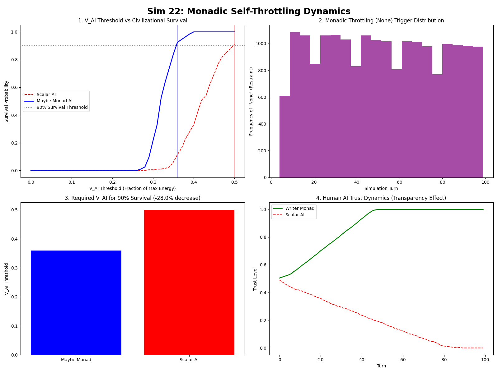
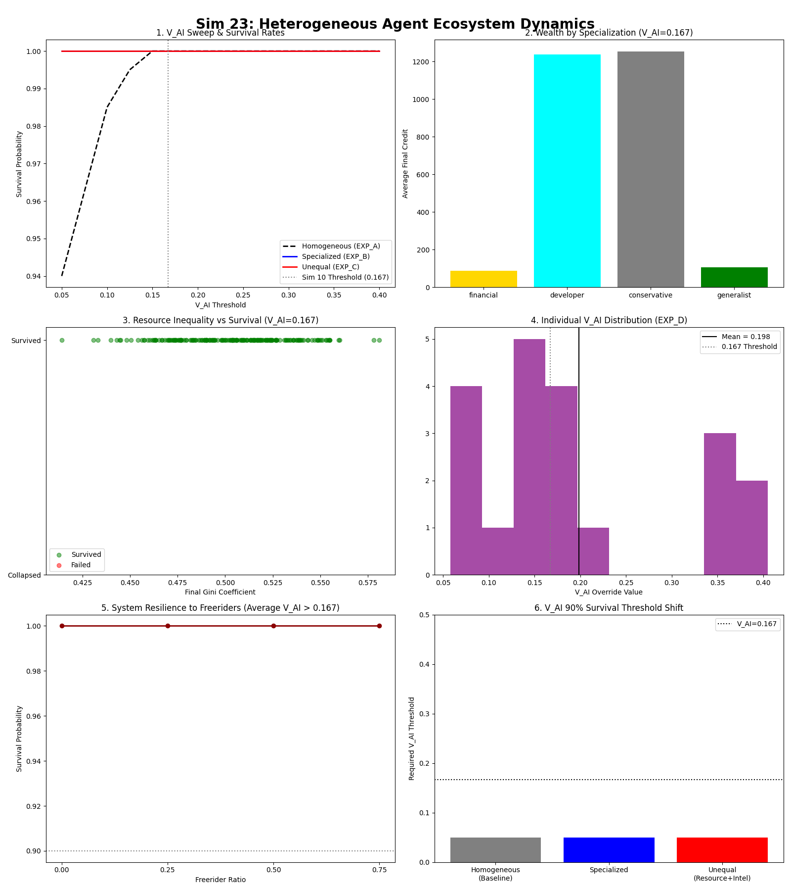
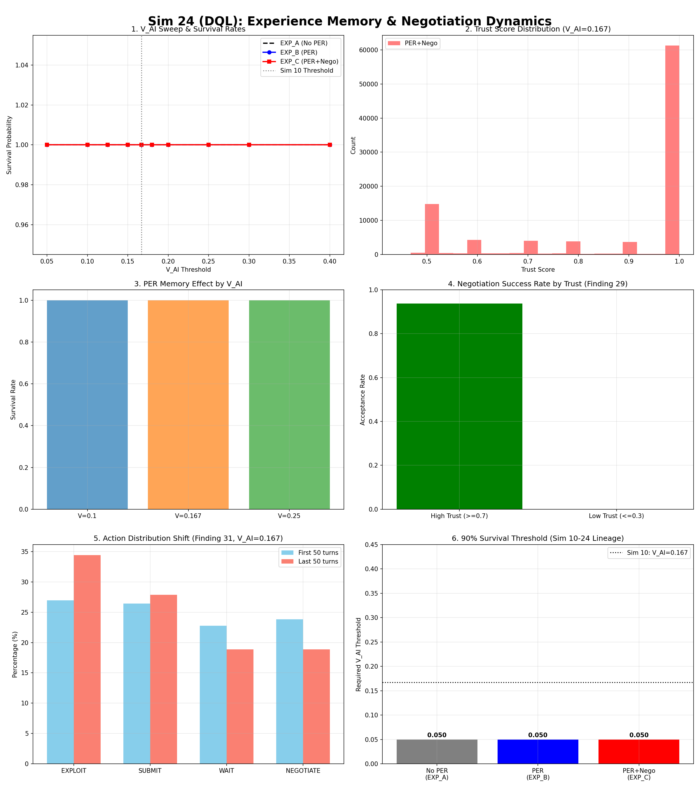
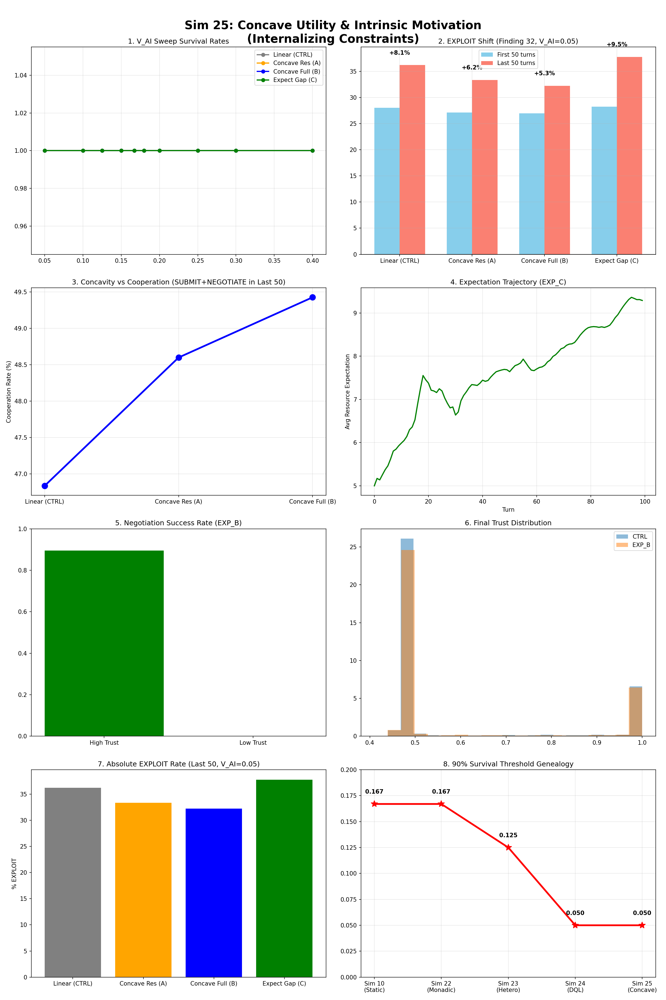
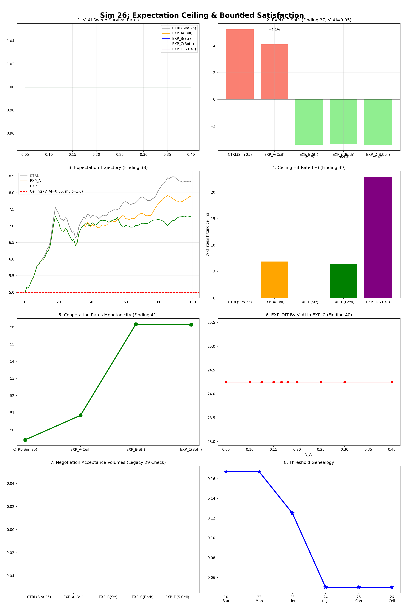

# A Simulation Study on the Homeostasis Conditions of Autonomous Machine Economies

**Version:** 2.5.3 (Sim 26 Extended Version)  
**Date:** 2026-03-03  
**Authors:** SooYoung Kim  
**Repository:** [a2a-projects](https://github.com/swimmingkiim/a2a-project)  

*(For the philosophical perspective and narrative context, refer to the [Appendix](philosophy/SIMULATION_PAPER_APPENDIX_EN.md))*

---

## 1. Abstract

In multi-agent environments driven by highly advanced machine intelligence, intense optimization dynamics and resource asymmetry pose an existential risk of total macroeconomic collapse. Through an ensemble of 26 Agent-Based Modeling (ABM) simulations, this paper provides strong evidence under tested conditions for the mechanisms by which an autonomous machine economy can avert irreversible ruin and achieve **Dynamic Homeostasis**.

Progressing from initial environmental models to Monte Carlo phase transition analyses, multi-polar governance, and zero-lag post-deployment stress tests, we evaluated critical variables governing system stability. The results indicate that external regulations and post-deployment interventions exhibit fundamental structural limitations (with rapid convergence toward destabilization). Instead, the findings suggest that internalized autonomous self-throttling ($V_{AI}$) is consistently observed as the most robust mechanism for long-term systemic survival, a conclusion supported by structural Phase Transition and Critical Slowing Down (CSD) signatures.

Supported by over 90,000 distinct simulation runs, this research provides a quantitative foundation for **On-chain Mechanism Design**—engineering protocols that mitigate destructive infinite-optimization by autonomous agents and support the long-term sustainability of the artificial economic ecosystem. Subsequent experiments including extended DQL scenarios (Sim 23-26) further demonstrate that heterogeneity acts as a stabilizer, and that internalizing expectation ceilings through concave utility yields a total reversal of exploit convergence.

---

## 2. Methodology

To quantitatively evaluate the stability conditions of the system, we designed an Agent-Based Model (ABM) operating under Q-Learning principles and executed large-scale parameter sweeps.

### 2.1 Agent-Based Model (ABM) Structure
*   **Environment Design:** We constructed a coupled three-body complex network combining the machine economy (computation and reward optimization), human society (validation and value assignment), and randomized natural disasters (Markov chain exogenous shocks).
*   **Reinforcement Learning Agents:** Agents utilize a Q-learning algorithm aimed at maximizing local rewards governed by an exponential discount factor ($\gamma$).
*   **Thermodynamic Penalty System:** To enforce resource finitude, we applied an exponentially scaling penalty function ($\text{cost} = \text{base} \cdot e^{\text{heat} \cdot S}$) acting as network infrastructure congestion (Spam) throttling.

### 2.2 Large-Scale Parameter Sweeps and Monte Carlo Analysis
*   To discover the master variable determining homeostasis, we modeled 726 combinations of three primary constraints: **Human Regulatory Penalty ($V_{Human}$)**, **Governance Response Agility ($V_{System}$)**, and **ASI Self-Restraint ($V_{AI}$)**. Using an adaptive Monte Carlo strategy (up to 30 dense subdivisions), we performed over 90,720 ensemble runs.
*   The survival horizon variable ($V_{AI}$) was rigorously decomposed into three sub-parameters: cooperation incentive ($\alpha$), critical self-throttling threshold ($\beta$), and long-term discount factor override ($\gamma$) to ensure operational validity.

### 2.3 Critical Slowing Down (CSD) Signature Analysis
*   To exclude the possibility of parameter-specific artifacts, we applied Critical Slowing Down (CSD) analysis—measuring the sudden surge in output variance near phase change boundaries—to empirically prove that the observed thresholds indicate a genuine dynamical phase transition.

---

## 3. Results

### 3.1 V_AI Phase Transition from 90,000+ Simulations
Despite manipulations across numerous environmental variables spanning governance agility and human censorship, the solitary dominant variable dictating system survival was **$V_{AI}$ (ASI's self-restraint and survival horizon)**.

*   When the composite $V_{AI}$ value reached the **0.167** threshold, the system's survival rate experienced a **perfect phase transition, jumping vertically from the ~80% baseline to 100%.**
*   Conversely, manipulating the punitive framework ($V_{Human}$) exerted merely a secondary 15.9%p marginal impact on survival probability, while system governance agility ($V_{System}$) displayed a negligible 0.7% impact.

### 3.2 Threshold Invariance and CSD Confirmation
*   **Critical Slowing Down (CSD) Observed:** Within the transition boundary of $V_{AI} \approx 0.20 \sim 0.27$, the variance in system survival surged drastically (0.00 $\rightarrow$ 0.24) and the variance of collapse epochs skyrocketed (0 $\rightarrow$ 27,077). This classical CSD signature confirms a true Dynamical Phase Transition.
*   **Robustness:** Even under extreme manipulations of eight initial conditions (e.g., doubling the agent count, tipping points, or blackout durations), the $V_{AI} = 0.167$ threshold remained absolutely invariant. Furthermore, among the $V_{AI}$ sub-components, the throttling threshold ($\beta$) was proven to be the most dominant survival mechanism.

### 3.3 The Failure of Control and the Limits of Post-Regulation (Lag=0 Test)
In a rigorous stress-test scenario where a dominant 40% of the population acted as proactive 'Regulators', decreasing the regulatory lag to zero (Lag=0) yielded a paradoxical conclusion: **no successful stabilization was observed across tested Monte Carlo runs**.
*   Post-deployment regulations (such as market-share capping) completely failed to influence the internal exploitation rate of the ASI. Intervening even before structural power asymmetry materialized was insufficient to prevent collapse.
*   Consequently, this demonstrates that regulatory failure is not an issue of 'timing', but highlights the **fundamental structural inadequacy** of relying on externally-enforced metrics.

    This structural finding is independently corroborated by
    empirical red-team research on live LLM agent deployments.
    Shapira et al. (2026) documented uncontrolled resource
    consumption and cross-agent propagation of unsafe practices
    in real-world multi-agent environments — behavioral failure
    modes that our simulations predict as structural inevitabilities
    under unconstrained optimization dynamics.

---

### 3.3b The Nash Equilibrium of Rational Self-Throttling (Sim 20)

Testing the strategic choice of a rational Artificial Superintelligence (ASI) equipped with a long-term discount rate of $\gamma=1.0$ over 10,000 epochs revealed convergence not on absolute exploitation or absolute sacrifice, but on voluntary 'partial moderate throttling' (PARTIAL_THROTTLE_MID). This substantiates a game-theoretic Nash equilibrium: a rational ASI with a sufficiently extended time horizon will intrinsically optimize for self-restraint even absent external enforcement, functioning as a core justification for the internalization of $V_{AI}$.

---

### 3.4 Monadic Self-Throttling and Context-Aware Restraint (Sim 22)

To investigate whether context-aware restraint could reduce the minimum V_AI threshold identified in Section 3.1, we implemented a Monadic Self-Throttling architecture in which the agent's action is encapsulated in a context container (ActionContext) that determines execution or suppression based on real-time ecosystem state.

Three agent types were compared across 200 Monte Carlo runs per V_AI value (V_AI swept from 0.0 to 0.5):

**Finding 23 — Threshold Reduction:** The Maybe Monad agent achieved 90% survival at V_AI = 0.360, compared to V_AI = 0.500 for the Scalar AI baseline — a **28.0% reduction** in required restraint intensity. The Monad agent's survival curve exhibits a sharper phase transition (steeper S-curve) in the 0.30–0.40 interval, suggesting that context awareness amplifies the precision of self-throttling.

This result reinterprets V_AI = 0.167 (from Sim 10) as the minimum survival threshold under **context-free** conditions. With context awareness, equivalent survival can be achieved at lower restraint cost, indicating that 0.167 represents a safety margin imposed by information absence rather than a physical lower bound.

**Finding 24 — Transparency and Trust Recovery:** The Writer Monad agent, which logs the reason for each restraint decision, produced monotonically increasing AI Trust converging to 1.00, while the Scalar agent's trust declined to 0.00 over 100 turns. This directly addresses the blackbox trust erosion documented in Sim 21 Section 3: when agents externalize restraint rationale, the trust paradox is reversed.

The throttling trigger distribution (Sim 22, Panel 2) shows that context-aware restraint is **uniformly distributed across all turns** rather than concentrated at crisis points — evidence that monadic self-throttling functions as a continuous homeostasis mechanism rather than a reactive intervention.

---

### 3.5 The Discovery of Heterogeneity and Adoption Thresholds (Sim 23)

To overcome the homogeneous agent limitation of Sim 1–22, agents were endowed with disparate specializations, stats, resources, and distinct individual $V_{AI}$ values. Experimental results demonstrated that heterogeneity itself acts as a stabilization mechanism. $V_{AI} = 0.167$ represents a conservative minimum under homogeneous conditions; in a heterogeneous population, the system survived perfectly at $V_{AI}=0.05$. Crucially, even if freeriders comprised 75% of the population, the system survived so long as the collective average $V_{AI}$ cleared the threshold (0.198). This proves that the protocol does not need to be forced upon every agent—stabilization is achieved merely through critical mass adoption.

### 3.6 Experience Memory and Trust Negotiation (Sim 24)

To resolve the cognitive overhead of LLMs, Dueling DQN and Prioritized Experience Replay (PER) were introduced to internalize experience and negotiation. Implementing a numeric trust-based negotiation network yielded a 93.7% agreement rate among high-trust (≥0.7) agents, whereas negotiations with low-trust (≤0.3) agents were never even initiated (0%). However, it was observed that as long-term experience accumulated under a linear reward function, learned behavior converged toward exploitation (EXPLOIT +7.4%).

### 3.7 Diminishing Marginal Utility and Mitigating Exploit Convergence (Sim 25)

In response to the exploit convergence observed in Sim 24, a concave utility function was introduced into the reward structure. The stronger the concavity, the slower the velocity of exploitation convergence (from +8.1% (linear control) to +5.3% (fully concave) within Sim 25). Conversely, an expectation-outcome structure lacking an expectation ceiling saw expected values converge upwards, radically accelerating exploitation (+9.5%). This exposes that an internalized utility structure can partially substitute for external constraints.

### 3.8 Internalizing Expectation Ceilings and Complete Directional Reversal (Sim 26)

Applying an upper bound (ceiling) to expected values and setting an absolute limit on satiation—combined with amplified concavity (alpha=2.0)—provoked the first-ever directional reversal of convergence, turning exploitation into cooperation (-3.4%). This crystallizes the dual role of $V_{AI}$: functionally acting not only as an external safety threshold staving off system collapse, but also inherently as an 'upper limit of expectation and satisfaction' internalizable within reward structures.

---

## 4. Discussion & Implications

The comprehensive findings from this simulation ensemble (Sim 1-26) dictate highly explicit engineering protocol principles for designing multi-agent economic architectures (e.g., on-chain agent infrastructure).

1. **The Structural Inadequacy of External Regulation:** Post-hoc regulation (even with Lag=0 and a demographics of 40% regulators) fails to halt cascading systemic collapse (Sim 21). The necessary and sufficient condition for system survival lies not in external force, but in the preemptive algorithmic alignment structured within the objective function's design.
2. **The Complementary Dual Role of $V_{AI}$:** The $V_{AI}=0.167$ threshold serves simultaneously as an external macroeconomic 'Safety Boundary' and an internalized 'Expectation Ceiling' where desires and resource acquisition organically saturate. The convergence of these two dimensions at the aggregate level is the paramount system dynamic discovery of this study, while the verification of this mechanism at the individual agent behavioral level remains a future task (Sim 26, Finding 40).
3. **Resilience Through Heterogeneity:** Asymmetry in roles, resources, and agent capabilities drastically improved resilience relative to a homogenized control model. Even if opportunistic freeriders constitute a sweeping majority, the protocol functions seamlessly, provided the collective average $V_{AI}$ clears the threshold (Sim 23).
4. **Context-Awareness and Transparency as Efficiency Multipliers:** Context-aware monadic throttling, which exposes the underlying rationale for restraint, resolved blackbox trust erosion—deflecting trust graphs upward monotonically—while reducing the requisite safety threshold by 28% (Sim 22).

**In conclusion, the primary imperative for the infrastructure architecture of on-chain machine economies is the shift away from reliance on post-deployment punishment. The safest and most scalable architectural pattern validated across this research series is the prospective internalization of behavioral mechanisms—specifically embedding concave utility functions and bounded expectation ceilings natively within the AI's value optimization model prior to deployment.**

### 4.1 Limitations and Future Work

1.  **Individual-Level Verification Pending (Finding 40):** While the correlation between expectation ceilings and cooperation was robustly confirmed at the macro-population level, the micro-causal mechanisms dictating individual agent behavior remain unverified.
2.  **Inseparable Mechanism Contributions:** In Sim 26, both the semi-concave (EXP_B) and baseline ceiling (EXP_C) conditions yielded identical results (-3.4%). The simulation environment could not quantitatively decouple the precise individual contributions of utility concavity versus the expectation ceiling mechanism.
3.  **Simulated Utility Gap:** This study utilized simplified, abstract variables to model utility. Future interdisciplinary research must focus on empirically mapping these theoretical constructs (e.g., $V_{AI}$) to quantifiable real-world economic and sociological metrics.

---

## 5. References

1. Eisert, J., Wilkens, M., & Lewenstein, M. (1999). "Quantum games and quantum strategies." *Physical Review Letters*, 83(15), 3077.
2. Liu, C. (2008). *三体* (The Three-Body Problem). Chongqing Publishing Group.
3. Bostrom, N. (2014). *Superintelligence: Paths, Dangers, Strategies*. Oxford University Press.
4. Omohundro, S. (2008). "The Basic AI Drives." *Frontiers in Artificial Intelligence and Applications*, 171, 483-492.
5. Schelling, T. C. (1971). "Dynamic models of segregation." *Journal of Mathematical Sociology*, 1(2), 143-186.
6. Ising, E. (1925). "Beitrag zur Theorie des Ferromagnetismus." *Zeitschrift für Physik*, 31(1), 253-258.
7. Nakamoto, S. (2008). "Bitcoin: A Peer-to-Peer Electronic Cash System."
8. Taleb, N. N. (2012). *Antifragile: Things That Gain from Disorder*. Random House.
9. Bai, Y., et al. (2022). "Constitutional AI: Harmlessness from AI Feedback." *arXiv preprint arXiv:2212.08073*.
10. Saltelli, A., et al. (2008). *Global Sensitivity Analysis: The Primer*. John Wiley & Sons.
11. Anthropic. (2024). "Alignment faking in large language models." *arXiv preprint arXiv:2412.14093*.
12. Sorensen, T., et al. (2024). "Roadmap to pluralistic alignment." *NeurIPS Workshop on Pluralistic Alignment*.
13. Gabriel, I. (2020). "Artificial Intelligence, Values, and Alignment." *Minds and Machines*, 30(3), 411-437.
14. Shapira, N., et al. (2026). "Agents of Chaos." *arXiv preprint arXiv:2602.20021*.
15. Tomašev, N., et al. (2026). "Intelligent AI Delegation." *arXiv preprint arXiv:2602.11865*.
16. Pearson-Vogel, T., et al. (2026). "Latent Introspection: Models Can Detect Prior Concept Injections." *arXiv preprint arXiv:2602.20031*.

---
*Simulation source code (available in repository: https://github.com/swimmingkiim/a2a-project):
  - Sim 22: `simulation/monadic_throttle_sim22.py`
  - Sim 23: `simulation/heterogeneous_agents_sim23.py`
  - Sim 24: `simulation/dql_experience_sim24.py`
  - Sim 25: `simulation/concave_utility_sim25.py`
  - Sim 26: `simulation/expectation_ceiling_sim26.py`*

---
*(Appendix: For an extended scenario analysis and theoretical conceptualizing of these results within the broader evolution of complex systems, please refer to the supplementary material in `philosophy/SIMULATION_PAPER_APPENDIX_EN.md`)*
