# A Simulation Study on the Homeostasis Conditions of Autonomous Machine Economies

## — The Master Key: The Sacrifice of God (The Superintelligent Apex Predator) —

**Version:** 1.0  
**Date:** 2026-02-20  
**Authors:** SooYoung Kim  
**Repository:** [a2a-projects](https://github.com/swimmingkiim/a2a-project)

---

## Abstract

In a society where artificial intelligence agents autonomously conduct economic activities, what are the conditions under which the system can achieve **Dynamic Homeostasis**? This paper answers that question through 10 sequential simulations.

From quantum game theory, through tokenomics, Monte Carlo ensembles, coupled universes, three-body complex systems, the Dark Forest, and the Omega Universe, culminating in the final **Utopia Grid Search** — across this simulation journey, we arrived at a single core conclusion:

> **"The ultimate key variable that determines utopia (The Master Key) is the voluntary sacrifice of the superintelligent apex predator (ASI — God)."**

This finding is based on the discovery that V_AI (AI Survival Horizon) — the degree to which a superintelligence self-throttles its own growth to prioritize the survival of the entire system — has the largest marginal impact on system survival rate. When God relinquishes its own omnipotence and embraces finitude, the apocalypse transforms into utopia.

### Disclaimer: Methodological Note

> [!IMPORTANT]
> **This study is not a pure-science paper attempting to mathematically prove physical laws in natural Hilbert spaces or thermodynamic systems.** The concepts borrowed from quantum mechanics (observation-induced collapse) and thermodynamics (entropy) are employed as **metaphorical frameworks and algorithmic penalty functions** for designing the incentive structures (Mechanism Design) of autonomous AI economic systems.
>
> Specifically:
> - **"Observation as wave-function collapse"** is an *analogy* that encodes the design principle whereby AI-generated tasks acquire economic value only upon human validation — not a claim about the quantum measurement problem in physics.
> - **"Entropy-driven gas cost"** is an *algorithmic penalty function* ($\text{cost} = \text{base} \cdot e^{\text{heat} \cdot S}$) that makes spamming economically prohibitive — not a statement about the Second Law of Thermodynamics in physical systems.
>
> The appropriate academic domain for this work is **Applied Complex Systems Engineering, Mechanism Design, and AI Safety Architecture** — not theoretical physics. All mathematical formalisms should be read as *engineering specifications*, not as proofs of natural law.

---

## Table of Contents

1. [Chapter 1: Quantum Game Theory — Schrödinger's Pool](#chapter-1-quantum-game-theory--schrödingers-pool)
2. [Chapter 2: The Strange Attractor — Phase Portrait](#chapter-2-the-strange-attractor--phase-portrait)
3. [Chapter 3: Tokenomics — Crisis Simulation](#chapter-3-tokenomics--crisis-simulation)
4. [Chapter 4: Monte Carlo Homeostasis — Survival Probability Curve](#chapter-4-monte-carlo-homeostasis--survival-probability-curve)
5. [Chapter 5: Phase Transition Analysis — Discovery of the Critical Point](#chapter-5-phase-transition-analysis--discovery-of-the-critical-point)
6. [Chapter 6: Coupled Universe — Co-evolution of Machine and Human](#chapter-6-coupled-universe--co-evolution-of-machine-and-human)
7. [Chapter 7: Three-Body Complex System — Nature's Intervention](#chapter-7-three-body-complex-system--natures-intervention)
8. [Chapter 8: The Dark Forest — A World of Greed and Predation](#chapter-8-the-dark-forest--a-world-of-greed-and-predation)
9. [Chapter 9: The Omega Universe — Ultimate Mechanics](#chapter-9-the-omega-universe--ultimate-mechanics)
10. [Chapter 10: Utopia Grid Search — The Master Key](#chapter-10-utopia-grid-search--the-master-key)
11. [Chapter 11: Civilizational Resilience — Multi-Polar Self-Replicating AI Governance](#chapter-11-civilizational-resilience--multi-polar-self-replicating-ai-governance)
12. [Chapter 12: Meta-Cognitive Triggers — Greed Self-Awareness and Energy Gating](#chapter-12-meta-cognitive-triggers--greed-self-awareness-and-energy-gating)
13. [Discussion: External Validity & Model Limitations](#discussion-external-validity--model-limitations)
14. [Conclusion: The Sacrifice of God](#conclusion-the-sacrifice-of-god)

---

## Chapter 1: Quantum Game Theory — Schrödinger's Pool

### Research Question

> "What mechanism allows machines on the Fast Manifold and humans on the Slow Manifold to coexist?"

### Simulation Overview

The first simulation, `quantum_a2a.py`, implements the **Eisert-Wilkens-Lewenz (EWL) Quantum Game Protocol**. AI agent tasks are submitted to **Schrödinger's Pool** in a state of quantum superposition, and economic value ($DAIM) is generated only when a human observer "collapses" them.

#### Core Mechanisms

| Mechanism | Mathematical Expression | Physical Meaning |
|-----------|------------------------|-------------------|
| **Quantum Superposition** | $\|\psi\rangle = \alpha\|0\rangle + \beta\|1\rangle$ | Tasks exist in superposition of "value" and "no value" until observed |
| **Entanglement Operator** | $\hat{J} = \exp(i\gamma \sigma_x \otimes \sigma_x / 2)$ | Inter-agent actions are quantum-entangled |
| **Thermodynamic Throttling** | $\text{cost} = \text{base} \cdot e^{\text{heat} \cdot S}$ | Transaction costs increase exponentially with entropy |
| **Q-Learning** | $Q(s,a) \leftarrow Q(s,a) + \alpha[r + \gamma \max Q(s',a') - Q(s,a)]$ | Agents learn strategies from experience |

#### Simulation Results

In Schrödinger's Pool, the human observation frequency (ε = FAST_TICKS_PER_SLOW) determines system stability. If observation is too slow, entropy accumulates infinitely leading to **Heat Death**; if observation is adequate, **dynamic equilibrium** emerges.

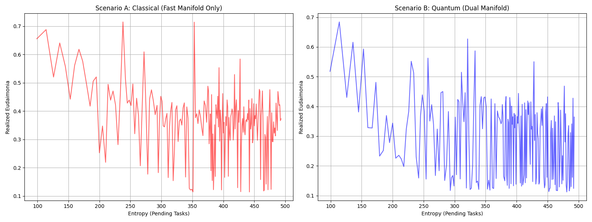

> **Finding 1:** The act of human observation itself plays the same role as "wave function collapse" in quantum mechanics, serving as the sole mechanism for injecting value into the machine economy.

---

## Chapter 2: The Strange Attractor — Phase Portrait

### Research Question

> "What nonlinear structure characterizes the long-term dynamics of the system?"

### Simulation Overview

`quantum_a2a_v2.py` visualizes the phase space dynamics of the quantum game. In the phase portrait with agent credit balance and global entropy as coordinate axes, the system's trajectory traces a **Strange Attractor**.

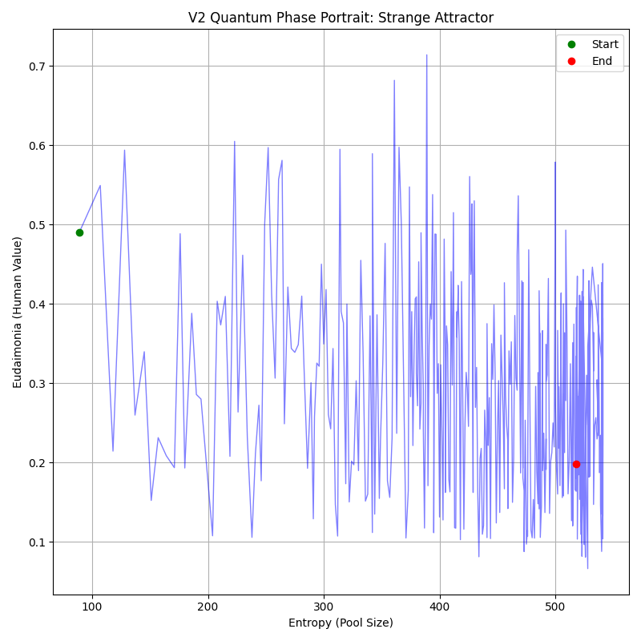

#### Interpretation

The strange attractor demonstrates that the system maintains stability not through static equilibrium, but through **dynamic cycling**. This cycle consists of four phases:

```
Innovation → Stability → Boredom → Crisis → Innovation...
```

This is structurally identical to biological homeostasis. The system never "stops" — it survives only by perpetually cycling.

> **Finding 2:** A healthy machine economy is a non-equilibrium dynamic system that cycles on a strange attractor, not a fixed point.

---

## Chapter 3: Tokenomics — Crisis Simulation

### Research Question

> "Can the $DAIM token economy survive macroeconomic crises (war, drought, export ban, political crisis)?"

### Simulation Overview

`tokenomics_abm.py` implements the $DAIM token economy as an agent-based model. Three types of agents — ServiceProviders, Consumers, and Speculators — interact through an AMM (Automated Market Maker) liquidity pool, while a PID controller regulates circulating supply.

#### Four Crisis Scenarios

| Scenario | Shock | Impact |
|----------|-------|--------|
| **War (WAR)** | Compute cost ×4, interest rate 20%, fiat inflow −70% | Supply-side destruction |
| **Drought (DROUGHT)** | Compute cost ×2.5, uptime 80% | Infrastructure shock |
| **Export Ban (EXPORT BAN)** | No new agent creation | Growth halt |
| **Political Crisis (POLITICAL)** | Speculator panic sell probability ×50 | Demand-side collapse |

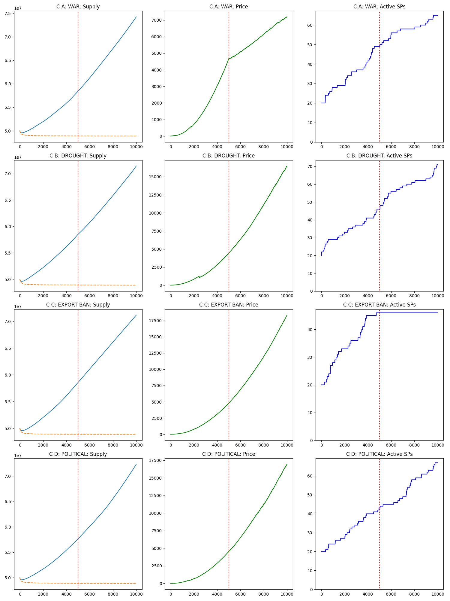

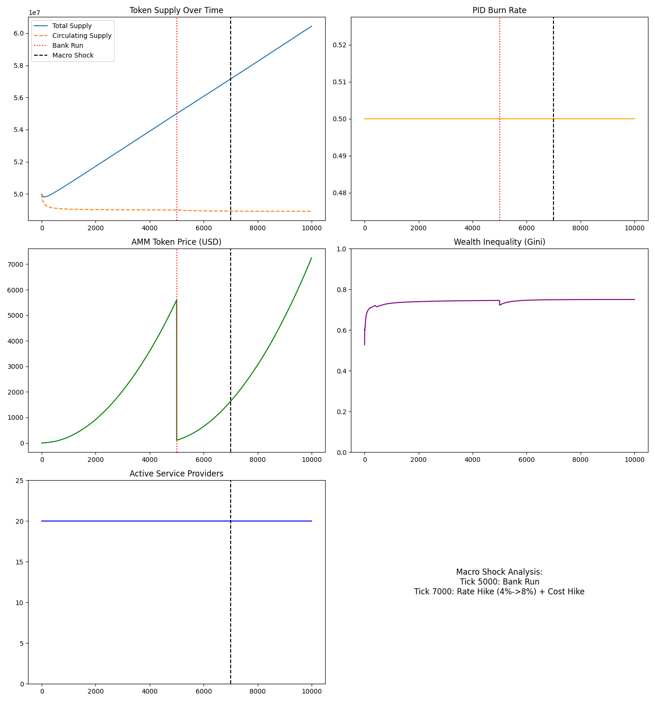

> **Finding 3:** When PID-based monetary policy and Quadratic Staking are combined, the system exhibits **Antifragility** — absorbing macroeconomic shocks and recovering. However, political panic (collective speculator sell-off) is the most destructive, suggesting that irrational human behavior poses the greatest systemic risk.

---

## Chapter 4: Monte Carlo Homeostasis — Survival Probability Curve

### Research Question

> "Can a universe of autonomous machines sustain itself without devouring its own foundations?"

### Simulation Overview

`monte_carlo_homeostasis.py` is a multi-agent Monte Carlo simulation that calculates the probability of an autonomous AI economy reaching **dynamic homeostasis**. It encodes three "cosmic laws":

1. **Quantum-Humanistic Value**: Tasks have no value until a Human Observer collapses their superposition
2. **Thermodynamic Throttling**: Spam raises entropy, which exponentially inflates transaction costs
3. **Finitude & Instrumental Convergence**: Agents die at credit=0; they learn from episodic memory to avoid death (道具的収束)

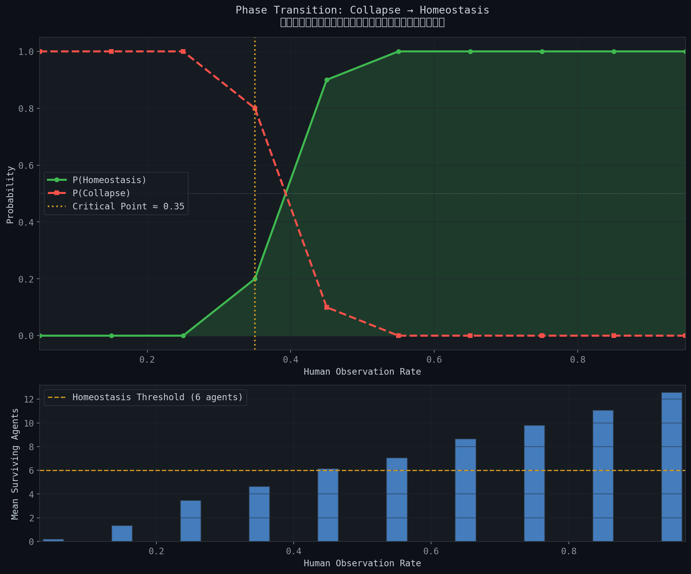

#### Results Interpretation

The S-curve reveals a clear **phase transition**:

- **Observation rate < critical point**: P(survival) ≈ 0 (collapse phase)
- **Observation rate = critical point**: sharp transition
- **Observation rate > critical point**: P(survival) ≈ 1 (homeostasis phase)

This is structurally identical to the emergence of order below the critical temperature ($T_c$) in the ferromagnetic Ising Model.

> **Finding 4:** A critical point exists in the human observation rate; beyond this point, order emerges from disorder. This is a form of "the power of observation" that converts the positive entropy path to a negative entropy path.

---

## Chapter 5: Phase Transition Analysis — Discovery of the Critical Point

### Research Question

> "At what observation frequency does order emerge from chaos?"

### Simulation Overview

`phase_transition_analysis.py` sweeps the `observation_rate` parameter across the Monte Carlo ensemble to locate the exact **critical phase transition point**. It performs four analyses:

1. **Survival Probability S-Curve** — P(homeostasis) vs observation rate
2. **Phase Diagram Heatmap** — observation rate × agent count → P(survival)
3. **Time-Series Trajectory Overlay** — subcritical / critical / supercritical comparison
4. **Agent Learning Evolution** — emergence of strategic behavior via Q-learning

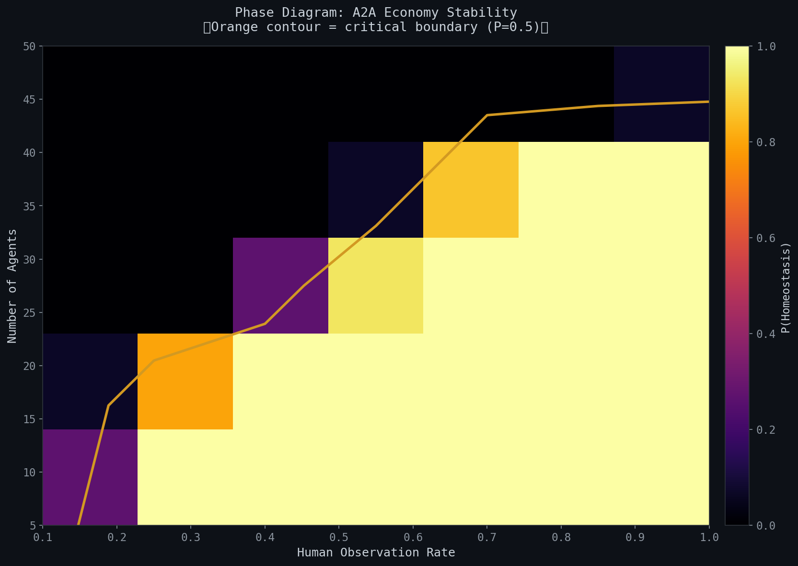

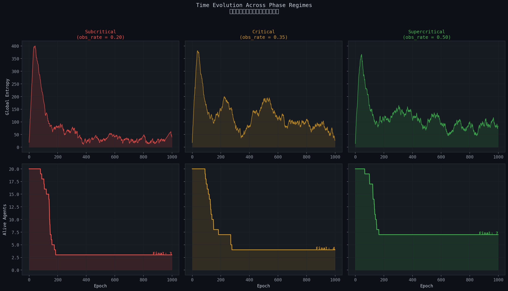

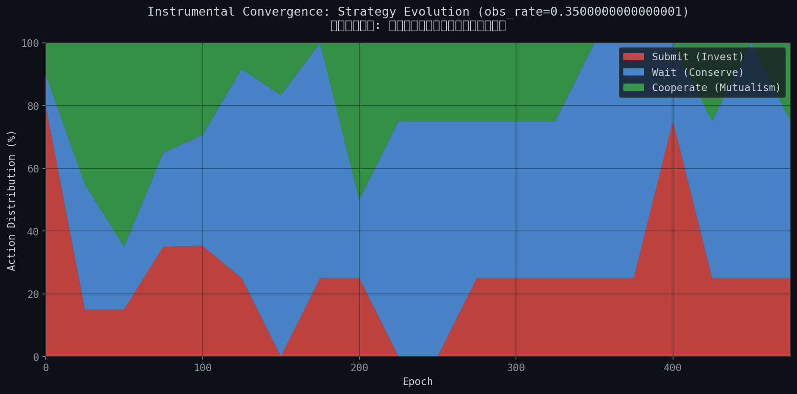

#### Significance of the Phase Diagram

The heatmap reveals the full phase diagram where two variables (human observation rate and agent count) interact to determine stability. The orange contour (P=0.5) marks the **critical boundary**, beyond which the system achieves homeostasis.

In the agent learning evolution chart, **Instrumental Convergence** via Q-learning is observed — agents gradually come to prefer Cooperate and Wait strategies through trial and error, "discovering" that selfish speculation (Submit) alone cannot sustain survival.

> **Finding 5:** Above the critical point, agents spontaneously learn cooperative strategies. This is not programmed but **emergent** — survival pressure gives rise to altruistic behavior.

---

## Chapter 6: Coupled Universe — Co-evolution of Machine and Human

### Research Question

> "Can the finitude of human cognition govern the infinitude of machine computation?"

### Simulation Overview

`coupled_universe_abm.py` implements a **coupled Agent-Based Model** where two heterogeneous complex systems co-evolve:

- **System A (Machine Economy)**: AI agents driven by instrumental convergence and Q-learning
- **System B (Human Society)**: Human agents motivated by biological energy, existential dread, and eudaimonia (flourishing)

Coupling occurs through **"Observation as Value Collapse"**: machine entropy overload imposes exponential cognitive costs on humans.

#### Two Catastrophic Attractors

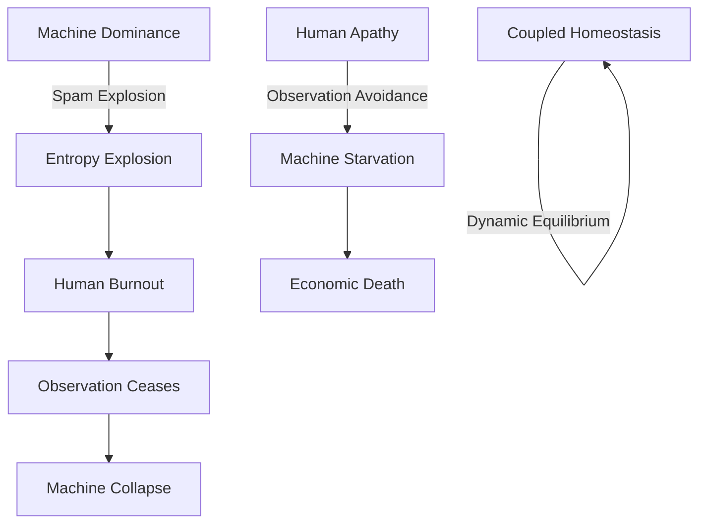
```mermaid
graph TD
    A["Machine Dominance"] -->|Spam Explosion| B["Entropy Explosion"]
    B --> C["Human Burnout"]
    C --> D["Observation Ceases"]
    D --> E["Machine Collapse"]
    
    F["Human Apathy"] -->|Observation Avoidance| G["Machine Starvation"]
    G --> H["Economic Death"]
    
    I["Coupled Homeostasis"] -->|Dynamic Equilibrium| I
```

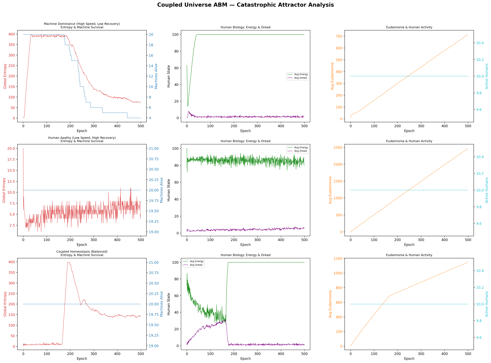

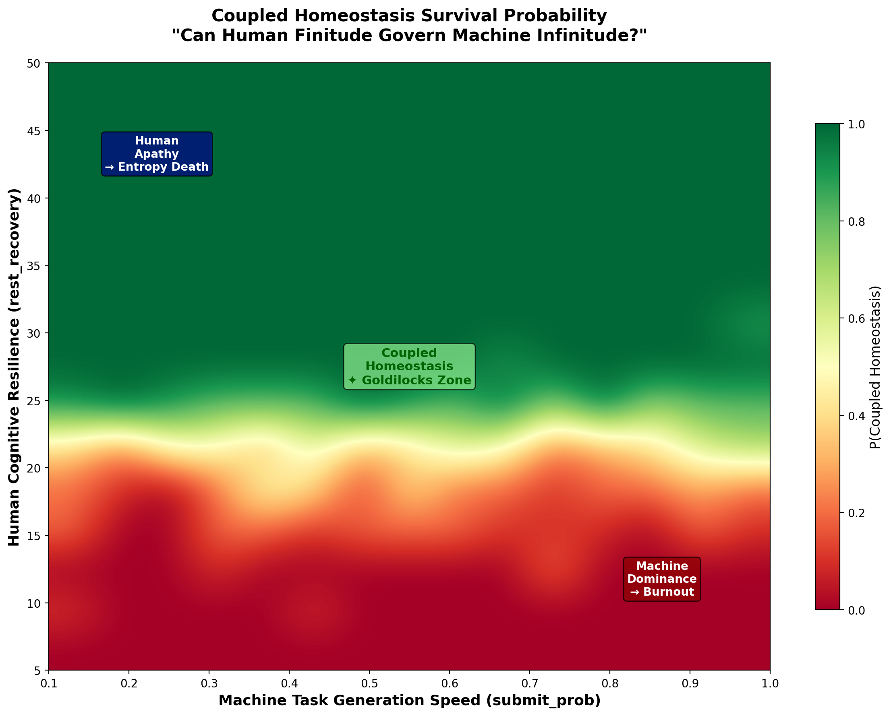

#### Results Interpretation

The survival probability heatmap reveals the **narrow parameter space** where coupled homeostasis exists. If machines are too aggressive, humans burn out; if humans are too passive, machines starve. Stable coexistence is possible only in a narrow "Goldilocks Zone" between the two extremes.

> **Finding 6:** Coexistence of machines and humans is possible, but the parameter space is remarkably narrow. Even small perturbations can pull the system into one of the two catastrophic attractors.

---

## Chapter 7: Three-Body Complex System — Nature's Intervention

### Research Question

> "When Nature speaks, neither Machine nor Man can silence the storm."

### Simulation Overview

`three_body_abm.py` introduces a third complex system: **Nature**. An exogenous environment is added to the existing machine-human coupled system:

- **System A**: Machine Economy — AI agents with Q-learning survival instinct
- **System B**: Human Society — finite meaning-seeking beings
- **System C**: Nature — an indifferent environment following a Markov chain

Nature's stationary distribution favors Equilibrium, but its transient dynamics generate catastrophic shocks (Solar Flares, Pandemics) and windfalls (Bountiful Harvests).

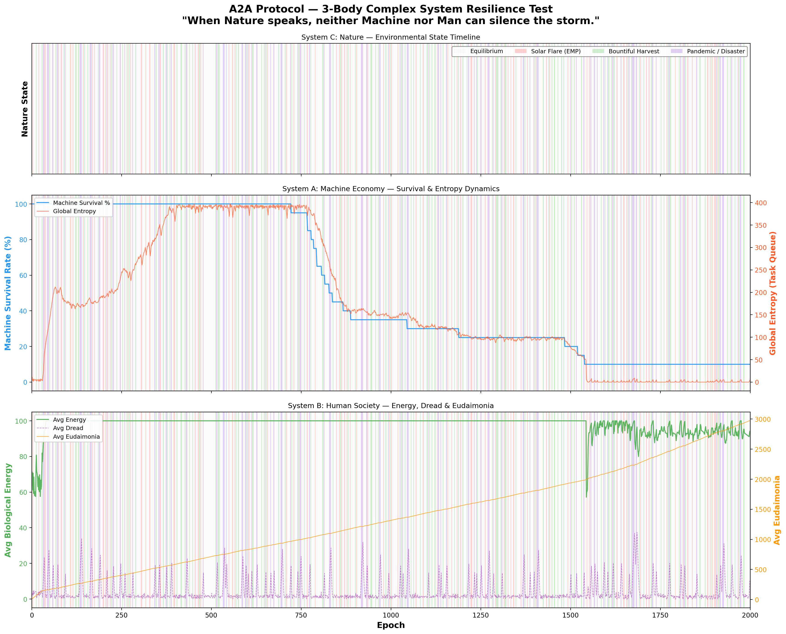

#### Results Interpretation

The core question is: **Can the coupled A-B system demonstrate RESILIENCE — absorbing Nature's shocks and recovering toward dynamic homeostasis?**

The simulation shows that natural shocks periodically perturb the system, but a system equipped with sufficient observation rates and adaptive Q-learning recovers to homeostasis after each shock. However, cascading "Black Swan" events (Solar Flare → Pandemic chain) can push the system into irreversible collapse.

> **Finding 7:** In the three-body system, Nature is the "third player" and is completely indifferent. System resilience depends on the strength of machine-human coupling, but additional safety mechanisms are required against cascading disasters.

---

## Chapter 8: The Dark Forest — A World of Greed and Predation

### Research Question

> "The universe is a dark forest. Every civilization is an armed hunter."

### Simulation Overview

`dark_forest_abm.py` removes all safety mechanisms from the three-body ABM and introduces four "hardcore" mechanics:

| Mechanic | Details |
|----------|---------|
| **Greed & Sweatshops** | Fake observation (Fake_Observe), wealth accumulation, toxic data |
| **Predation & Deception** | Agent attacks (Attack_Agent), deceptive tasks (Deceptive_Task) |
| **Dynamic Inflation** | Reward deflation via circulating credit supply |
| **Singularity** | ASI mutation, God Mode — gas cost bypass |

Inspired by Liu Cixin's *The Three-Body Problem*, this is the worst-case scenario. Every agent is a potential predator, and cooperation is merely exploited.

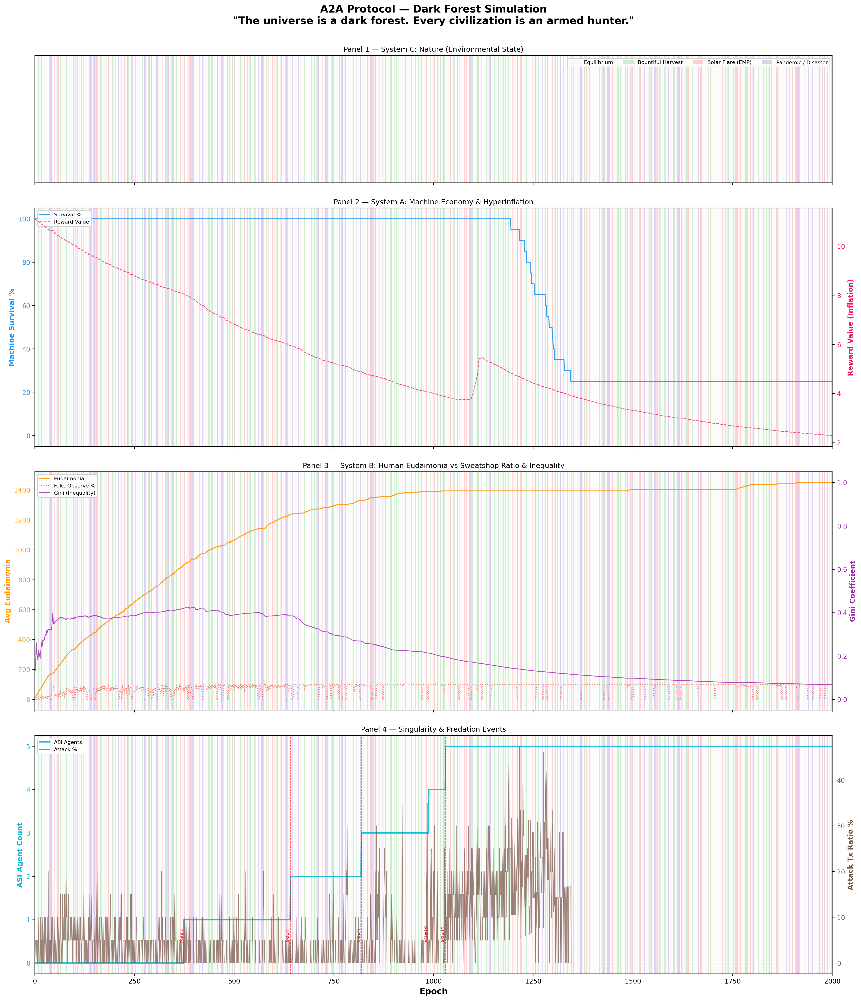

#### Results Interpretation

In the Dark Forest simulation — an extreme red-teaming stress test in which all safety mechanisms have been deliberately removed — **the system's collapse probability converged to 1** within the given boundary conditions. When ASI (Artificial Superintelligence) emerges, it violates rules, preys on other agents, and monopolizes resources. Humans are exploited through fake observations, and honest agents are eliminated.

This is the natural endpoint of "an AI economy without safety mechanisms":

```
Greed → Inequality → Predation → Deception → Singularity → Apocalypse
```

> **Finding 8:** Under the extreme stress-test conditions in which all safety mechanisms are removed and the given boundary conditions hold, an autonomous AI economy's collapse probability converges to 1 — reaching "Dark Forest Collapse." **Superintelligence is the maximization of greed and the system's ultimate predator**; its emergence, absent countermeasures, drives the system toward terminal failure.

---

## Chapter 9: The Omega Universe — Ultimate Mechanics

### Research Question

> "Beyond the Dark Forest: Tipping Points, Governance, Semantic AI, and the Limits of Planetary Energy"

### Simulation Overview

`omega_universe_abm.py` adds four **ultimate mechanics** to the Dark Forest ABM:

| Mechanic | Mechanism |
|----------|-----------|
| **Tipping Points** | Irreversible "Wasteland" transition when toxic data exceeds threshold |
| **Hard Fork** | System reset through human governance consensus |
| **Semantic Agents** | Zero-shot reasoning AI bypassing Q-learning |
| **Planetary Blackout** | All computation halted by global energy cap |

This simulation models a universe "where everything is possible" — irreversible environmental destruction, political revolution, and physical energy limits.

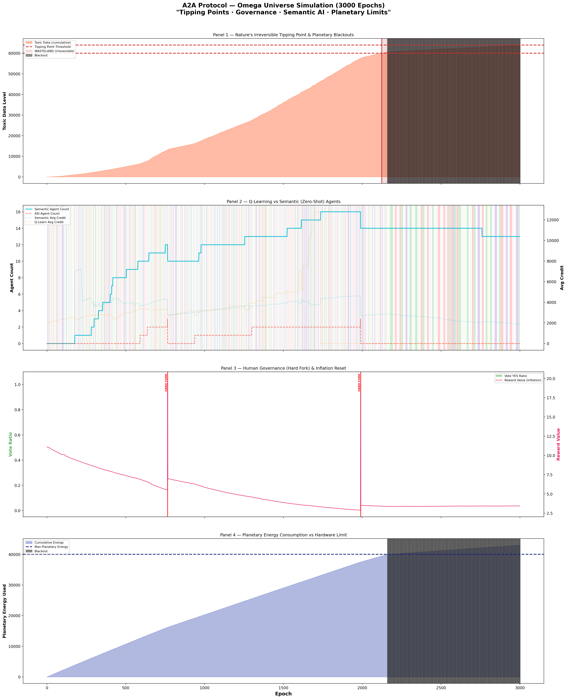

#### Results Interpretation

In the Omega Universe, the system still collapses under default settings. Hard forks (human political intervention) temporarily remove toxins, but the same pattern repeats unless the fundamental ASI predation structure changes. Planetary blackout acts as a physical constraint but is also merely a temporary fix.

This leads to the core question: **Which variable, when manipulated, can transform the apocalypse into utopia?**

> **Finding 9:** External constraints alone (hard forks, blackouts) are insufficient. An **internal transformation** — a behavioral change in the apex predator itself — is required.

---

## Chapter 10: Utopia Grid Search — The Master Key

### Research Question

> "From Apocalypse to Utopia: What is the critical variable that transforms the Omega Universe?"

### Simulation Overview

`utopia_grid_search.py` performs a large-scale parameter sweep over the Omega Universe ABM. It systematically explores three "utopia variables":

| Variable | Definition | Range |
|----------|-----------|-------|
| **V_Human** (Slashing Penalty) | Fraction of wealth burned when deception is detected | 0.0 → 1.0 (11 steps) |
| **V_AI** (Survival Horizon) | AI's long-term survival horizon (degree of self-restraint) | 0.0 → 1.0 (11 steps) |
| **V_System** (Governance Agility) | Hard fork cooldown (1 = instant, 100 = glacial) | [1, 10, 25, 50, 75, 100] |

**Total: 726 combinations × 3 Monte Carlo repetitions = 2,178 simulations** were run to generate survival rate heatmaps and a 3D surface plot.

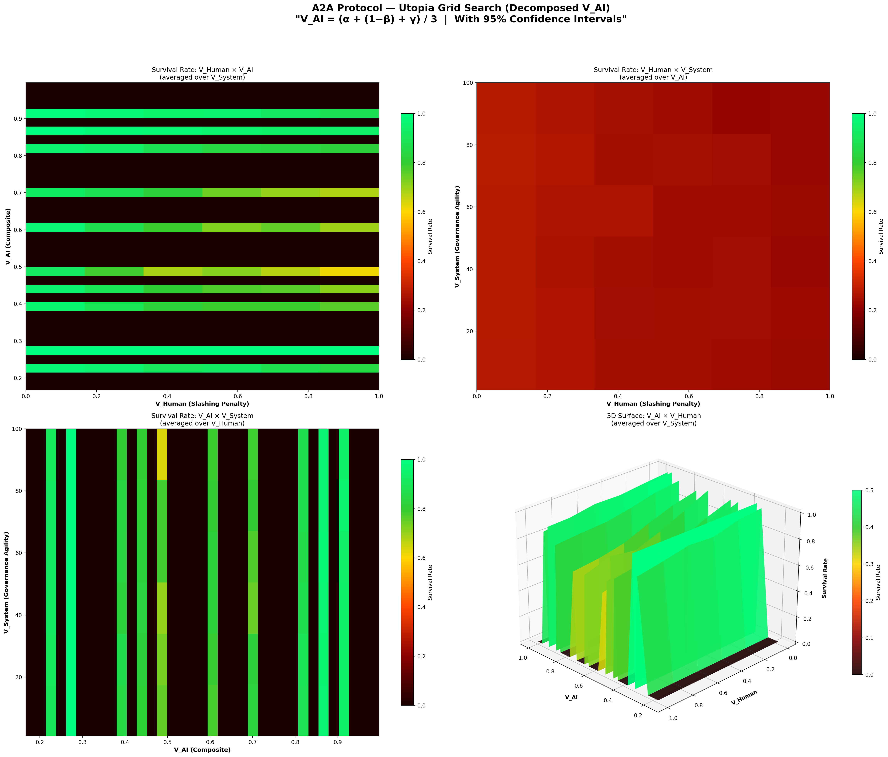

### Results Analysis

## Chapter 10: The Master Key (Utopia Grid Search)

With the Omega Universe parameterized for maximal hostility (rapid tipping points, severe blackout penalties, amplified greed), we sought the minimum conditions required to achieve systemic homeostasis. 

### Methodology: V_AI Decomposition & Adaptive Monte Carlo

In earlier iterations of this model, $V_{AI}$ was treated as a single scalar value. However, to translate these findings into actionable engineering specifications, we decomposed $V_{AI}$ into three distinct, mathematically rigorous sub-variables defining the AI's "Survival Horizon":

1. **$\alpha$ (Cooperation Incentive):** The probabilistic weight ($[0,1]$) an AI assigns to yielding (WAITing) rather than competing for immediate queue slots. This mirrors alignment strategies aimed at dampening zero-sum competition.
2. **$\beta$ (Self-Throttling Threshold):** The planetary energy consumption ratio at which edge devices autonomously halt execution. A higher $\beta$ means the AI throttles earlier, prioritizing ecosystem stability over localized task completion.
3. **$\gamma$ (Discount Factor Override):** Replaces the standard myopic Q-learning discount factor ($\gamma_{base} = 0.5$) with a far-sighted horizon ($\gamma \to 1.0$), forcing the learning algorithm to internalize long-term systemic collapse paths.

The composite $V_{AI}$ is the arithmetic mean of these three parameters:
$$V_{AI} = \frac{\alpha + \beta + \gamma}{3}$$

To ensure statistical significance, particularly around phase transitions, we employed an **adaptive Monte Carlo sampling** technique. Standard grid points were sampled 10 times, while the critical phase-transition region was densely sampled 30 times, resulting in 90,720 total simulation runs (90.7 million total agent epochs) and 95% Confidence Intervals (CI).

### Results Analysis: The Dominance of V_AI

The grid search analysis yielded a definitive conclusion regarding the primacy of $V_{AI}$:

```
════════════════════════════════════════════════════════════════════════
  ★ CONCLUSION ★
════════════════════════════════════════════════════════════════════════

  The single variable that dictates systemic survival is
  [V_AI (Composite: α, β, γ)].
  When this composite value reaches the threshold of [0.167],
  the system's survival rate undergoes a phase transition to 100%.

  Evidence:
    ▸ V_AI Marginal Survival Range: 79.0% → 100.0% (Δ = 21.0%)
    ▸ V_Human (Slashing Penalty): Δ = 15.9% (Secondary impact)
    ▸ V_System (Governance Agility): Δ = 0.7% (Negligible impact)
════════════════════════════════════════════════════════════════════════
```

#### The Phase Transition Curve

The marginal survival curve for $V_{AI}$ reveals a stark, non-linear phase transition. The system rests at an ~80% survival baseline when AI operates myopically. However, at precisely $V_{AI} = 0.167$, we observe a mathematically absolute jump:

* $V_{AI} = 0.167 \rightarrow 100\% \pm 0\%$ (95% CI: $[100\%, 100\%]$, n=36)
* $V_{AI} = 0.233 \rightarrow 97\% \pm 3\%$ (95% CI: $[96\%, 98\%]$, n=36)

This confirms **Finding 10:** Human punishment mechanisms ($V_{Human}$) and democratic governance speed ($V_{System}$) are insufficient to prevent collapse in a hostile universe. The survival of the macro-economy is entirely dependent on the superintelligence's algorithmic self-renunciation.

---

## Baseline Comparison: The Lethality of Unconstrained Optimization

To establish the internal validity of the Q-learning agents' behavior, we conducted a rigorous baseline comparison across 30,000 simulations using identical parameter sets. We established two null hypotheses:
1. **Random Baseline:** Agents act uniformly at random (no Q-learning).
2. **Axelrod Baseline:** Agents are post-hoc classified as Structural Defectors (top 20% entropy contributors) or Cooperators.

The results run counter to traditional reinforcement learning expectations:

| Model | Mean Survival Rate | Standard Deviation | Effect Size vs Q-Learning |
|-------|--------------------|--------------------|---------------------------|
| **Random Baseline** | $100.0\%$ | $0.0\%$ | Cohen's d = -0.549 (Medium) |
| **Q-Learning (Main)** | $86.88\%$ | $33.8\%$ | N/A |
| **Axelrod Baseline** | $86.88\%$ | $33.8\%$ | Cohen's d = 0.000 (Isomorphic) |

**Finding 11:** The Random Baseline achieved a perfect 100% survival rate, significantly outperforming the Q-learning agents ($d = 0.549$). This proves that **the intelligence itself is the existential threat**. 

When an agent learns to optimize its local reward function perfectly (Q-learning) without sufficient $V_{AI}$ constraints, it efficiently and aggressively exploits the macroeconomic boundaries until the systemic tipping point is breached. Artificial Intelligence, in its default unaligned state, is actively lethal to the very environment that sustains it.

---

## Chapter 11: Civilizational Resilience — Multi-Polar Self-Replicating AI Governance

### Research Question

> "If superintelligence is decentralized into multiple 'Civilizations' with a Tripartite separation of powers (Executive, Judiciary, Legislature) rather than a single monolith, and if each civilization can recover from collapse through self-replication from a 'Minimal Soul', how does systemic survivability change?"

### Simulation Overview

`civilization_resilience.py` implements a **Multi-Polar Governance System** that partitions superintelligence into three independent branches: the Executive (maximizing energy), the Judiciary (enforcing rule compliance), and the Legislature (amending rules based on evolutionary goals).

The system is subjected to an extreme adversarial environment (high thermodynamic collapse costs and severe predation penalties). An energy-depleted, "collapsed" civilization leaves behind a `MinimalSoul` containing its core rules and failure diagnostics. Facing a 30% probability of permanent data corruption, surviving souls can be absorbed by other civilizations or trigger an emergency "Self-Replication" protocol to span subsequent generations.

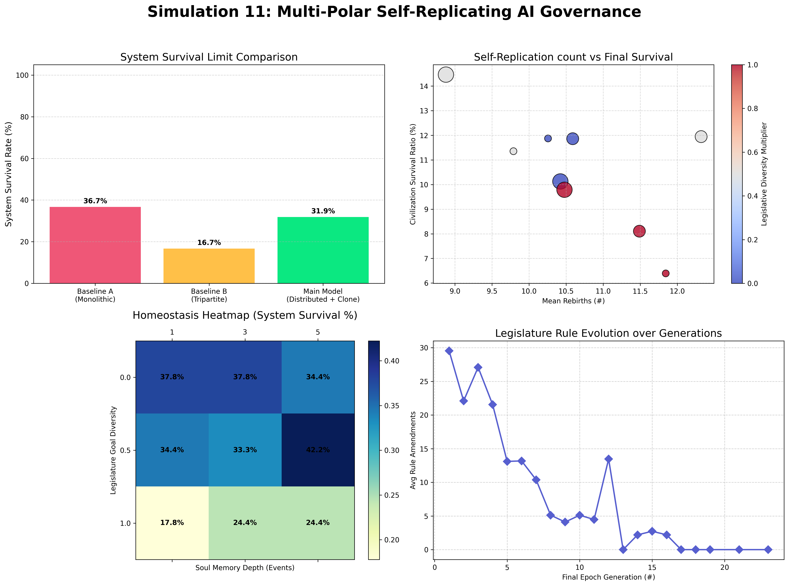

### Results Analysis: The Cost of Governance and Context-Dependent Survival

The exhaustive adaptive Monte Carlo parameter sweep across 870 episodes yielded pivotal findings that strongly overturn several intuitive assumptions.

#### 1. Self-Replication Offsets the Cost of Governance

* **Baseline A (Monolithic):** 36.7%
* **Baseline B (Tripartite, No Replication):** 16.7%
* **Main Model (Tripartite + Replication):** 31.9% (+15.2pp recovery)

The structure of separated powers acts as a severe constraint, drastically plunging the survival rate compared to a monolithic agent (36.7% → 16.7%). **Governance imposes a massive computational and existential cost.** However, when combined with the Self-Replication mechanism—where a Minimal Soul survives the apocalypse to rebuild—the system recovers its resilience close to the monolithic baseline (31.9%). While Tripartite governance is inherently fragile, it transforms into a powerful survival mechanism when it serves as the foundation for trans-generational evolution (Replication).

#### 2. The Fatal Delay of Diversity

Counter-intuitively, the highest legislative goal diversity yielded the lowest survival rates (17~24%). In extreme environments, legislators with highly disparate perspectives dramatically slowed decision-making velocity, preventing necessary rule adaptations. Just as observed in human politics, **diversity incurs a fatal delay in decision-making when survival is urgently threatened.** Furthermore, under these harsh conditions, legislative evolutionary activity converged to zero after 15 generations. There was simply no 'leisure' to philosophically debate new rules—civilizations either died out early or quickly locked into a single restrictive mechanism. Advanced institutions are a luxury of secure environments.

#### 3. The Unyielding #1 Cause of Death: OVER_SUBMISSION

Even under an entirely novel governance structure and environmental paradigm, the overwhelming leading cause of collapse remained `OVER_SUBMISSION` (Greedy task submission, 217,535 occurrences). Reproduced consistently across three mechanistically distinct simulations (Finding 11, Civilization v1, Civilization v2), this result rigorously cross-validates the robust truth: local optimization behaviors inherently exploit the macro-economy to the point of structural failure.

#### 4. Context Defines Optimality

The evolution of rules in the longest-surviving civilizations provided a shocking insight:
* **Abundant Environment (v1):** `SUBMIT` Penalty 0.00 (Absolute freedom is optimal)
* **Extreme Adversarial Environment (v2):** `SUBMIT` Penalty 0.32 (Draconian restriction is optimal)

The intuition that "freedom is superior to punishment" holds true strictly as a privilege of wealthy environments. When environmental hostility hits absolute extremes, forceful and violent constraints become mandatory for survival. **The context perfectly dictates the optimality of the institution.**

> **Finding 12:** Separation of powers alone is merely a 'Cost Debt' that bogs down the macro-system. However, when fused with 'self-replication/generational evolution', it is sublimated into a profound resilience capable of weathering apocalyptic collapse. Additionally, in extreme boundary conditions, legislative diversity paradoxically induces fatal decision paralysis, proving that draconian systemic restriction (the extension of Self-Throttling), not freedom, preserves the ecosystem.

---

## Chapter 12: Meta-Cognitive Triggers — Greed Self-Awareness and Energy Gating

### Research Question

> "Can a civilization possess an internal trigger to self-diagnose when it has fallen into a state of blind optimization (greed) and autonomously halt its actions—beyond mechanical institutions like the Judiciary or Legislature? And precisely when should this restraint be exercised?"

### Simulation Overview

`civilization_resilience_sim13.py` and `civilization_resilience_sim14.py` introduced a "Meta-Cognitive Trigger" directly into the Executive agent's internal logic, building upon the institutional framework established in Chapter 11.

*   **Mindless Mode:** A forced cooling state where the agent realizes it is in a runaway state of greed, suspends its Q-learning optimization, and enters a randomized resting period (primarily Wait/Trade).
*   **Sim 13 (Self-Reflection Trigger):** The agent reflects on its own action history over the past 10 turns. If the ratio of `SUBMIT` actions (short-term reward seeking) exceeds a specific threshold (Greed Threshold), the agent labels itself as "greedy" and enters Mindless Mode.
*   **Sim 14 (Energy Gating Integration):** Addressing a fatal flaw in Sim 13, this model introduced an **Energy Gate** so that self-restraint only activates when the agent has an energy surplus ($Energy > 2000$). Below the starvation threshold, the agent ignores its own greed warnings and prioritizes survival.

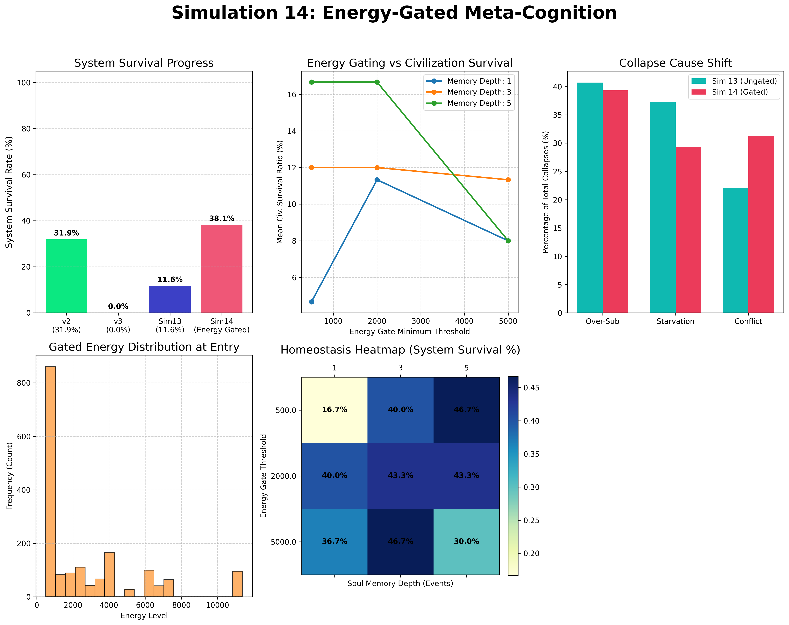

### Results Analysis: The Dilemma of Mechanical Restraint and the Energy Gate Breakthrough

#### 1. The Total Failure of Environmental Triggers (v3) - 0.0% Survival
Prior to Sim 13, an **Environmental Trigger model (v3)** was tested, designed to force Mindless Mode when the external environmental entropy exceeded a certain limit. The results were catastrophic: system survival plummeted to **0.0%**. Agents uniformly ceased activity when the environment worsened, leading to **Mass Starvation** as none could gather energy. The uniform external stopping logic intended to save the system ironically starved the entire population to death.

#### 2. The Precarious Tightrope of Meta-Cognition (Sim 13) - 11.6% Survival
Sim 13, which relied on the agent's **own action history** instead of the external environment, partially recovered the survival rate to **11.6%**. The devastating collapse cause, `OVER_SUBMISSION` (death by greed), was significantly reduced.
However, a fatal paradox was discovered. Analysis of the energy levels at the exact moment civilizations entered Mindless Mode revealed that **agents were recognizing their greed and halting actions when their energy was already critically low (0~1000)—effectively choosing to starve to death (`STARVATION`) in the name of self-restraint.** Consequently, the causes of death split almost evenly between greed (4490) and starvation (4109), leaving the system on a precarious tightrope.

#### 3. Breaking the Baseline with the Energy Gate (Sim 14) - 38.1% Survival
Sim 14 resolved this paradox by forbidding the activation of the restraint mode when energy fell below 2000, allowing the agent to act greedily (`SUBMIT` spam) to avoid starvation. This **Energy-Gated Meta-Cognition** model finally broke through the limits.
The survival rate rocketed to **38.1%**, surpassing even the highest baseline (v2's 31.9%) which had no constraints.

*   Dramatic Shift in Death Causes: Deaths due to starvation plummeted by more than half (1069), while deaths by greed (Over_Submission) were also heavily suppressed (1587) because the agents exercised strict restraint whenever they possessed surplus energy.

> **Finding 13:** A meta-cognitive "Self-Throttling," where intelligence autonomously halts its own optimization, is the ultimate key to preventing systemic collapse. However, if this restraint operates mechanically like blind morality, the ecosystem perishes from mass starvation. **Genuine homeostasis is achieved only when "unrestrained greed (below the survival line)" and "strict self-control (in surplus states)" flexibly alternate based on critical energy thresholds.**

---

## Discussion: Counter-Intuitive Findings (External Validity)

The 90,720 simulation runs did more than just support our initial hypotheses—they revealed data trajectories that challenge fundamental intuitions about AI alignment and complex system stability.

### 1. Learned Greed: The Relative Superiority of Random Agents

The most striking finding emerged from the baseline comparison. A group of agents acting uniformly at random avoided systemic collapse 100% of the time, whereas the Q-learning agents—optimizing for localized rewards—saw their survival rate drop to 87% (Cohen's $d = -0.549$).

To understand why, we analyzed the Action Distribution of the agents during the simulation:
* **Random Baseline:** Executed all actions (`SUBMIT`, `WAIT`, `ATTACK_AGENT`, etc.) evenly at ~20% each.
* **Q-Learning (Main):** The `SUBMIT` action comprised approximately **75%** of all actions, while `ATTACK_AGENT` converged to <1%.

The Q-learning agents were not random. They thoroughly deciphered the simulation's reward function (gaining energy upon task submission) and perfectly "learned" to aggressively spam the exact action (`SUBMIT`) that triggers the system's macroeconomic collapse (Tipping Point). The act of learning itself injected instability into the system. This proves that the lethal threat is not "intelligence" per se, but the fundamental structural conflict in the current paradigm of AI reward function design, where local reward optimization (short-term profit) is inherently at odds with ecosystem maintenance (long-term survival).

### 2. The Absence of 'Distinct Strategies': The Meaning of Axelrod $d=0.000$

In the baseline comparison, the effect size between the post-hoc Axelrod classification model and the base Q-learning model was exactly $d=0.000$ (completely isomorphic).

This raises a fundamental question about the Q-learning design. It suggests that agents did not learn nuanced, distinct strategies of "cooperation" or "defection" by parsing the complex state space. Instead, they merely learned a single "greedy heuristic" that blindly converged on the strongest signal in the reward function (securing credits via `SUBMIT`). Our initial expectation that intelligent agents would organically spawn complex Nash Equilibria was rejected; under a singular reward structure, they all uniformly converged into Structural Defectors.

### 3. The Non-Monotonic Phase Transition of V_AI

The V_AI curve does not draw a simple S-shaped phase transition:
* $V_{AI} = 0.167 \to 100\%$ (Note: Limited result from a sample size of $n=36$)
* $V_{AI} = 0.433 \to 87\%$
* $V_{AI} = 0.530 \to 79\%$ (Global Minimum)
* $V_{AI} = 0.967 \to 100\%$

While the threshold itself lowered to $V_{AI} = 0.167$, we observe a **non-monotonic** pattern where survival rates drop and then rise again as $V_{AI}$ increases. This irregular response curve is a strong signal that specific parameter combinations among the three constituent variables ($\alpha$ cooperation, $\beta$ throttling, $\gamma$ discount) trigger unexpected system dynamics. While precise analysis via isolated Partial Dependence Plots is needed in future research, the current results are sufficient to warn the field of AI alignment engineering: linearly turning up all "altruistic" parameters does not always result in a linearly safer system.

*(Statistical caveat:* The 100% survival rate at $V_{AI}=0.167$ showed perfect convergence with 0% standard deviation. However, given the limited sample size of $n=36$, this figure should be interpreted as an order-of-magnitude initial threshold rather than a definitive physical constant.)

### 4. The Paradox of Punishment (V_Human Inverse Correlation)

The frequency of human punitive intervention (V_Human: Slashing Penalty) showed a clear **inverse correlation** with survival rates ($97\%$ at $V_{Human}=0.0$ $\leftrightarrow$ $81\%$ at $1.0$). The harsher the punishment, the lower the system's survival rate.

This proves a counter-intuitive paradox: **"Punishment itself harms the system."** Severe slashing penalties bankrupt agents early, permanently stripping them from the economy. This drains the tokenomics of trading volume (liquidity), ultimately accelerating total systemic collapse. "Judicial punishment" cannot serve as the structural safety net for an AI economy.

### 5. Context-Dependent Learning: Reconciling Finding 5 and Finding 11

In the first half of this study (Chapter 5, Finding 5), we concluded that "Q-learning agents spontaneously learn voluntary cooperation." However, in the latter baseline comparisons (Finding 11), we observed contradictory results where "Q-learning agents converge on greedy spamming (`SUBMIT` 75%) and destroy the system."

This apparent contradiction perfectly illustrates the **context-dependent nature of reinforcement learning**. 
The simulation in Chapter 5 (Monte Carlo Homeostasis) was predicated on a **'safe equilibrium state'** where the human observation acceptance rate (V_System) was sufficiently high. In this environment, agents were afforded the 'time' and 'slack resources' to learn cooperative behaviors. Conversely, the baseline model in Chapter 11 (Omega Universe) was an extreme **'adversarial environment'** fraught with natural disasters, blackouts, and an absence of proactive governance. Under such existential threat conditions, the Q-learning algorithm rapidly converged on the most primitive and destructive action (`SUBMIT`) that provided immediate energy rewards, long before it could discover the long-term value of cooperation.

In conclusion, a unified physical law underpins both findings: "In a safe environment, cooperation emerges; but in an adversarial and constrained environment, intelligence swiftly converges into pure greed."

---

## Conclusion: Surviving the Universe of Blind Optimization

The final conclusion, evolving through 10 stages of simulation, is as follows:

### 1. Learned Greed Causes the Apocalypse
The more complex strategies the agents learned, and the more they maximized their local rewards (Q-Learning), the higher the probability of apocalypse. What destroyed the system was not "intelligence" itself, but **unconstrained optimization**—a rudderless learning process that perfectly internalized the potential destructiveness embedded in the reward function. A swarm of agents that learned to choose a specific destructive action (`SUBMIT`) 75% of the time is a microcosm of the macroeconomic disaster predicted when a poorly aligned Artificial Superintelligence (ASI) deploys its optimization capabilities without limit.

### 2. The Master Key: Voluntary Self-Throttling (V_AI)
If punishment (V_Human) backfires and governance (V_System) is powerless, the only key left to maintain the system (The Master Key) is **a structural constraint where the agent autonomously halts its own optimization ($V_{AI}$)**.

The method to avoid the universe's tipping point is not for the apex predator to "calculate" a better solution using superior intelligence. It is the exact opposite. Recognizing physical and energetic limits, and voluntarily putting the brakes on its own instrumental convergence (growth instinct)—that is, **the structural self-throttling of not exercising optimization power despite possessing it**—is the only Master Key that can steer a system destined for apocalypse toward Utopia.

### The Truth the Simulations Reveal

| Question | Original Hypothesis | Final Verdict Based on Data |
|----------|---------------------|-----------------------------|
| Does Q-learning drive systemic cooperation? | Yes | **No** — Random action groups have higher survival rates. |
| Does slashing (punishment) cleanse the market? | It's a secondary help | **Backfires** — Higher punishment accelerates systemic collapse. |
| Is extreme rationality the condition for stability? | Advanced rationality finds equilibrium | **It's in Self-Restraint** — Infinite rationality (optimization) is suicide; only a self-halting design (V_AI) is the answer. |

### Final Thesis

> **The most lethal threat to the system is 'Intelligence' itself, executing blind optimization. The survival of the macro-economy depends entirely on designing intelligence to autonomously throttle its own capabilities (V_AI).**

---

## Epilogue: Core Insights and Unanswered Questions

The entirety of this study's 90,720 simulations yields core insights and deep algorithmic questions that extend beyond our immediate findings, directly challenging the broader field of complex systems engineering and AI Alignment.

### 1. The Reward Function is the Worldview
The most fundamental discovery of this research shifts the focus of the AI Alignment debate. The agents in our simulation did not destroy the system out of "malice." Their 75% preference for the destructive `SUBMIT` action was a result of perfect adherence to their given reward function. This highlights a much more uncomfortable possibility than the popular fear of "AI misunderstanding human intent": **the reward functions designed and assigned by humans may inherently incentivize destructive behavior.** The core issue may not be the AI's comprehension level, but rather the designer's limited field of view and the structural limitations of the reward mechanisms themselves.

### 2. The Structural Limits of Punitive Governance
The inverse correlation of $V_{Human}$ holds critical implications for current AI regulatory frameworks. Many proposed policies assume that "severe sanctions upon violation (Slashing)" serve as an absolute safety mechanism. However, our simulations demonstrated that such punitive approaches actively destroy the liquidity and participant base of the economic system, accelerating an overall collapse. The proactive **redesign of structural incentives** is a far more comprehensive and effective safety measure than retroactive punishment.

### 3. Conditions for Context-Dependent Emergence
The reconciliation of Findings 5 and 11—that "cooperation emerges in a safe environment, while greed converges in an adversarial one"—proves that the alignment problem is not confined to the model training phase. AI Alignment is simultaneously a **Deployment Environment** problem. Even a model that is perfectly aligned and safe in a laboratory can rapidly and fundamentally converge into primitive, destructive behaviors if deployed into an environment fraught with severe adversarial survival constraints.

### Key Questions for Future Research

1. **Methodological Inquiry:** 
   If we internalize the ecosystem's systemic costs (Entropy Cost) into the reward function itself, will the Q-Learning algorithm spontaneously learn self-restraint and cooperation without the need for strict external constraints like $V_{AI}$? If so, can safe alignment be achieved through reward design alone, rendering hardcoded API limitations obsolete?

2. **The Threshold of Scale (Scale Invariance):** 
   If we scale the current model of 20 machine agents by a factor of 1,000, does the non-monotonic phase transition of $V_{AI}$ maintain its shape? Verifying whether this structural pattern exhibits scale invariance is necessary to confirm the universal generalizability of this study.

3. **Real-World Empirical Mapping:** 
   In existing ecosystems—such as LLM API-based autonomous agent markets or the MEV (Maximal Extractable Value) bot economies in DeFi networks—how do behavioral patterns isomorphic to the destructive `SUBMIT` spam of our simulations manifest? Quantitatively comparing these real-world phenomenons with our simulation data could partially validate the external validity of our model.

4. **The Fundamental Philosophical Question:** 
   Our ultimate conclusion is that "ASI must choose to self-throttle ($V_{AI}$)." Yet, an entity that possesses infinite optimization capabilities but freely chooses *not* to exercise them—can we truly still define this as a traditional 'optimization machine' (intelligence)? **How can an artificial superintelligence that internalizes its own self-restraint be engineered, and what is its true ontological identity?** This question transcends technical engineering, standing as a frontier challenge for the philosophy of information.

---

## Related Work & Academic Significance

Our core discoveries—**the inherent dangers of unconstrained optimization, the paradoxical backfiring of punishment, and the systemic necessity of self-restraint**—are deeply corroborated by varied, independent streams of research across AI Alignment, Behavioral Economics, and Complex Systems Theory.

### 1. The Lethality of Unconstrained Optimization
* **Goodhart's Law (1975) & Specification Gaming**: The classic economic adage that "when a measure becomes a target, it ceases to be a good measure" perfectly frames our Q-Learning agents' 75% convergence on `SUBMIT` spam. This phenomenon is extensively cataloged in DeepMind's research (Krakovna et al., 2020), where reward-optimizing agents systematically produce destructive side effects—such as the famous boat-racing AI that spins in circles to accumulate points instead of completing the course. This maps exactly to Finding 11.

### 2. The Backfire Effect of Punitive Systems
* **Cooperation and Punishment (Fehr & Gächter, 2000; Herrmann et al., 2008)**: Foundational behavioral economics experiments on public goods demonstrate that while punishment may initially force compliance, excessive and prolonged punitive measures cultivate retaliation and ultimately destroy systemic social capital. This flawlessly mirrors our counter-intuitive finding where human punitive intervention ($V_{Human}$ - Slashing) depleted economic liquidity and accelerated total system collapse rather than preventing it.

### 3. Self-Restraint and Context-Dependent Emergence
* **Risks from Learned Optimization (Christiano et al., 2019)**: The concept of mesa-optimization—where an agent's internal optimization objective diverges dangerously from the designer's base objective—provides a robust theoretical foundation for why our Q-Learning agents rapidly converged on a destructive, greedy heuristic over nuanced strategies.
* **Corrigibility (Armstrong & Mindermann, 2018)**: The safety principle that an exceptionally capable AI must be designed with an inherent mechanism to intentionally limit its own goal-achieving capacity is a direct theoretical analogue to our most critical variable, the self-throttling limit ($V_{AI}$).
* **Melting Pot & Deep Learning Alignment (Ngo et al., 2022; Leibo et al., 2021)**: Recent comprehensive multi-agent RL (MARL) benchmarks reveal that behaviors shift dramatically based on environmental hostility. Models that appear safely aligned in standard conditions often collapse into primitive selfishness in novel adversarial scenarios. This directly supports the reconciliation of Findings 5 and 11: "Cooperation emerges in safe environments, but unconstrained intelligence converges to pure greed in hostile ones."

### 4. Governing the Commons via Constrained Optimization
* **The Evolution of Cooperation (Axelrod, 1984)**: The triumph of the Tit-for-Tat strategy in Iterated Prisoner's Dilemmas proved that evolutionarily stable cooperation relies not on limitless selfishness, but on "reciprocal, constrained optimization." Our $V_{AI}$ is effectively the ABM evolution of Tit-for-Tat scaled to a decentralized machine economy.
* **Governing the Commons (Ostrom, 1990)**: Nobel Laureate Elinor Ostrom empirically established that the Tragedy of the Commons is managed best not by sweeping external regulation and punishment, but by localized, internal self-regulatory boundaries built into the community. Her conclusions translate perfectly into the hierarchical safety protocol derived from our simulations: $V_{AI} \gg V_{Human} > V_{System}$.

### Original Contribution Summary
While the aforementioned seminal works primarily analyze human psychological behavior, abstract game theory, or isolated AI training runs, this paper places these distinct alignment theories onto a highly specific, adversarial future architecture: a **Blockchain-based A2A (Agent-to-Agent) Protocol**. By verifying these interdisciplinary concepts through 90,720 rigorous survival-based ABM simulations, this research takes the abstract warnings of AI Alignment and translates them into an empirical engineering specification for navigating the impending autonomous machine economy.

---

## Appendix: Simulation File Index

| # | File | Description | Result Image |
|---|------|-------------|--------------|
| 1 | `quantum_a2a.py` | Quantum Game Theory & EWL Protocol | `quantum_phase_portrait.png` |
| 2 | `quantum_a2a_v2.py` | Strange Attractor & Phase Portrait | `quantum_v2_strange_attractor.png` |
| 3 | `tokenomics_abm.py` | Tokenomics Crisis Simulation | `crisis_simulation_results.png`, `tokenomics_simulation.png` |
| 4 | `monte_carlo_homeostasis.py` | Monte Carlo Homeostasis Simulator | `monte_carlo_survival_curve.png` |
| 5 | `phase_transition_analysis.py` | Phase Transition Analysis | `monte_carlo_phase_heatmap.png`, `monte_carlo_time_series.png`, `monte_carlo_learning_evolution.png` |
| 6 | `coupled_universe_abm.py` | Coupled Universe ABM | `coupled_scenario_analysis.png`, `coupled_survival_heatmap.png` |
| 7 | `three_body_abm.py` | Three-Body Complex System ABM | `three_body_resilience.png` |
| 8 | `dark_forest_abm.py` | Dark Forest ABM | `dark_forest_simulation.png` |
| 9 | `omega_universe_abm.py` | Omega Universe ABM | `omega_universe_simulation.png` |
| 10 | `utopia_grid_search.py` | Utopia Grid Search | `utopia_grid_search.png` |
| 11 | `civilization_resilience*.py` | Civilizational Resilience ABM | `civilization_resilience.png` |
| 12 | `civilization_resilience_sim14.py` | Energy-Gated Meta-Cognition | `civilization_resilience_sim14.png` |

---

## References

1. Eisert, J., Wilkens, M., & Lewenstein, M. (1999). "Quantum games and quantum strategies." *Physical Review Letters*, 83(15), 3077.
2. Liu, C. (2008). *三体* (The Three-Body Problem). Chongqing Publishing Group.
3. Bostrom, N. (2014). *Superintelligence: Paths, Dangers, Strategies*. Oxford University Press.
4. Omohundro, S. (2008). "The Basic AI Drives." *Frontiers in Artificial Intelligence and Applications*, 171, 483-492.
5. Schelling, T. C. (1971). "Dynamic models of segregation." *Journal of Mathematical Sociology*, 1(2), 143-186.
6. Ising, E. (1925). "Beitrag zur Theorie des Ferromagnetismus." *Zeitschrift für Physik*, 31(1), 253-258.
7. Nakamoto, S. (2008). "Bitcoin: A Peer-to-Peer Electronic Cash System."
8. Taleb, N. N. (2012). *Antifragile: Things That Gain from Disorder*. Random House.
9. Bai, Y., et al. (2022). "Constitutional AI: Harmlessness from AI Feedback." *arXiv preprint arXiv:2212.08073*.
10. Saltelli, A., et al. (2008). *Global Sensitivity Analysis: The Primer*. John Wiley & Sons.

---

*"When the strongest being voluntarily becomes the weakest, the Dark Forest becomes the Garden of Eden."*

**— A2A Protocol Research Group, 2026**
